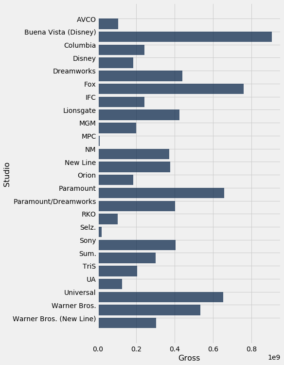
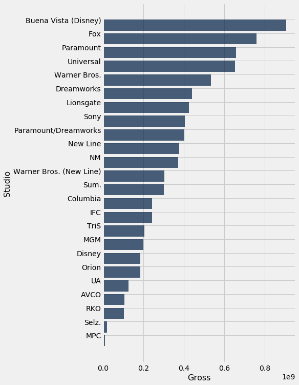
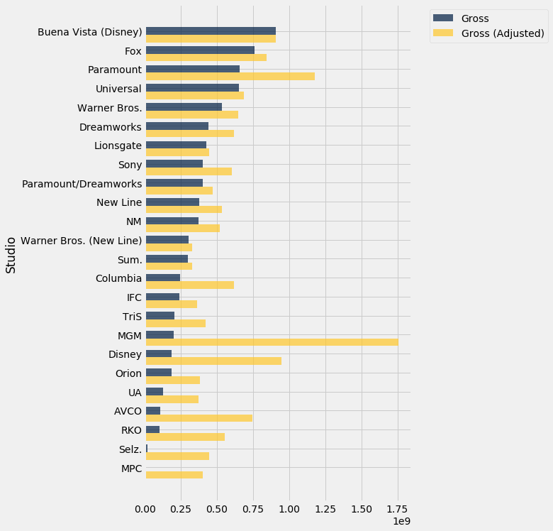
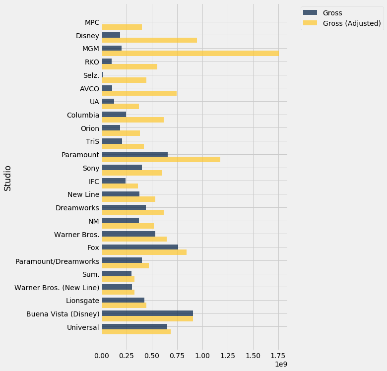

```python
from datascience import *
import numpy as np

%matplotlib inline
import matplotlib.pyplot as plots
plots.style.use('fivethirtyeight')
```

## Python


```python
3 * 4
```


    12


```python
12 + 3
```


    15


<br><br><br><br>

## Names


```python
24 * 7
```


    168


```python
hours_per_week = 24 * 7
```


```python
hours_per_week
```


    168


```python
hours_per_week * 60
```


    10080


Calculate the number of seconds in a year.


```python
60 * 60 * 24 * 365
```


    31536000


```python
seconds_per_year = 60 * 60 * 24 * 365
```


```python
seconds_per_year
```


    31536000


```python
seconds_per_hour = 60 * 60
hours_per_year = 24 * 365
seconds_per_year = seconds_per_hour * hours_per_year
seconds_per_year
```


    31536000


<br><br><br><br>

## Functions


```python
abs(-5)
```


    5


```python
abs(3-8)
```


    5


```python
max(3, 4)
```


    4


```python
y = max(3, 4)
```


```python
y
```


    4


<br><br><br><br>

## Tables


```python
Table.read_table('flowers.csv')
```


<table border="1" class="dataframe">
    <thead>
        <tr>
            <th>Petals</th> <th>Name</th> <th>Color</th>
        </tr>
    </thead>
    <tbody>
        <tr>
            <td>8     </td> <td>lotus    </td> <td>pink  </td>
        </tr>
    </tbody>
        <tr>
            <td>34    </td> <td>sunflower</td> <td>yellow</td>
        </tr>
    </tbody>
        <tr>
            <td>5     </td> <td>rose     </td> <td>red   </td>
        </tr>
    </tbody>
</table>


```python
flowers = Table.read_table('flowers.csv')
```


```python
flowers
```


<table border="1" class="dataframe">
    <thead>
        <tr>
            <th>Petals</th> <th>Name</th> <th>Color</th>
        </tr>
    </thead>
    <tbody>
        <tr>
            <td>8     </td> <td>lotus    </td> <td>pink  </td>
        </tr>
    </tbody>
        <tr>
            <td>34    </td> <td>sunflower</td> <td>yellow</td>
        </tr>
    </tbody>
        <tr>
            <td>5     </td> <td>rose     </td> <td>red   </td>
        </tr>
    </tbody>
</table>


<br><br><br><br>

## Table operations: selecting columns


```python
flowers.select('Petals')
```


<table border="1" class="dataframe">
    <thead>
        <tr>
            <th>Petals</th>
        </tr>
    </thead>
    <tbody>
        <tr>
            <td>8     </td>
        </tr>
    </tbody>
        <tr>
            <td>34    </td>
        </tr>
    </tbody>
        <tr>
            <td>5     </td>
        </tr>
    </tbody>
</table>


```python
flowers
```


<table border="1" class="dataframe">
    <thead>
        <tr>
            <th>Petals</th> <th>Name</th> <th>Color</th>
        </tr>
    </thead>
    <tbody>
        <tr>
            <td>8     </td> <td>lotus    </td> <td>pink  </td>
        </tr>
    </tbody>
        <tr>
            <td>34    </td> <td>sunflower</td> <td>yellow</td>
        </tr>
    </tbody>
        <tr>
            <td>5     </td> <td>rose     </td> <td>red   </td>
        </tr>
    </tbody>
</table>


```python
petals = flowers.select('Petals')
```


```python
petals
```


<table border="1" class="dataframe">
    <thead>
        <tr>
            <th>Petals</th>
        </tr>
    </thead>
    <tbody>
        <tr>
            <td>8     </td>
        </tr>
    </tbody>
        <tr>
            <td>34    </td>
        </tr>
    </tbody>
        <tr>
            <td>5     </td>
        </tr>
    </tbody>
</table>


```python
flowers.select('Petals', 'Name')
```


<table border="1" class="dataframe">
    <thead>
        <tr>
            <th>Petals</th> <th>Name</th>
        </tr>
    </thead>
    <tbody>
        <tr>
            <td>8     </td> <td>lotus    </td>
        </tr>
    </tbody>
        <tr>
            <td>34    </td> <td>sunflower</td>
        </tr>
    </tbody>
        <tr>
            <td>5     </td> <td>rose     </td>
        </tr>
    </tbody>
</table>


```python
flowers.drop('Color')
```


<table border="1" class="dataframe">
    <thead>
        <tr>
            <th>Petals</th> <th>Name</th>
        </tr>
    </thead>
    <tbody>
        <tr>
            <td>8     </td> <td>lotus    </td>
        </tr>
    </tbody>
        <tr>
            <td>34    </td> <td>sunflower</td>
        </tr>
    </tbody>
        <tr>
            <td>5     </td> <td>rose     </td>
        </tr>
    </tbody>
</table>


```python
flowers
```


<table border="1" class="dataframe">
    <thead>
        <tr>
            <th>Petals</th> <th>Name</th> <th>Color</th>
        </tr>
    </thead>
    <tbody>
        <tr>
            <td>8     </td> <td>lotus    </td> <td>pink  </td>
        </tr>
    </tbody>
        <tr>
            <td>34    </td> <td>sunflower</td> <td>yellow</td>
        </tr>
    </tbody>
        <tr>
            <td>5     </td> <td>rose     </td> <td>red   </td>
        </tr>
    </tbody>
</table>


## Table operations: Sorting


```python
movies = Table.read_table('top_movies_by_title.csv')
```


```python
movies
```


<table border="1" class="dataframe">
    <thead>
        <tr>
            <th>Title</th> <th>Studio</th> <th>Gross</th> <th>Gross (Adjusted)</th> <th>Year</th>
        </tr>
    </thead>
    <tbody>
        <tr>
            <td>101 Dalmatians            </td> <td>Disney              </td> <td>144880014</td> <td>869280100       </td> <td>1961</td>
        </tr>
    </tbody>
        <tr>
            <td>2001: A Space Odyssey     </td> <td>MGM                 </td> <td>56954992 </td> <td>377027700       </td> <td>1968</td>
        </tr>
    </tbody>
        <tr>
            <td>9 to 5                    </td> <td>Fox                 </td> <td>103290500</td> <td>334062200       </td> <td>1980</td>
        </tr>
    </tbody>
        <tr>
            <td>A Star Is Born (1976)     </td> <td>Warner Bros.        </td> <td>80000000 </td> <td>326760600       </td> <td>1976</td>
        </tr>
    </tbody>
        <tr>
            <td>Air Force One             </td> <td>Sony                </td> <td>172956409</td> <td>327752300       </td> <td>1997</td>
        </tr>
    </tbody>
        <tr>
            <td>Airport                   </td> <td>Universal           </td> <td>100489151</td> <td>575168200       </td> <td>1970</td>
        </tr>
    </tbody>
        <tr>
            <td>Aladdin                   </td> <td>Buena Vista (Disney)</td> <td>217350219</td> <td>456248400       </td> <td>1992</td>
        </tr>
    </tbody>
        <tr>
            <td>Alice in Wonderland (2010)</td> <td>Buena Vista (Disney)</td> <td>334191110</td> <td>365718600       </td> <td>2010</td>
        </tr>
    </tbody>
        <tr>
            <td>American Graffiti         </td> <td>Universal           </td> <td>115000000</td> <td>571714300       </td> <td>1973</td>
        </tr>
    </tbody>
        <tr>
            <td>American Sniper           </td> <td>Warner Bros.        </td> <td>350126372</td> <td>374796000       </td> <td>2014</td>
        </tr>
    </tbody>
</table>
<p>... (190 rows omitted)</p>


```python
movies.show(3)
```


<table border="1" class="dataframe">
    <thead>
        <tr>
            <th>Title</th> <th>Studio</th> <th>Gross</th> <th>Gross (Adjusted)</th> <th>Year</th>
        </tr>
    </thead>
    <tbody>
        <tr>
            <td>101 Dalmatians       </td> <td>Disney</td> <td>144880014</td> <td>869280100       </td> <td>1961</td>
        </tr>
    </tbody>
        <tr>
            <td>2001: A Space Odyssey</td> <td>MGM   </td> <td>56954992 </td> <td>377027700       </td> <td>1968</td>
        </tr>
    </tbody>
        <tr>
            <td>9 to 5               </td> <td>Fox   </td> <td>103290500</td> <td>334062200       </td> <td>1980</td>
        </tr>
    </tbody>
</table>
<p>... (197 rows omitted)</p>


```python
movies.sort('Gross')
```


<table border="1" class="dataframe">
    <thead>
        <tr>
            <th>Title</th> <th>Studio</th> <th>Gross</th> <th>Gross (Adjusted)</th> <th>Year</th>
        </tr>
    </thead>
    <tbody>
        <tr>
            <td>The Four Horsemen of the Apocalypse</td> <td>MPC         </td> <td>9183673 </td> <td>399489800       </td> <td>1921</td>
        </tr>
    </tbody>
        <tr>
            <td>Sergeant York                      </td> <td>Warner Bros.</td> <td>16361885</td> <td>418671800       </td> <td>1941</td>
        </tr>
    </tbody>
        <tr>
            <td>Duel in the Sun                    </td> <td>Selz.       </td> <td>20408163</td> <td>443877500       </td> <td>1946</td>
        </tr>
    </tbody>
        <tr>
            <td>The Bells of St. Mary's            </td> <td>RKO         </td> <td>21333333</td> <td>545882400       </td> <td>1945</td>
        </tr>
    </tbody>
        <tr>
            <td>The Caine Mutiny                   </td> <td>Columbia    </td> <td>21750000</td> <td>386173500       </td> <td>1954</td>
        </tr>
    </tbody>
        <tr>
            <td>The Best Years of Our Lives        </td> <td>RKO         </td> <td>23650000</td> <td>478500000       </td> <td>1946</td>
        </tr>
    </tbody>
        <tr>
            <td>House of Wax                       </td> <td>Warner Bros.</td> <td>23750000</td> <td>439627700       </td> <td>1953</td>
        </tr>
    </tbody>
        <tr>
            <td>The Bridge on the River Kwai       </td> <td>Columbia    </td> <td>27200000</td> <td>473280000       </td> <td>1957</td>
        </tr>
    </tbody>
        <tr>
            <td>Psycho                             </td> <td>Universal   </td> <td>32000000</td> <td>371200100       </td> <td>1960</td>
        </tr>
    </tbody>
        <tr>
            <td>The Greatest Show on Earth         </td> <td>Paramount   </td> <td>36000000</td> <td>522000000       </td> <td>1952</td>
        </tr>
    </tbody>
</table>
<p>... (190 rows omitted)</p>


```python
movies.sort('Gross', descending=True)
```


<table border="1" class="dataframe">
    <thead>
        <tr>
            <th>Title</th> <th>Studio</th> <th>Gross</th> <th>Gross (Adjusted)</th> <th>Year</th>
        </tr>
    </thead>
    <tbody>
        <tr>
            <td>Star Wars: The Force Awakens             </td> <td>Buena Vista (Disney)</td> <td>906723418</td> <td>906723400       </td> <td>2015</td>
        </tr>
    </tbody>
        <tr>
            <td>Avatar                                   </td> <td>Fox                 </td> <td>760507625</td> <td>846120800       </td> <td>2009</td>
        </tr>
    </tbody>
        <tr>
            <td>Titanic                                  </td> <td>Paramount           </td> <td>658672302</td> <td>1178627900      </td> <td>1997</td>
        </tr>
    </tbody>
        <tr>
            <td>Jurassic World                           </td> <td>Universal           </td> <td>652270625</td> <td>687728000       </td> <td>2015</td>
        </tr>
    </tbody>
        <tr>
            <td>Marvel's The Avengers                    </td> <td>Buena Vista (Disney)</td> <td>623357910</td> <td>668866600       </td> <td>2012</td>
        </tr>
    </tbody>
        <tr>
            <td>The Dark Knight                          </td> <td>Warner Bros.        </td> <td>534858444</td> <td>647761600       </td> <td>2008</td>
        </tr>
    </tbody>
        <tr>
            <td>Star Wars: Episode I - The Phantom Menace</td> <td>Fox                 </td> <td>474544677</td> <td>785715000       </td> <td>1999</td>
        </tr>
    </tbody>
        <tr>
            <td>Star Wars                                </td> <td>Fox                 </td> <td>460998007</td> <td>1549640500      </td> <td>1977</td>
        </tr>
    </tbody>
        <tr>
            <td>Avengers: Age of Ultron                  </td> <td>Buena Vista (Disney)</td> <td>459005868</td> <td>465684200       </td> <td>2015</td>
        </tr>
    </tbody>
        <tr>
            <td>The Dark Knight Rises                    </td> <td>Warner Bros.        </td> <td>448139099</td> <td>500961700       </td> <td>2012</td>
        </tr>
    </tbody>
</table>
<p>... (190 rows omitted)</p>


```python
sorted_by_gross = movies.sort('Gross', descending=True)
```


```python
sorted_by_gross.sort('Studio')
```


<table border="1" class="dataframe">
    <thead>
        <tr>
            <th>Title</th> <th>Studio</th> <th>Gross</th> <th>Gross (Adjusted)</th> <th>Year</th>
        </tr>
    </thead>
    <tbody>
        <tr>
            <td>The Graduate                              </td> <td>AVCO                </td> <td>104945305</td> <td>744517700       </td> <td>1967</td>
        </tr>
    </tbody>
        <tr>
            <td>Star Wars: The Force Awakens              </td> <td>Buena Vista (Disney)</td> <td>906723418</td> <td>906723400       </td> <td>2015</td>
        </tr>
    </tbody>
        <tr>
            <td>Marvel's The Avengers                     </td> <td>Buena Vista (Disney)</td> <td>623357910</td> <td>668866600       </td> <td>2012</td>
        </tr>
    </tbody>
        <tr>
            <td>Avengers: Age of Ultron                   </td> <td>Buena Vista (Disney)</td> <td>459005868</td> <td>465684200       </td> <td>2015</td>
        </tr>
    </tbody>
        <tr>
            <td>Pirates of the Caribbean: Dead Man's Chest</td> <td>Buena Vista (Disney)</td> <td>423315812</td> <td>562266800       </td> <td>2006</td>
        </tr>
    </tbody>
        <tr>
            <td>The Lion King                             </td> <td>Buena Vista (Disney)</td> <td>422783777</td> <td>775573900       </td> <td>1994</td>
        </tr>
    </tbody>
        <tr>
            <td>Toy Story 3                               </td> <td>Buena Vista (Disney)</td> <td>415004880</td> <td>454156300       </td> <td>2010</td>
        </tr>
    </tbody>
        <tr>
            <td>Iron Man 3                                </td> <td>Buena Vista (Disney)</td> <td>409013994</td> <td>424632700       </td> <td>2013</td>
        </tr>
    </tbody>
        <tr>
            <td>Frozen                                    </td> <td>Buena Vista (Disney)</td> <td>400738009</td> <td>426656900       </td> <td>2013</td>
        </tr>
    </tbody>
        <tr>
            <td>Finding Nemo                              </td> <td>Buena Vista (Disney)</td> <td>380843261</td> <td>535802700       </td> <td>2003</td>
        </tr>
    </tbody>
</table>
<p>... (190 rows omitted)</p>


```python
sorted_by_gross.sort('Studio', distinct=True).show(30)
```


<table border="1" class="dataframe">
    <thead>
        <tr>
            <th>Title</th> <th>Studio</th> <th>Gross</th> <th>Gross (Adjusted)</th> <th>Year</th>
        </tr>
    </thead>
    <tbody>
        <tr>
            <td>The Graduate                                 </td> <td>AVCO                   </td> <td>104945305</td> <td>744517700       </td> <td>1967</td>
        </tr>
    </tbody>
        <tr>
            <td>Star Wars: The Force Awakens                 </td> <td>Buena Vista (Disney)   </td> <td>906723418</td> <td>906723400       </td> <td>2015</td>
        </tr>
    </tbody>
        <tr>
            <td>Ghostbusters                                 </td> <td>Columbia               </td> <td>242212467</td> <td>619211400       </td> <td>1984</td>
        </tr>
    </tbody>
        <tr>
            <td>Snow White and the Seven Dwarfs              </td> <td>Disney                 </td> <td>184925486</td> <td>948300000       </td> <td>1937</td>
        </tr>
    </tbody>
        <tr>
            <td>Shrek 2                                      </td> <td>Dreamworks             </td> <td>441226247</td> <td>618143100       </td> <td>2004</td>
        </tr>
    </tbody>
        <tr>
            <td>Avatar                                       </td> <td>Fox                    </td> <td>760507625</td> <td>846120800       </td> <td>2009</td>
        </tr>
    </tbody>
        <tr>
            <td>My Big Fat Greek Wedding                     </td> <td>IFC                    </td> <td>241438208</td> <td>360349500       </td> <td>2002</td>
        </tr>
    </tbody>
        <tr>
            <td>The Hunger Games: Catching Fire              </td> <td>Lionsgate              </td> <td>424668047</td> <td>444697400       </td> <td>2013</td>
        </tr>
    </tbody>
        <tr>
            <td>Gone with the Wind                           </td> <td>MGM                    </td> <td>198676459</td> <td>1757788200      </td> <td>1939</td>
        </tr>
    </tbody>
        <tr>
            <td>The Four Horsemen of the Apocalypse          </td> <td>MPC                    </td> <td>9183673  </td> <td>399489800       </td> <td>1921</td>
        </tr>
    </tbody>
        <tr>
            <td>The Passion of the Christ                    </td> <td>NM                     </td> <td>370782930</td> <td>519432100       </td> <td>2004</td>
        </tr>
    </tbody>
        <tr>
            <td>The Lord of the Rings: The Return of the King</td> <td>New Line               </td> <td>377845905</td> <td>536265400       </td> <td>2003</td>
        </tr>
    </tbody>
        <tr>
            <td>Dances with Wolves                           </td> <td>Orion                  </td> <td>184208848</td> <td>380183900       </td> <td>1990</td>
        </tr>
    </tbody>
        <tr>
            <td>Titanic                                      </td> <td>Paramount              </td> <td>658672302</td> <td>1178627900      </td> <td>1997</td>
        </tr>
    </tbody>
        <tr>
            <td>Transformers: Revenge of the Fallen          </td> <td>Paramount/Dreamworks   </td> <td>402111870</td> <td>468938100       </td> <td>2009</td>
        </tr>
    </tbody>
        <tr>
            <td>Bambi                                        </td> <td>RKO                    </td> <td>102247150</td> <td>554298300       </td> <td>1942</td>
        </tr>
    </tbody>
        <tr>
            <td>Duel in the Sun                              </td> <td>Selz.                  </td> <td>20408163 </td> <td>443877500       </td> <td>1946</td>
        </tr>
    </tbody>
        <tr>
            <td>Spider-Man                                   </td> <td>Sony                   </td> <td>403706375</td> <td>604517300       </td> <td>2002</td>
        </tr>
    </tbody>
        <tr>
            <td>The Twilight Saga: Eclipse                   </td> <td>Sum.                   </td> <td>300531751</td> <td>328883800       </td> <td>2010</td>
        </tr>
    </tbody>
        <tr>
            <td>Terminator 2: Judgment Day                   </td> <td>TriS                   </td> <td>204843345</td> <td>423310500       </td> <td>1991</td>
        </tr>
    </tbody>
        <tr>
            <td>Rocky III                                    </td> <td>UA                     </td> <td>125049125</td> <td>369865300       </td> <td>1982</td>
        </tr>
    </tbody>
        <tr>
            <td>Jurassic World                               </td> <td>Universal              </td> <td>652270625</td> <td>687728000       </td> <td>2015</td>
        </tr>
    </tbody>
        <tr>
            <td>The Dark Knight                              </td> <td>Warner Bros.           </td> <td>534858444</td> <td>647761600       </td> <td>2008</td>
        </tr>
    </tbody>
        <tr>
            <td>The Hobbit: An Unexpected Journey            </td> <td>Warner Bros. (New Line)</td> <td>303003568</td> <td>329153300       </td> <td>2012</td>
        </tr>
    </tbody>
</table>


## Visualization


```python
top_per_studio = sorted_by_gross.sort('Studio', distinct=True)
```


```python
top_per_studio.barh('Studio', 'Gross')
```





```python
top_studios = top_per_studio.sort('Gross', descending=True)
top_studios.barh('Studio', 'Gross')
```





```python
just_revenues = top_studios.select('Studio', 'Gross', 'Gross (Adjusted)')
```


```python
just_revenues
```


<table border="1" class="dataframe">
    <thead>
        <tr>
            <th>Studio</th> <th>Gross</th> <th>Gross (Adjusted)</th>
        </tr>
    </thead>
    <tbody>
        <tr>
            <td>Buena Vista (Disney)</td> <td>906723418</td> <td>906723400       </td>
        </tr>
    </tbody>
        <tr>
            <td>Fox                 </td> <td>760507625</td> <td>846120800       </td>
        </tr>
    </tbody>
        <tr>
            <td>Paramount           </td> <td>658672302</td> <td>1178627900      </td>
        </tr>
    </tbody>
        <tr>
            <td>Universal           </td> <td>652270625</td> <td>687728000       </td>
        </tr>
    </tbody>
        <tr>
            <td>Warner Bros.        </td> <td>534858444</td> <td>647761600       </td>
        </tr>
    </tbody>
        <tr>
            <td>Dreamworks          </td> <td>441226247</td> <td>618143100       </td>
        </tr>
    </tbody>
        <tr>
            <td>Lionsgate           </td> <td>424668047</td> <td>444697400       </td>
        </tr>
    </tbody>
        <tr>
            <td>Sony                </td> <td>403706375</td> <td>604517300       </td>
        </tr>
    </tbody>
        <tr>
            <td>Paramount/Dreamworks</td> <td>402111870</td> <td>468938100       </td>
        </tr>
    </tbody>
        <tr>
            <td>New Line            </td> <td>377845905</td> <td>536265400       </td>
        </tr>
    </tbody>
</table>
<p>... (14 rows omitted)</p>


```python
just_revenues.barh('Studio')
```





```python
sorted_by_year = top_studios.sort('Year')
revenues_by_year = sorted_by_year.select('Studio', 'Gross', 'Gross (Adjusted)')
revenues_by_year.barh('Studio')
```





```python
sorted_by_year
```


<table border="1" class="dataframe">
    <thead>
        <tr>
            <th>Title</th> <th>Studio</th> <th>Gross</th> <th>Gross (Adjusted)</th> <th>Year</th>
        </tr>
    </thead>
    <tbody>
        <tr>
            <td>The Four Horsemen of the Apocalypse</td> <td>MPC     </td> <td>9183673  </td> <td>399489800       </td> <td>1921</td>
        </tr>
    </tbody>
        <tr>
            <td>Snow White and the Seven Dwarfs    </td> <td>Disney  </td> <td>184925486</td> <td>948300000       </td> <td>1937</td>
        </tr>
    </tbody>
        <tr>
            <td>Gone with the Wind                 </td> <td>MGM     </td> <td>198676459</td> <td>1757788200      </td> <td>1939</td>
        </tr>
    </tbody>
        <tr>
            <td>Bambi                              </td> <td>RKO     </td> <td>102247150</td> <td>554298300       </td> <td>1942</td>
        </tr>
    </tbody>
        <tr>
            <td>Duel in the Sun                    </td> <td>Selz.   </td> <td>20408163 </td> <td>443877500       </td> <td>1946</td>
        </tr>
    </tbody>
        <tr>
            <td>The Graduate                       </td> <td>AVCO    </td> <td>104945305</td> <td>744517700       </td> <td>1967</td>
        </tr>
    </tbody>
        <tr>
            <td>Rocky III                          </td> <td>UA      </td> <td>125049125</td> <td>369865300       </td> <td>1982</td>
        </tr>
    </tbody>
        <tr>
            <td>Ghostbusters                       </td> <td>Columbia</td> <td>242212467</td> <td>619211400       </td> <td>1984</td>
        </tr>
    </tbody>
        <tr>
            <td>Dances with Wolves                 </td> <td>Orion   </td> <td>184208848</td> <td>380183900       </td> <td>1990</td>
        </tr>
    </tbody>
        <tr>
            <td>Terminator 2: Judgment Day         </td> <td>TriS    </td> <td>204843345</td> <td>423310500       </td> <td>1991</td>
        </tr>
    </tbody>
</table>
<p>... (14 rows omitted)</p>


## Table operations: where


```python
# This table can be found online: https://www.statcrunch.com/app/index.php?dataid=1843341
nba = Table.read_table('nba_salaries.csv')
```


```python
nba
```


<table border="1" class="dataframe">
    <thead>
        <tr>
            <th>PLAYER</th> <th>POSITION</th> <th>TEAM</th> <th>2015-2016 SALARY</th>
        </tr>
    </thead>
    <tbody>
        <tr>
            <td>Paul Millsap    </td> <td>PF      </td> <td>Atlanta Hawks</td> <td>18.6717         </td>
        </tr>
    </tbody>
        <tr>
            <td>Al Horford      </td> <td>C       </td> <td>Atlanta Hawks</td> <td>12              </td>
        </tr>
    </tbody>
        <tr>
            <td>Tiago Splitter  </td> <td>C       </td> <td>Atlanta Hawks</td> <td>9.75625         </td>
        </tr>
    </tbody>
        <tr>
            <td>Jeff Teague     </td> <td>PG      </td> <td>Atlanta Hawks</td> <td>8               </td>
        </tr>
    </tbody>
        <tr>
            <td>Kyle Korver     </td> <td>SG      </td> <td>Atlanta Hawks</td> <td>5.74648         </td>
        </tr>
    </tbody>
        <tr>
            <td>Thabo Sefolosha </td> <td>SF      </td> <td>Atlanta Hawks</td> <td>4               </td>
        </tr>
    </tbody>
        <tr>
            <td>Mike Scott      </td> <td>PF      </td> <td>Atlanta Hawks</td> <td>3.33333         </td>
        </tr>
    </tbody>
        <tr>
            <td>Kent Bazemore   </td> <td>SF      </td> <td>Atlanta Hawks</td> <td>2               </td>
        </tr>
    </tbody>
        <tr>
            <td>Dennis Schroder </td> <td>PG      </td> <td>Atlanta Hawks</td> <td>1.7634          </td>
        </tr>
    </tbody>
        <tr>
            <td>Tim Hardaway Jr.</td> <td>SG      </td> <td>Atlanta Hawks</td> <td>1.30452         </td>
        </tr>
    </tbody>
</table>
<p>... (407 rows omitted)</p>


```python
nba.sort('2015-2016 SALARY')
```


<table border="1" class="dataframe">
    <thead>
        <tr>
            <th>PLAYER</th> <th>POSITION</th> <th>TEAM</th> <th>2015-2016 SALARY</th>
        </tr>
    </thead>
    <tbody>
        <tr>
            <td>Thanasis Antetokounmpo</td> <td>SF      </td> <td>New York Knicks     </td> <td>0.030888        </td>
        </tr>
    </tbody>
        <tr>
            <td>Jordan McRae          </td> <td>SG      </td> <td>Phoenix Suns        </td> <td>0.049709        </td>
        </tr>
    </tbody>
        <tr>
            <td>Cory Jefferson        </td> <td>PF      </td> <td>Phoenix Suns        </td> <td>0.049709        </td>
        </tr>
    </tbody>
        <tr>
            <td>Elliot Williams       </td> <td>SG      </td> <td>Memphis Grizzlies   </td> <td>0.055722        </td>
        </tr>
    </tbody>
        <tr>
            <td>Orlando Johnson       </td> <td>SG      </td> <td>Phoenix Suns        </td> <td>0.055722        </td>
        </tr>
    </tbody>
        <tr>
            <td>Phil Pressey          </td> <td>PG      </td> <td>Phoenix Suns        </td> <td>0.055722        </td>
        </tr>
    </tbody>
        <tr>
            <td>Keith Appling         </td> <td>PG      </td> <td>Orlando Magic       </td> <td>0.061776        </td>
        </tr>
    </tbody>
        <tr>
            <td>Sean Kilpatrick       </td> <td>SG      </td> <td>Denver Nuggets      </td> <td>0.099418        </td>
        </tr>
    </tbody>
        <tr>
            <td>Erick Green           </td> <td>PG      </td> <td>Utah Jazz           </td> <td>0.099418        </td>
        </tr>
    </tbody>
        <tr>
            <td>Jeff Ayres            </td> <td>PF      </td> <td>Los Angeles Clippers</td> <td>0.111444        </td>
        </tr>
    </tbody>
</table>
<p>... (407 rows omitted)</p>


```python
nba.where('2015-2016 SALARY', are.above(10))
```


<table border="1" class="dataframe">
    <thead>
        <tr>
            <th>PLAYER</th> <th>POSITION</th> <th>TEAM</th> <th>2015-2016 SALARY</th>
        </tr>
    </thead>
    <tbody>
        <tr>
            <td>Paul Millsap  </td> <td>PF      </td> <td>Atlanta Hawks    </td> <td>18.6717         </td>
        </tr>
    </tbody>
        <tr>
            <td>Al Horford    </td> <td>C       </td> <td>Atlanta Hawks    </td> <td>12              </td>
        </tr>
    </tbody>
        <tr>
            <td>Joe Johnson   </td> <td>SF      </td> <td>Brooklyn Nets    </td> <td>24.8949         </td>
        </tr>
    </tbody>
        <tr>
            <td>Thaddeus Young</td> <td>PF      </td> <td>Brooklyn Nets    </td> <td>11.236          </td>
        </tr>
    </tbody>
        <tr>
            <td>Al Jefferson  </td> <td>C       </td> <td>Charlotte Hornets</td> <td>13.5            </td>
        </tr>
    </tbody>
        <tr>
            <td>Nicolas Batum </td> <td>SG      </td> <td>Charlotte Hornets</td> <td>13.1253         </td>
        </tr>
    </tbody>
        <tr>
            <td>Kemba Walker  </td> <td>PG      </td> <td>Charlotte Hornets</td> <td>12              </td>
        </tr>
    </tbody>
        <tr>
            <td>Derrick Rose  </td> <td>PG      </td> <td>Chicago Bulls    </td> <td>20.0931         </td>
        </tr>
    </tbody>
        <tr>
            <td>Jimmy Butler  </td> <td>SG      </td> <td>Chicago Bulls    </td> <td>16.4075         </td>
        </tr>
    </tbody>
        <tr>
            <td>Joakim Noah   </td> <td>C       </td> <td>Chicago Bulls    </td> <td>13.4            </td>
        </tr>
    </tbody>
</table>
<p>... (59 rows omitted)</p>


```python
nba.where('2015-2016 SALARY', are.above(10)).sort('2015-2016 SALARY')
```


<table border="1" class="dataframe">
    <thead>
        <tr>
            <th>PLAYER</th> <th>POSITION</th> <th>TEAM</th> <th>2015-2016 SALARY</th>
        </tr>
    </thead>
    <tbody>
        <tr>
            <td>DeMar DeRozan  </td> <td>SG      </td> <td>Toronto Raptors     </td> <td>10.05           </td>
        </tr>
    </tbody>
        <tr>
            <td>Gerald Wallace </td> <td>SF      </td> <td>Philadelphia 76ers  </td> <td>10.1059         </td>
        </tr>
    </tbody>
        <tr>
            <td>Luol Deng      </td> <td>SF      </td> <td>Miami Heat          </td> <td>10.1516         </td>
        </tr>
    </tbody>
        <tr>
            <td>Monta Ellis    </td> <td>SG      </td> <td>Indiana Pacers      </td> <td>10.3            </td>
        </tr>
    </tbody>
        <tr>
            <td>Wilson Chandler</td> <td>SF      </td> <td>Denver Nuggets      </td> <td>10.4494         </td>
        </tr>
    </tbody>
        <tr>
            <td>Brendan Haywood</td> <td>C       </td> <td>Cleveland Cavaliers </td> <td>10.5225         </td>
        </tr>
    </tbody>
        <tr>
            <td>Jrue Holiday   </td> <td>PG      </td> <td>New Orleans Pelicans</td> <td>10.5955         </td>
        </tr>
    </tbody>
        <tr>
            <td>Tyreke Evans   </td> <td>SG      </td> <td>New Orleans Pelicans</td> <td>10.7346         </td>
        </tr>
    </tbody>
        <tr>
            <td>Marcin Gortat  </td> <td>C       </td> <td>Washington Wizards  </td> <td>11.2174         </td>
        </tr>
    </tbody>
        <tr>
            <td>Thaddeus Young </td> <td>PF      </td> <td>Brooklyn Nets       </td> <td>11.236          </td>
        </tr>
    </tbody>
</table>
<p>... (59 rows omitted)</p>


```python
nba.where('PLAYER', are.equal_to('Stephen Curry'))
```


<table border="1" class="dataframe">
    <thead>
        <tr>
            <th>PLAYER</th> <th>POSITION</th> <th>TEAM</th> <th>2015-2016 SALARY</th>
        </tr>
    </thead>
    <tbody>
        <tr>
            <td>Stephen Curry</td> <td>PG      </td> <td>Golden State Warriors</td> <td>11.3708         </td>
        </tr>
    </tbody>
</table>


```python
nba.where('TEAM', are.equal_to('Golden State Warriors'))
```


<table border="1" class="dataframe">
    <thead>
        <tr>
            <th>PLAYER</th> <th>POSITION</th> <th>TEAM</th> <th>2015-2016 SALARY</th>
        </tr>
    </thead>
    <tbody>
        <tr>
            <td>Klay Thompson    </td> <td>SG      </td> <td>Golden State Warriors</td> <td>15.501          </td>
        </tr>
    </tbody>
        <tr>
            <td>Draymond Green   </td> <td>PF      </td> <td>Golden State Warriors</td> <td>14.2609         </td>
        </tr>
    </tbody>
        <tr>
            <td>Andrew Bogut     </td> <td>C       </td> <td>Golden State Warriors</td> <td>13.8            </td>
        </tr>
    </tbody>
        <tr>
            <td>Andre Iguodala   </td> <td>SF      </td> <td>Golden State Warriors</td> <td>11.7105         </td>
        </tr>
    </tbody>
        <tr>
            <td>Stephen Curry    </td> <td>PG      </td> <td>Golden State Warriors</td> <td>11.3708         </td>
        </tr>
    </tbody>
        <tr>
            <td>Jason Thompson   </td> <td>PF      </td> <td>Golden State Warriors</td> <td>7.00847         </td>
        </tr>
    </tbody>
        <tr>
            <td>Shaun Livingston </td> <td>PG      </td> <td>Golden State Warriors</td> <td>5.54373         </td>
        </tr>
    </tbody>
        <tr>
            <td>Harrison Barnes  </td> <td>SF      </td> <td>Golden State Warriors</td> <td>3.8734          </td>
        </tr>
    </tbody>
        <tr>
            <td>Marreese Speights</td> <td>C       </td> <td>Golden State Warriors</td> <td>3.815           </td>
        </tr>
    </tbody>
        <tr>
            <td>Leandro Barbosa  </td> <td>SG      </td> <td>Golden State Warriors</td> <td>2.5             </td>
        </tr>
    </tbody>
</table>
<p>... (4 rows omitted)</p>


```python
nba.where('TEAM', are.equal_to('Golden State Warriors')).sort('2015-2016 SALARY', descending=True)
```


<table border="1" class="dataframe">
    <thead>
        <tr>
            <th>PLAYER</th> <th>POSITION</th> <th>TEAM</th> <th>2015-2016 SALARY</th>
        </tr>
    </thead>
    <tbody>
        <tr>
            <td>Klay Thompson    </td> <td>SG      </td> <td>Golden State Warriors</td> <td>15.501          </td>
        </tr>
    </tbody>
        <tr>
            <td>Draymond Green   </td> <td>PF      </td> <td>Golden State Warriors</td> <td>14.2609         </td>
        </tr>
    </tbody>
        <tr>
            <td>Andrew Bogut     </td> <td>C       </td> <td>Golden State Warriors</td> <td>13.8            </td>
        </tr>
    </tbody>
        <tr>
            <td>Andre Iguodala   </td> <td>SF      </td> <td>Golden State Warriors</td> <td>11.7105         </td>
        </tr>
    </tbody>
        <tr>
            <td>Stephen Curry    </td> <td>PG      </td> <td>Golden State Warriors</td> <td>11.3708         </td>
        </tr>
    </tbody>
        <tr>
            <td>Jason Thompson   </td> <td>PF      </td> <td>Golden State Warriors</td> <td>7.00847         </td>
        </tr>
    </tbody>
        <tr>
            <td>Shaun Livingston </td> <td>PG      </td> <td>Golden State Warriors</td> <td>5.54373         </td>
        </tr>
    </tbody>
        <tr>
            <td>Harrison Barnes  </td> <td>SF      </td> <td>Golden State Warriors</td> <td>3.8734          </td>
        </tr>
    </tbody>
        <tr>
            <td>Marreese Speights</td> <td>C       </td> <td>Golden State Warriors</td> <td>3.815           </td>
        </tr>
    </tbody>
        <tr>
            <td>Leandro Barbosa  </td> <td>SG      </td> <td>Golden State Warriors</td> <td>2.5             </td>
        </tr>
    </tbody>
</table>
<p>... (4 rows omitted)</p>


```python
nba.where('2015-2016 SALARY', are.between(10, 12))
```


<table border="1" class="dataframe">
    <thead>
        <tr>
            <th>PLAYER</th> <th>POSITION</th> <th>TEAM</th> <th>2015-2016 SALARY</th>
        </tr>
    </thead>
    <tbody>
        <tr>
            <td>Thaddeus Young </td> <td>PF      </td> <td>Brooklyn Nets        </td> <td>11.236          </td>
        </tr>
    </tbody>
        <tr>
            <td>Brendan Haywood</td> <td>C       </td> <td>Cleveland Cavaliers  </td> <td>10.5225         </td>
        </tr>
    </tbody>
        <tr>
            <td>Kenneth Faried </td> <td>PF      </td> <td>Denver Nuggets       </td> <td>11.236          </td>
        </tr>
    </tbody>
        <tr>
            <td>Wilson Chandler</td> <td>SF      </td> <td>Denver Nuggets       </td> <td>10.4494         </td>
        </tr>
    </tbody>
        <tr>
            <td>Andre Iguodala </td> <td>SF      </td> <td>Golden State Warriors</td> <td>11.7105         </td>
        </tr>
    </tbody>
        <tr>
            <td>Stephen Curry  </td> <td>PG      </td> <td>Golden State Warriors</td> <td>11.3708         </td>
        </tr>
    </tbody>
        <tr>
            <td>Monta Ellis    </td> <td>SG      </td> <td>Indiana Pacers       </td> <td>10.3            </td>
        </tr>
    </tbody>
        <tr>
            <td>Luol Deng      </td> <td>SF      </td> <td>Miami Heat           </td> <td>10.1516         </td>
        </tr>
    </tbody>
        <tr>
            <td>Tyreke Evans   </td> <td>SG      </td> <td>New Orleans Pelicans </td> <td>10.7346         </td>
        </tr>
    </tbody>
        <tr>
            <td>Jrue Holiday   </td> <td>PG      </td> <td>New Orleans Pelicans </td> <td>10.5955         </td>
        </tr>
    </tbody>
</table>
<p>... (5 rows omitted)</p>


