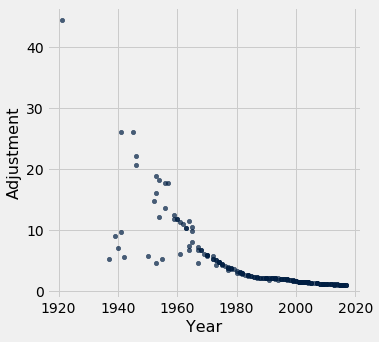
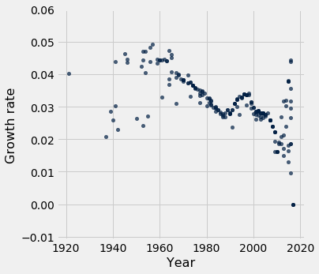

```python
from datascience import *
import numpy as np

%matplotlib inline
import matplotlib.pyplot as plots
plots.style.use('fivethirtyeight')
```

## Arithmetic


```python
2 + 3
```


    5


```python
2 * 3
```


    6


```python
2 ** 3
```


    8


```python
2 * * 3
```


      File "<ipython-input-5-0f343c0fc354>", line 1
        2 * * 3
            ^
    SyntaxError: invalid syntax


```python
10 * 2 ** 3
```


    80


```python
2 + 3 * 4 + 5
```


    19


```python
2 / 3
```


    0.6666666666666666


```python
2 / 0
```


    ---------------------------------------------------------------------------

    ZeroDivisionError                         Traceback (most recent call last)

    <ipython-input-9-8b4ac6d3a3e1> in <module>()
    ----> 1 2 / 0
    

    ZeroDivisionError: division by zero


```python
2 / 3000
```


    0.0006666666666666666


```python
2 / 3000000
```


    6.666666666666667e-07


```python
0.6666666666666666 - 0.6666666666666666123456789
```


    0.0


```python
0.000000000000000123456789
```


    1.23456789e-16


```python
0.000000000000000000000000000000000000000000000000000000000000000000000123456789
```


    1.23456789e-70


```python
2 ** 0.5
```


    1.4142135623730951


```python
2 ** 0.5 * 2 ** 0.5
```


    2.0000000000000004


```python
2 ** 0.5 * 2 ** 0.5 - 2
```


    4.440892098500626e-16


## Growth


```python
sept_7 = 4366
aug_7 = 1830
growth_per_month = (sept_7 / aug_7) - 1
growth_per_month
```


    1.385792349726776


```python
sept_7 * (1 + growth_per_month) ** 12
```


    148482554.67988718


```python
fed_budget_2002 = 2370000000000
fed_budget_2012 = 3380000000000
fed_budget_2012 - fed_budget_2002
```


    1010000000000


```python
g = (fed_budget_2012 / fed_budget_2002) ** (1/10) - 1
g
```


    0.03613617208346853


```python
fed_budget_2002 * (1 + g) ** 16 # Actual 2018 budget: $4.1 trillion
```


    4182324373087.768


## Arrays


```python
make_array(1, 2, 3)
```


    array([1, 2, 3])


```python
make_array(1, 2, 3) * 2
```


    array([2, 4, 6])


```python
a = make_array(1, 2, 3)
```


```python
a + 5
```


    array([6, 7, 8])


```python
a + make_array(10, 100, 1000)
```


    array([  11,  102, 1003])


```python
a
```


    array([1, 2, 3])


```python
sum(a)
```


    6


```python
max(a)
```


    3


```python
min(a)
```


    1


```python
fed_budget_2002 * (1 + g) ** a
```


    array([2.45564273e+12, 2.54438026e+12, 2.63632442e+12])


## Columns


```python
# From http://www.boxofficemojo.com/alltime/adjusted.htm
movies = Table.read_table('top_movies_2017.csv')
movies
```


<table border="1" class="dataframe">
    <thead>
        <tr>
            <th>Title</th> <th>Studio</th> <th>Gross</th> <th>Gross (Adjusted)</th> <th>Year</th>
        </tr>
    </thead>
    <tbody>
        <tr>
            <td>Gone with the Wind              </td> <td>MGM            </td> <td>198676459</td> <td>1796176700      </td> <td>1939</td>
        </tr>
    </tbody>
        <tr>
            <td>Star Wars                       </td> <td>Fox            </td> <td>460998007</td> <td>1583483200      </td> <td>1977</td>
        </tr>
    </tbody>
        <tr>
            <td>The Sound of Music              </td> <td>Fox            </td> <td>158671368</td> <td>1266072700      </td> <td>1965</td>
        </tr>
    </tbody>
        <tr>
            <td>E.T.: The Extra-Terrestrial     </td> <td>Universal      </td> <td>435110554</td> <td>1261085000      </td> <td>1982</td>
        </tr>
    </tbody>
        <tr>
            <td>Titanic                         </td> <td>Paramount      </td> <td>658672302</td> <td>1204368000      </td> <td>1997</td>
        </tr>
    </tbody>
        <tr>
            <td>The Ten Commandments            </td> <td>Paramount      </td> <td>65500000 </td> <td>1164590000      </td> <td>1956</td>
        </tr>
    </tbody>
        <tr>
            <td>Jaws                            </td> <td>Universal      </td> <td>260000000</td> <td>1138620700      </td> <td>1975</td>
        </tr>
    </tbody>
        <tr>
            <td>Doctor Zhivago                  </td> <td>MGM            </td> <td>111721910</td> <td>1103564200      </td> <td>1965</td>
        </tr>
    </tbody>
        <tr>
            <td>The Exorcist                    </td> <td>Warner Brothers</td> <td>232906145</td> <td>983226600       </td> <td>1973</td>
        </tr>
    </tbody>
        <tr>
            <td>Snow White and the Seven Dwarves</td> <td>Disney         </td> <td>184925486</td> <td>969010000       </td> <td>1937</td>
        </tr>
    </tbody>
</table>
<p>... (190 rows omitted)</p>


```python
movies.column('Gross')
```


    array([198676459, 460998007, 158671368, 435110554, 658672302,  65500000,
           260000000, 111721910, 232906145, 184925486, 936662225, 144880014,
           290475067,  74000000, 760507625, 309306177, 402453882, 474544677,
           422783777, 156000000, 248159971, 104945305,  76408097, 652270625,
           134966411, 330252182, 102272727, 188755690, 623357910,  63595658,
           534858444, 141843612,  51600000, 242212467, 441226247, 102308889,
           106397186, 403706375, 306169268, 285761243,  84254167,  57777778,
           234760478,  51081062, 100489151, 115000000,  36000000, 423315812,
            42000000, 102247150, 119601481, 251188924,  21333333, 377845905,
           380843261, 116000000, 532177324,  93141149, 373585825,  36000000,
            72000000, 141600000, 370782930, 380270577, 210609762, 342551365,
           448139099, 293506292, 134218018, 177200000, 126737428, 504014165,
           486295561,  43656822, 317575550,  93602326, 132088635,  44824144,
           112892319, 117235147,  23650000,  84563118, 315544750, 241721524,
           250690539,  27200000, 402111870,  46332858,  40356000, 108981275,
            81600000, 179870271, 459005868, 310676740, 219195243, 217350219,
           415004880, 217631306, 424668047,  20408163, 408010692, 305413918,
            23750000,  36764313, 229086679, 197171806, 289916256, 400738009,
           336530303, 409013994, 205396118,  16361885, 260044825, 179800601,
           381011219, 245852179, 267665011, 322719944, 368061265, 408084349,
           281576461, 319246193, 174803506,   9183673, 216540909, 406381596,
            86273333,  87404651, 153083102, 218967620, 291710957, 290013036,
           309420425, 261988482, 183875760,  21750000, 318412101, 352390543,
           279261160, 317101119, 191796233, 389397196, 184208848, 129795554,
            56954992, 172825435, 368384330,  56666667, 356461711, 350126372,
           106260000, 201578182,  32000000, 125049125, 292004738, 150415432,
           184031112, 363070709, 178406268,  79666653, 334191110, 261441092,
           233632142, 173585516, 364001123, 167780960, 241438208, 333176600,
           353007020, 180981856, 337135885, 336045770,  94213184, 119285432,
           206040086, 301959197, 242829261, 249541069,  52223306, 215409889,
           226164286, 173837933,  61749765, 156645693, 341268248, 181410615,
           165493908, 153665036, 312433331, 293004164, 162831698, 227966634,
           108185706, 296623634,  66000000, 103290500, 330360194, 158348367,
           325100054, 156452370])


```python
adjustment = movies.column('Gross (Adjusted)') / movies.column('Gross')
adjustment
```


    array([ 9.04071227,  3.43490249,  7.97921336,  2.89830938,  1.82847828,
           17.78      ,  4.37931038,  9.87777778,  4.22155714,  5.24000245,
            1.0261364 ,  6.13103475,  3.0048221 , 11.77324324,  1.13750615,
            2.70343195,  2.03050893,  1.69188348,  1.8745083 ,  5.08      ,
            3.17135393,  7.24928095,  9.6620192 ,  1.07738625,  5.19849046,
            2.11621342,  6.79591148,  3.62508913,  1.09643912, 10.45624844,
            1.23767421,  4.61786323, 12.52112597,  2.61231145,  1.43156194,
            6.13103423,  5.84868382,  1.5301205 ,  2.0113067 ,  2.10720318,
            7.11199958, 10.33720958,  2.54286286, 11.53865987,  5.8486841 ,
            5.08      , 16.16363611,  1.35725192, 13.67692381,  5.53955489,
            4.7006132 ,  2.22807037, 26.14705822,  1.45026555,  1.43761005,
            4.70370345,  1.00967474,  5.75556245,  1.43156208, 14.81666667,
            7.40833333,  3.76006003,  1.43150064,  1.38689536,  2.49257344,
            1.49810467,  1.1422844 ,  1.74401168,  3.79914491,  2.8548307 ,
            3.98654689,  1.        ,  1.02662956, 11.3974352 ,  1.56519102,
            5.29349132,  3.74041718, 10.98425438,  4.33658556,  4.1737091 ,
           20.6744186 ,  5.77176447,  1.54388752,  2.01131241,  1.936819  ,
           17.78      ,  1.19165644, 10.33720821, 11.85333284,  4.37931012,
            5.84868382,  2.64583301,  1.03670635,  1.52999771,  2.13674436,
            2.14498289,  1.1182389 ,  2.10229773,  1.07003388, 22.22499889,
            1.10824155,  1.47429005, 18.91489263, 12.17631076,  1.93681929,
            2.22807007,  1.51336529,  1.0879295 ,  1.2921511 ,  1.0608593 ,
            2.10862895, 26.14706068,  1.64459993,  2.3747924 ,  1.1197316 ,
            1.72976584,  1.57067111,  1.29215101,  1.13266062,  1.01854923,
            1.47429511,  1.29215104,  2.34972347, 44.45000383,  1.8781278 ,
            1.        ,  4.70370375,  4.64040638,  2.64128695,  1.84174902,
            1.37676179,  1.38479361,  1.29215129,  1.5241212 ,  2.14651513,
           18.14285517,  1.23812725,  1.11660006,  1.40620414,  1.23816151,
            2.03335276,  1.        ,  2.10894701,  2.99015943,  6.76431664,
            2.22688981,  1.04430121,  6.78625937,  1.07705481,  1.09383706,
            3.59919066,  1.8955226 , 11.8533375 ,  3.02235461,  1.29215095,
            2.5042251 ,  2.04367835,  1.03556853,  2.10165486,  4.70370332,
            1.1182389 ,  1.42917969,  1.5941274 ,  2.14328308,  1.01870125,
            2.20970604,  1.52510741,  1.09872242,  1.03312818,  2.01131212,
            1.07393522,  1.07708423,  3.8314818 ,  3.02463339,  1.75000024,
            1.19151297,  1.47429514,  1.43156195,  6.81593578,  1.64935046,
            1.57067151,  2.03830829,  5.73548418,  2.25197255,  1.03173443,
            1.93681886,  2.11163906,  2.2736571 ,  1.11823889,  1.19160047,
            2.1421689 ,  1.52999188,  3.19784205,  1.16615994,  5.22941212,
            3.30483249,  1.02959438,  2.14734264,  1.0440229 ,  2.16301677])


```python
movies.with_column('Adjustment', adjustment)
```


<table border="1" class="dataframe">
    <thead>
        <tr>
            <th>Title</th> <th>Studio</th> <th>Gross</th> <th>Gross (Adjusted)</th> <th>Year</th> <th>Adjustment</th>
        </tr>
    </thead>
    <tbody>
        <tr>
            <td>Gone with the Wind              </td> <td>MGM            </td> <td>198676459</td> <td>1796176700      </td> <td>1939</td> <td>9.04071   </td>
        </tr>
    </tbody>
        <tr>
            <td>Star Wars                       </td> <td>Fox            </td> <td>460998007</td> <td>1583483200      </td> <td>1977</td> <td>3.4349    </td>
        </tr>
    </tbody>
        <tr>
            <td>The Sound of Music              </td> <td>Fox            </td> <td>158671368</td> <td>1266072700      </td> <td>1965</td> <td>7.97921   </td>
        </tr>
    </tbody>
        <tr>
            <td>E.T.: The Extra-Terrestrial     </td> <td>Universal      </td> <td>435110554</td> <td>1261085000      </td> <td>1982</td> <td>2.89831   </td>
        </tr>
    </tbody>
        <tr>
            <td>Titanic                         </td> <td>Paramount      </td> <td>658672302</td> <td>1204368000      </td> <td>1997</td> <td>1.82848   </td>
        </tr>
    </tbody>
        <tr>
            <td>The Ten Commandments            </td> <td>Paramount      </td> <td>65500000 </td> <td>1164590000      </td> <td>1956</td> <td>17.78     </td>
        </tr>
    </tbody>
        <tr>
            <td>Jaws                            </td> <td>Universal      </td> <td>260000000</td> <td>1138620700      </td> <td>1975</td> <td>4.37931   </td>
        </tr>
    </tbody>
        <tr>
            <td>Doctor Zhivago                  </td> <td>MGM            </td> <td>111721910</td> <td>1103564200      </td> <td>1965</td> <td>9.87778   </td>
        </tr>
    </tbody>
        <tr>
            <td>The Exorcist                    </td> <td>Warner Brothers</td> <td>232906145</td> <td>983226600       </td> <td>1973</td> <td>4.22156   </td>
        </tr>
    </tbody>
        <tr>
            <td>Snow White and the Seven Dwarves</td> <td>Disney         </td> <td>184925486</td> <td>969010000       </td> <td>1937</td> <td>5.24      </td>
        </tr>
    </tbody>
</table>
<p>... (190 rows omitted)</p>


```python
movies.with_column('Adjustment', adjustment).scatter('Year', 'Adjustment')
```





```python
movies.column('Year')
```


    array([1939, 1977, 1965, 1982, 1997, 1956, 1975, 1965, 1973, 1937, 2015,
           1961, 1980, 1959, 2009, 1983, 1993, 1999, 1994, 1973, 1981, 1967,
           1941, 2015, 1972, 1994, 1964, 1978, 2012, 1965, 2008, 1967, 1959,
           1984, 2004, 1969, 1970, 2002, 1996, 1990, 1940, 1963, 1984, 1964,
           1970, 1973, 1953, 2006, 1956, 1942, 1974, 1989, 1945, 2003, 2003,
           1974, 2016, 1950, 2004, 1952, 1964, 1978, 2004, 2005, 1985, 2002,
           2012, 1999, 1978, 1982, 1977, 2017, 2016, 1961, 2001, 1955, 1977,
           1962, 1975, 1976, 1946, 1972, 2001, 1996, 1997, 1957, 2009, 1963,
           1960, 1975, 1970, 1984, 2015, 2002, 1993, 1992, 2010, 1990, 2013,
           1946, 2012, 2003, 1953, 1954, 1997, 1989, 2001, 2013, 2007, 2013,
           1991, 1941, 2000, 1986, 2011, 1999, 2001, 2007, 2013, 2016, 2003,
           2007, 1986, 1921, 1998, 2017, 1974, 1953, 1984, 1991, 2005, 2005,
           2007, 2002, 1993, 1954, 2008, 2011, 2004, 2008, 1995, 2017, 1990,
           1982, 1968, 1988, 2016, 1967, 2015, 2014, 1979, 1998, 1960, 1982,
           2007, 1985, 1995, 2016, 1990, 1974, 2010, 2004, 2000, 1992, 2016,
           1987, 2002, 2014, 2015, 1996, 2014, 2015, 1977, 1981, 1999, 2009,
           2003, 2004, 1968, 2000, 2001, 1995, 1970, 1987, 2016, 1997, 1991,
           1987, 2010, 2009, 1992, 2002, 1981, 2009, 1972, 1980, 2016, 1993,
           2016, 1988])


```python
age = 2017 - movies.column('Year')
movies = movies.with_column('Age', age)
movies
```


<table border="1" class="dataframe">
    <thead>
        <tr>
            <th>Title</th> <th>Studio</th> <th>Gross</th> <th>Gross (Adjusted)</th> <th>Year</th> <th>Age</th>
        </tr>
    </thead>
    <tbody>
        <tr>
            <td>Gone with the Wind              </td> <td>MGM            </td> <td>198676459</td> <td>1796176700      </td> <td>1939</td> <td>78  </td>
        </tr>
    </tbody>
        <tr>
            <td>Star Wars                       </td> <td>Fox            </td> <td>460998007</td> <td>1583483200      </td> <td>1977</td> <td>40  </td>
        </tr>
    </tbody>
        <tr>
            <td>The Sound of Music              </td> <td>Fox            </td> <td>158671368</td> <td>1266072700      </td> <td>1965</td> <td>52  </td>
        </tr>
    </tbody>
        <tr>
            <td>E.T.: The Extra-Terrestrial     </td> <td>Universal      </td> <td>435110554</td> <td>1261085000      </td> <td>1982</td> <td>35  </td>
        </tr>
    </tbody>
        <tr>
            <td>Titanic                         </td> <td>Paramount      </td> <td>658672302</td> <td>1204368000      </td> <td>1997</td> <td>20  </td>
        </tr>
    </tbody>
        <tr>
            <td>The Ten Commandments            </td> <td>Paramount      </td> <td>65500000 </td> <td>1164590000      </td> <td>1956</td> <td>61  </td>
        </tr>
    </tbody>
        <tr>
            <td>Jaws                            </td> <td>Universal      </td> <td>260000000</td> <td>1138620700      </td> <td>1975</td> <td>42  </td>
        </tr>
    </tbody>
        <tr>
            <td>Doctor Zhivago                  </td> <td>MGM            </td> <td>111721910</td> <td>1103564200      </td> <td>1965</td> <td>52  </td>
        </tr>
    </tbody>
        <tr>
            <td>The Exorcist                    </td> <td>Warner Brothers</td> <td>232906145</td> <td>983226600       </td> <td>1973</td> <td>44  </td>
        </tr>
    </tbody>
        <tr>
            <td>Snow White and the Seven Dwarves</td> <td>Disney         </td> <td>184925486</td> <td>969010000       </td> <td>1937</td> <td>80  </td>
        </tr>
    </tbody>
</table>
<p>... (190 rows omitted)</p>


```python
movies = movies.with_column('Growth rate', adjustment ** (1 / age) - 1)
movies
```

    /usr/local/lib/python3.6/dist-packages/ipykernel_launcher.py:1: RuntimeWarning: divide by zero encountered in true_divide
      """Entry point for launching an IPython kernel.


<table border="1" class="dataframe">
    <thead>
        <tr>
            <th>Title</th> <th>Studio</th> <th>Gross</th> <th>Gross (Adjusted)</th> <th>Year</th> <th>Age</th> <th>Growth rate</th>
        </tr>
    </thead>
    <tbody>
        <tr>
            <td>Gone with the Wind              </td> <td>MGM            </td> <td>198676459</td> <td>1796176700      </td> <td>1939</td> <td>78  </td> <td>0.0286296  </td>
        </tr>
    </tbody>
        <tr>
            <td>Star Wars                       </td> <td>Fox            </td> <td>460998007</td> <td>1583483200      </td> <td>1977</td> <td>40  </td> <td>0.0313305  </td>
        </tr>
    </tbody>
        <tr>
            <td>The Sound of Music              </td> <td>Fox            </td> <td>158671368</td> <td>1266072700      </td> <td>1965</td> <td>52  </td> <td>0.0407475  </td>
        </tr>
    </tbody>
        <tr>
            <td>E.T.: The Extra-Terrestrial     </td> <td>Universal      </td> <td>435110554</td> <td>1261085000      </td> <td>1982</td> <td>35  </td> <td>0.0308706  </td>
        </tr>
    </tbody>
        <tr>
            <td>Titanic                         </td> <td>Paramount      </td> <td>658672302</td> <td>1204368000      </td> <td>1997</td> <td>20  </td> <td>0.0306341  </td>
        </tr>
    </tbody>
        <tr>
            <td>The Ten Commandments            </td> <td>Paramount      </td> <td>65500000 </td> <td>1164590000      </td> <td>1956</td> <td>61  </td> <td>0.0483123  </td>
        </tr>
    </tbody>
        <tr>
            <td>Jaws                            </td> <td>Universal      </td> <td>260000000</td> <td>1138620700      </td> <td>1975</td> <td>42  </td> <td>0.0357896  </td>
        </tr>
    </tbody>
        <tr>
            <td>Doctor Zhivago                  </td> <td>MGM            </td> <td>111721910</td> <td>1103564200      </td> <td>1965</td> <td>52  </td> <td>0.0450283  </td>
        </tr>
    </tbody>
        <tr>
            <td>The Exorcist                    </td> <td>Warner Brothers</td> <td>232906145</td> <td>983226600       </td> <td>1973</td> <td>44  </td> <td>0.0332735  </td>
        </tr>
    </tbody>
        <tr>
            <td>Snow White and the Seven Dwarves</td> <td>Disney         </td> <td>184925486</td> <td>969010000       </td> <td>1937</td> <td>80  </td> <td>0.0209198  </td>
        </tr>
    </tbody>
</table>
<p>... (190 rows omitted)</p>


```python
movies.scatter('Year', 'Growth rate')
```





```python
movies.sort('Age').show(20)
```


<table border="1" class="dataframe">
    <thead>
        <tr>
            <th>Title</th> <th>Studio</th> <th>Gross</th> <th>Gross (Adjusted)</th> <th>Year</th> <th>Age</th> <th>Growth rate</th>
        </tr>
    </thead>
    <tbody>
        <tr>
            <td>Beauty and the Beast (2017)        </td> <td>Buena Vista    </td> <td>504014165</td> <td>504014165       </td> <td>2017</td> <td>0   </td> <td>0          </td>
        </tr>
    </tbody>
        <tr>
            <td>Wonder Woman                       </td> <td>Warner Brothers</td> <td>406381596</td> <td>406381596       </td> <td>2017</td> <td>0   </td> <td>0          </td>
        </tr>
    </tbody>
        <tr>
            <td>Guardians of the Galaxy Vol. 2     </td> <td>Buena Vista    </td> <td>389397196</td> <td>389397196       </td> <td>2017</td> <td>0   </td> <td>0          </td>
        </tr>
    </tbody>
        <tr>
            <td>Rogue One: A Star Wars Story       </td> <td>Buena Vista    </td> <td>532177324</td> <td>537326000       </td> <td>2016</td> <td>1   </td> <td>0.00967474 </td>
        </tr>
    </tbody>
        <tr>
            <td>Finding Dory                       </td> <td>Buena Vista    </td> <td>486295561</td> <td>499245400       </td> <td>2016</td> <td>1   </td> <td>0.0266296  </td>
        </tr>
    </tbody>
        <tr>
            <td>Captain America: Civil War         </td> <td>Buena Vista    </td> <td>408084349</td> <td>415654000       </td> <td>2016</td> <td>1   </td> <td>0.0185492  </td>
        </tr>
    </tbody>
        <tr>
            <td>The Secret Life of Pets            </td> <td>Universal      </td> <td>368384330</td> <td>384704200       </td> <td>2016</td> <td>1   </td> <td>0.0443012  </td>
        </tr>
    </tbody>
        <tr>
            <td>Deadpool                           </td> <td>Fox            </td> <td>363070709</td> <td>375984600       </td> <td>2016</td> <td>1   </td> <td>0.0355685  </td>
        </tr>
    </tbody>
        <tr>
            <td>The Jungle Book (2016)             </td> <td>Buena Vista    </td> <td>364001123</td> <td>370808400       </td> <td>2016</td> <td>1   </td> <td>0.0187013  </td>
        </tr>
    </tbody>
        <tr>
            <td>Zootopia                           </td> <td>Buena Vista    </td> <td>341268248</td> <td>352098200       </td> <td>2016</td> <td>1   </td> <td>0.0317344  </td>
        </tr>
    </tbody>
        <tr>
            <td>Batman v Superman: Dawn of Justice </td> <td>Warner Brothers</td> <td>330360194</td> <td>340137000       </td> <td>2016</td> <td>1   </td> <td>0.0295944  </td>
        </tr>
    </tbody>
        <tr>
            <td>Suicide Squad                      </td> <td>Warner Brothers</td> <td>325100054</td> <td>339411900       </td> <td>2016</td> <td>1   </td> <td>0.0440229  </td>
        </tr>
    </tbody>
        <tr>
            <td>Star Wars: The Force Awakens       </td> <td>Buena Vista    </td> <td>936662225</td> <td>961143200       </td> <td>2015</td> <td>2   </td> <td>0.0129839  </td>
        </tr>
    </tbody>
        <tr>
            <td>Jurassic World                     </td> <td>Universal      </td> <td>652270625</td> <td>702747400       </td> <td>2015</td> <td>2   </td> <td>0.0379722  </td>
        </tr>
    </tbody>
        <tr>
            <td>Avengers: Age of Ultron            </td> <td>Buena Vista    </td> <td>459005868</td> <td>475854300       </td> <td>2015</td> <td>2   </td> <td>0.0181878  </td>
        </tr>
    </tbody>
        <tr>
            <td>Inside Out                         </td> <td>Buena Vista    </td> <td>356461711</td> <td>383928800       </td> <td>2015</td> <td>2   </td> <td>0.0378125  </td>
        </tr>
    </tbody>
        <tr>
            <td>Furious 7                          </td> <td>Universal      </td> <td>353007020</td> <td>364701500       </td> <td>2015</td> <td>2   </td> <td>0.0164291  </td>
        </tr>
    </tbody>
        <tr>
            <td>Minions                            </td> <td>Universal      </td> <td>336045770</td> <td>361949600       </td> <td>2015</td> <td>2   </td> <td>0.0378267  </td>
        </tr>
    </tbody>
        <tr>
            <td>American Sniper                    </td> <td>Warner Brothers</td> <td>350126372</td> <td>382981200       </td> <td>2014</td> <td>3   </td> <td>0.0303487  </td>
        </tr>
    </tbody>
        <tr>
            <td>GUnited Artistsrdians of the Galaxy</td> <td>Buena Vista    </td> <td>333176600</td> <td>366068600       </td> <td>2014</td> <td>3   </td> <td>0.0318803  </td>
        </tr>
    </tbody>
</table>
<p>... (180 rows omitted)</p>


```python
movies.sort('Year').show(20)
```


<table border="1" class="dataframe">
    <thead>
        <tr>
            <th>Title</th> <th>Studio</th> <th>Gross</th> <th>Gross (Adjusted)</th> <th>Year</th> <th>Age</th> <th>Growth rate</th>
        </tr>
    </thead>
    <tbody>
        <tr>
            <td>The Four Horsemen of the Apocalypse</td> <td>Metro          </td> <td>9183673  </td> <td>408214300       </td> <td>1921</td> <td>96  </td> <td>0.0403161  </td>
        </tr>
    </tbody>
        <tr>
            <td>Snow White and the Seven Dwarves   </td> <td>Disney         </td> <td>184925486</td> <td>969010000       </td> <td>1937</td> <td>80  </td> <td>0.0209198  </td>
        </tr>
    </tbody>
        <tr>
            <td>Gone with the Wind                 </td> <td>MGM            </td> <td>198676459</td> <td>1796176700      </td> <td>1939</td> <td>78  </td> <td>0.0286296  </td>
        </tr>
    </tbody>
        <tr>
            <td>Pinocchio                          </td> <td>Disney         </td> <td>84254167 </td> <td>599215600       </td> <td>1940</td> <td>77  </td> <td>0.025805   </td>
        </tr>
    </tbody>
        <tr>
            <td>Fantasia                           </td> <td>Disney         </td> <td>76408097 </td> <td>738256500       </td> <td>1941</td> <td>76  </td> <td>0.0302946  </td>
        </tr>
    </tbody>
        <tr>
            <td>Sergeant York                      </td> <td>Warner Brothers</td> <td>16361885 </td> <td>427815200       </td> <td>1941</td> <td>76  </td> <td>0.0438793  </td>
        </tr>
    </tbody>
        <tr>
            <td>Bambi                              </td> <td>RKO            </td> <td>102247150</td> <td>566403700       </td> <td>1942</td> <td>75  </td> <td>0.023088   </td>
        </tr>
    </tbody>
        <tr>
            <td>The Bells of St. Mary's            </td> <td>RKO            </td> <td>21333333 </td> <td>557803900       </td> <td>1945</td> <td>72  </td> <td>0.0463728  </td>
        </tr>
    </tbody>
        <tr>
            <td>The Best Years of Our Lives        </td> <td>RKO            </td> <td>23650000 </td> <td>488950000       </td> <td>1946</td> <td>71  </td> <td>0.0435836  </td>
        </tr>
    </tbody>
        <tr>
            <td>Duel in the Sun                    </td> <td>Selz.          </td> <td>20408163 </td> <td>453571400       </td> <td>1946</td> <td>71  </td> <td>0.0446471  </td>
        </tr>
    </tbody>
        <tr>
            <td>Cinderella (1950)                  </td> <td>Disney         </td> <td>93141149 </td> <td>536079700       </td> <td>1950</td> <td>67  </td> <td>0.0264661  </td>
        </tr>
    </tbody>
        <tr>
            <td>The Greatest Showman on Earth      </td> <td>Paramount      </td> <td>36000000 </td> <td>533400000       </td> <td>1952</td> <td>65  </td> <td>0.0423451  </td>
        </tr>
    </tbody>
        <tr>
            <td>The Robe                           </td> <td>Fox            </td> <td>36000000 </td> <td>581890900       </td> <td>1953</td> <td>64  </td> <td>0.0444398  </td>
        </tr>
    </tbody>
        <tr>
            <td>House of Wax                       </td> <td>Warner Brothers</td> <td>23750000 </td> <td>449228700       </td> <td>1953</td> <td>64  </td> <td>0.0470081  </td>
        </tr>
    </tbody>
        <tr>
            <td>Peter Pan                          </td> <td>Disney         </td> <td>87404651 </td> <td>405593100       </td> <td>1953</td> <td>64  </td> <td>0.0242711  </td>
        </tr>
    </tbody>
        <tr>
            <td>Rear Window                        </td> <td>Paramount      </td> <td>36764313 </td> <td>447653700       </td> <td>1954</td> <td>63  </td> <td>0.040472   </td>
        </tr>
    </tbody>
        <tr>
            <td>The Caine Mutiny                   </td> <td>Columbia       </td> <td>21750000 </td> <td>394607100       </td> <td>1954</td> <td>63  </td> <td>0.047079   </td>
        </tr>
    </tbody>
        <tr>
            <td>Lady and the Tramp                 </td> <td>Disney         </td> <td>93602326 </td> <td>495483100       </td> <td>1955</td> <td>62  </td> <td>0.0272432  </td>
        </tr>
    </tbody>
        <tr>
            <td>The Ten Commandments               </td> <td>Paramount      </td> <td>65500000 </td> <td>1164590000      </td> <td>1956</td> <td>61  </td> <td>0.0483123  </td>
        </tr>
    </tbody>
        <tr>
            <td>Around the World in 80 Days        </td> <td>United Artists </td> <td>42000000 </td> <td>574430800       </td> <td>1956</td> <td>61  </td> <td>0.0438131  </td>
        </tr>
    </tbody>
</table>
<p>... (180 rows omitted)</p>


```python
# http://www.boxofficemojo.com/about/adjuster.htm
```
