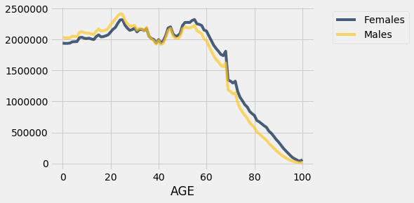

```python
# Run this cell to import libraries needed to run the examples
from datascience import *
import numpy as np

%matplotlib inline
import matplotlib.pyplot as plots
plots.style.use('fivethirtyeight')
```

## Census

**Please run all cells before this cell, including the import cell at the top of the notebook.**


```python
data = 'http://www2.census.gov/programs-surveys/popest/datasets/2010-2015/national/asrh/nc-est2015-agesex-res.csv'

# A copy can be accessed here in case census.gov moves the file:
# data = 'http://inferentialthinking.com/notebooks/nc-est2015-agesex-res.csv'

# Documentation is online here:
# https://www2.census.gov/programs-surveys/popest/technical-documentation/file-layouts/2010-2015/nc-est2015-agesex-res.pdf

full = Table.read_table('census.csv')
full
```


<table border="1" class="dataframe">
    <thead>
        <tr>
            <th>SEX</th> <th>AGE</th> <th>CENSUS2010POP</th> <th>ESTIMATESBASE2010</th> <th>POPESTIMATE2010</th> <th>POPESTIMATE2011</th> <th>POPESTIMATE2012</th> <th>POPESTIMATE2013</th> <th>POPESTIMATE2014</th> <th>POPESTIMATE2015</th>
        </tr>
    </thead>
    <tbody>
        <tr>
            <td>0   </td> <td>0   </td> <td>3944153      </td> <td>3944160          </td> <td>3951330        </td> <td>3963087        </td> <td>3926540        </td> <td>3931141        </td> <td>3949775        </td> <td>3978038        </td>
        </tr>
    </tbody>
        <tr>
            <td>0   </td> <td>1   </td> <td>3978070      </td> <td>3978090          </td> <td>3957888        </td> <td>3966551        </td> <td>3977939        </td> <td>3942872        </td> <td>3949776        </td> <td>3968564        </td>
        </tr>
    </tbody>
        <tr>
            <td>0   </td> <td>2   </td> <td>4096929      </td> <td>4096939          </td> <td>4090862        </td> <td>3971565        </td> <td>3980095        </td> <td>3992720        </td> <td>3959664        </td> <td>3966583        </td>
        </tr>
    </tbody>
        <tr>
            <td>0   </td> <td>3   </td> <td>4119040      </td> <td>4119051          </td> <td>4111920        </td> <td>4102470        </td> <td>3983157        </td> <td>3992734        </td> <td>4007079        </td> <td>3974061        </td>
        </tr>
    </tbody>
        <tr>
            <td>0   </td> <td>4   </td> <td>4063170      </td> <td>4063186          </td> <td>4077551        </td> <td>4122294        </td> <td>4112849        </td> <td>3994449        </td> <td>4005716        </td> <td>4020035        </td>
        </tr>
    </tbody>
        <tr>
            <td>0   </td> <td>5   </td> <td>4056858      </td> <td>4056872          </td> <td>4064653        </td> <td>4087709        </td> <td>4132242        </td> <td>4123626        </td> <td>4006900        </td> <td>4018158        </td>
        </tr>
    </tbody>
        <tr>
            <td>0   </td> <td>6   </td> <td>4066381      </td> <td>4066412          </td> <td>4073013        </td> <td>4074993        </td> <td>4097605        </td> <td>4142916        </td> <td>4135930        </td> <td>4019207        </td>
        </tr>
    </tbody>
        <tr>
            <td>0   </td> <td>7   </td> <td>4030579      </td> <td>4030594          </td> <td>4043046        </td> <td>4083225        </td> <td>4084913        </td> <td>4108349        </td> <td>4155326        </td> <td>4148360        </td>
        </tr>
    </tbody>
        <tr>
            <td>0   </td> <td>8   </td> <td>4046486      </td> <td>4046497          </td> <td>4025604        </td> <td>4053203        </td> <td>4093177        </td> <td>4095711        </td> <td>4120903        </td> <td>4167887        </td>
        </tr>
    </tbody>
        <tr>
            <td>0   </td> <td>9   </td> <td>4148353      </td> <td>4148369          </td> <td>4125415        </td> <td>4035710        </td> <td>4063152        </td> <td>4104072        </td> <td>4108349        </td> <td>4133564        </td>
        </tr>
    </tbody>
</table>
<p>... (296 rows omitted)</p>


```python
partial = full.select('SEX', 'AGE', 4, 9)
partial
```


<table border="1" class="dataframe">
    <thead>
        <tr>
            <th>SEX</th> <th>AGE</th> <th>POPESTIMATE2010</th> <th>POPESTIMATE2015</th>
        </tr>
    </thead>
    <tbody>
        <tr>
            <td>0   </td> <td>0   </td> <td>3951330        </td> <td>3978038        </td>
        </tr>
    </tbody>
        <tr>
            <td>0   </td> <td>1   </td> <td>3957888        </td> <td>3968564        </td>
        </tr>
    </tbody>
        <tr>
            <td>0   </td> <td>2   </td> <td>4090862        </td> <td>3966583        </td>
        </tr>
    </tbody>
        <tr>
            <td>0   </td> <td>3   </td> <td>4111920        </td> <td>3974061        </td>
        </tr>
    </tbody>
        <tr>
            <td>0   </td> <td>4   </td> <td>4077551        </td> <td>4020035        </td>
        </tr>
    </tbody>
        <tr>
            <td>0   </td> <td>5   </td> <td>4064653        </td> <td>4018158        </td>
        </tr>
    </tbody>
        <tr>
            <td>0   </td> <td>6   </td> <td>4073013        </td> <td>4019207        </td>
        </tr>
    </tbody>
        <tr>
            <td>0   </td> <td>7   </td> <td>4043046        </td> <td>4148360        </td>
        </tr>
    </tbody>
        <tr>
            <td>0   </td> <td>8   </td> <td>4025604        </td> <td>4167887        </td>
        </tr>
    </tbody>
        <tr>
            <td>0   </td> <td>9   </td> <td>4125415        </td> <td>4133564        </td>
        </tr>
    </tbody>
</table>
<p>... (296 rows omitted)</p>


```python
us_pop = partial.relabeled(2, '2010').relabeled(3, '2015')
us_pop
```


<table border="1" class="dataframe">
    <thead>
        <tr>
            <th>SEX</th> <th>AGE</th> <th>2010</th> <th>2015</th>
        </tr>
    </thead>
    <tbody>
        <tr>
            <td>0   </td> <td>0   </td> <td>3951330</td> <td>3978038</td>
        </tr>
    </tbody>
        <tr>
            <td>0   </td> <td>1   </td> <td>3957888</td> <td>3968564</td>
        </tr>
    </tbody>
        <tr>
            <td>0   </td> <td>2   </td> <td>4090862</td> <td>3966583</td>
        </tr>
    </tbody>
        <tr>
            <td>0   </td> <td>3   </td> <td>4111920</td> <td>3974061</td>
        </tr>
    </tbody>
        <tr>
            <td>0   </td> <td>4   </td> <td>4077551</td> <td>4020035</td>
        </tr>
    </tbody>
        <tr>
            <td>0   </td> <td>5   </td> <td>4064653</td> <td>4018158</td>
        </tr>
    </tbody>
        <tr>
            <td>0   </td> <td>6   </td> <td>4073013</td> <td>4019207</td>
        </tr>
    </tbody>
        <tr>
            <td>0   </td> <td>7   </td> <td>4043046</td> <td>4148360</td>
        </tr>
    </tbody>
        <tr>
            <td>0   </td> <td>8   </td> <td>4025604</td> <td>4167887</td>
        </tr>
    </tbody>
        <tr>
            <td>0   </td> <td>9   </td> <td>4125415</td> <td>4133564</td>
        </tr>
    </tbody>
</table>
<p>... (296 rows omitted)</p>


```python
us_pop.set_format([2, 3], NumberFormatter)
```


<table border="1" class="dataframe">
    <thead>
        <tr>
            <th>SEX</th> <th>AGE</th> <th>2010</th> <th>2015</th>
        </tr>
    </thead>
    <tbody>
        <tr>
            <td>0   </td> <td>0   </td> <td>3,951,330</td> <td>3,978,038</td>
        </tr>
    </tbody>
        <tr>
            <td>0   </td> <td>1   </td> <td>3,957,888</td> <td>3,968,564</td>
        </tr>
    </tbody>
        <tr>
            <td>0   </td> <td>2   </td> <td>4,090,862</td> <td>3,966,583</td>
        </tr>
    </tbody>
        <tr>
            <td>0   </td> <td>3   </td> <td>4,111,920</td> <td>3,974,061</td>
        </tr>
    </tbody>
        <tr>
            <td>0   </td> <td>4   </td> <td>4,077,551</td> <td>4,020,035</td>
        </tr>
    </tbody>
        <tr>
            <td>0   </td> <td>5   </td> <td>4,064,653</td> <td>4,018,158</td>
        </tr>
    </tbody>
        <tr>
            <td>0   </td> <td>6   </td> <td>4,073,013</td> <td>4,019,207</td>
        </tr>
    </tbody>
        <tr>
            <td>0   </td> <td>7   </td> <td>4,043,046</td> <td>4,148,360</td>
        </tr>
    </tbody>
        <tr>
            <td>0   </td> <td>8   </td> <td>4,025,604</td> <td>4,167,887</td>
        </tr>
    </tbody>
        <tr>
            <td>0   </td> <td>9   </td> <td>4,125,415</td> <td>4,133,564</td>
        </tr>
    </tbody>
</table>
<p>... (296 rows omitted)</p>


## Column Arithmetic

**Please run all cells before this cell, including the previous examples and the import cell at the top of the notebook.**


```python
2015 - 2010
```


    5


```python
'2015' - '2010'
```


    ---------------------------------------------------------------------------

    TypeError                                 Traceback (most recent call last)

    <ipython-input-7-7ad33c45c0af> in <module>()
    ----> 1 '2015' - '2010'
    

    TypeError: unsupported operand type(s) for -: 'str' and 'str'


```python
us_pop.column('2015') - us_pop.column('2010')
```


    array([   26708,    10676,  -124279,  -137859,   -57516,   -46495,
             -53806,   105314,   142283,     8149,   -65773,    14817,
             -12258,   -35360,    39772,    18740,  -128956,  -182081,
            -273010,  -308827,  -205077,    68834,   242467,   435038,
             493743,   440136,   383610,   202740,   117128,   172853,
             112970,   235717,   376012,   408173,   472649,   431069,
             278576,   131637,   -93087,  -453601,  -397641,  -298250,
            -158454,     6864,   156657,   -49214,  -369143,  -461788,
            -456974,  -446546,  -245943,   -19310,    -6240,    24091,
             228080,   294415,   305984,   424727,   518075,   469416,
             509071,   434492,   306876,     -774,   830101,   771518,
             722799,   610480,  1076541,   364917,   429913,   467584,
             585785,   395748,   267716,   207945,   240361,   189912,
              98631,    67159,    31471,   -11559,    -9403,     1122,
              28568,    42010,    24532,    53443,    53098,    50654,
              74710,    95876,    71818,    74742,    62343,    42934,
              25726,    23484,    14954,    11463,    22564, 12071957,
              16714,     8963,   -62081,   -70628,   -28388,   -25725,
             -28747,    53979,    74363,     4641,   -38224,     1945,
             -12869,   -22245,    13306,     2547,   -75761,  -107664,
            -149692,  -150514,   -91472,    48923,   143497,   236774,
             256590,   230384,   208652,   119425,    79757,   109247,
              63968,   126326,   195016,   211986,   239986,   224634,
             145889,    75926,   -44236,  -222140,  -200303,  -154838,
             -89471,     1380,    72631,   -19421,  -173876,  -218338,
            -220223,  -209586,  -117860,    -7055,    -2073,    15525,
             114944,   153299,   158833,   214554,   253548,   229525,
             244788,   202256,   136854,   -12389,   387254,   365250,
             343545,   292815,   518230,   181244,   208599,   219844,
             278122,   188995,   127262,   103996,   121207,    97682,
              57079,    44202,    29024,    11918,    14822,    19176,
              30948,    36721,    28122,    33762,    32656,    27624,
              34080,    38579,    30372,    28478,    24308,    16279,
              10563,     8317,     5214,     3473,     5736,  6141254,
               9994,     1713,   -62198,   -67231,   -29128,   -20770,
             -25059,    51335,    67920,     3508,   -27549,    12872,
                611,   -13115,    26466,    16193,   -53195,   -74417,
            -123318,  -158313,  -113605,    19911,    98970,   198264,
             237153,   209752,   174958,    83315,    37371,    63606,
              49002,   109391,   180996,   196187,   232663,   206435,
             132687,    55711,   -48851,  -231461,  -197338,  -143412,
             -68983,     5484,    84026,   -29793,  -195267,  -243450,
            -236751,  -236960,  -128083,   -12255,    -4167,     8566,
             113136,   141116,   147151,   210173,   264527,   239891,
             264283,   232236,   170022,    11615,   442847,   406268,
             379254,   317665,   558311,   183673,   221314,   247740,
             307663,   206753,   140454,   103949,   119154,    92230,
              41552,    22957,     2447,   -23477,   -24225,   -18054,
              -2380,     5289,    -3590,    19681,    20442,    23030,
              40630,    57297,    41446,    46264,    38035,    26655,
              15163,    15167,     9740,     7990,    16828,  5930703])


```python
change = us_pop.column('2015') - us_pop.column('2010')
census = us_pop.with_columns(
    'Change', change,
    'Total Growth', change / us_pop.column('2010')
)
census.set_format('Change', NumberFormatter)
census.set_format('Total Growth', PercentFormatter)
```


<table border="1" class="dataframe">
    <thead>
        <tr>
            <th>SEX</th> <th>AGE</th> <th>2010</th> <th>2015</th> <th>Change</th> <th>Total Growth</th>
        </tr>
    </thead>
    <tbody>
        <tr>
            <td>0   </td> <td>0   </td> <td>3,951,330</td> <td>3,978,038</td> <td>26,708  </td> <td>0.68%       </td>
        </tr>
    </tbody>
        <tr>
            <td>0   </td> <td>1   </td> <td>3,957,888</td> <td>3,968,564</td> <td>10,676  </td> <td>0.27%       </td>
        </tr>
    </tbody>
        <tr>
            <td>0   </td> <td>2   </td> <td>4,090,862</td> <td>3,966,583</td> <td>-124,279</td> <td>-3.04%      </td>
        </tr>
    </tbody>
        <tr>
            <td>0   </td> <td>3   </td> <td>4,111,920</td> <td>3,974,061</td> <td>-137,859</td> <td>-3.35%      </td>
        </tr>
    </tbody>
        <tr>
            <td>0   </td> <td>4   </td> <td>4,077,551</td> <td>4,020,035</td> <td>-57,516 </td> <td>-1.41%      </td>
        </tr>
    </tbody>
        <tr>
            <td>0   </td> <td>5   </td> <td>4,064,653</td> <td>4,018,158</td> <td>-46,495 </td> <td>-1.14%      </td>
        </tr>
    </tbody>
        <tr>
            <td>0   </td> <td>6   </td> <td>4,073,013</td> <td>4,019,207</td> <td>-53,806 </td> <td>-1.32%      </td>
        </tr>
    </tbody>
        <tr>
            <td>0   </td> <td>7   </td> <td>4,043,046</td> <td>4,148,360</td> <td>105,314 </td> <td>2.60%       </td>
        </tr>
    </tbody>
        <tr>
            <td>0   </td> <td>8   </td> <td>4,025,604</td> <td>4,167,887</td> <td>142,283 </td> <td>3.53%       </td>
        </tr>
    </tbody>
        <tr>
            <td>0   </td> <td>9   </td> <td>4,125,415</td> <td>4,133,564</td> <td>8,149   </td> <td>0.20%       </td>
        </tr>
    </tbody>
</table>
<p>... (296 rows omitted)</p>


## Accessing Values

**Please run all cells before this cell, including the previous examples and the import cell at the top of the notebook.**


```python
census.sort('Change', descending=True)
```


<table border="1" class="dataframe">
    <thead>
        <tr>
            <th>SEX</th> <th>AGE</th> <th>2010</th> <th>2015</th> <th>Change</th> <th>Total Growth</th>
        </tr>
    </thead>
    <tbody>
        <tr>
            <td>0   </td> <td>999 </td> <td>309,346,863</td> <td>321,418,820</td> <td>12,071,957</td> <td>3.90%       </td>
        </tr>
    </tbody>
        <tr>
            <td>1   </td> <td>999 </td> <td>152,088,043</td> <td>158,229,297</td> <td>6,141,254 </td> <td>4.04%       </td>
        </tr>
    </tbody>
        <tr>
            <td>2   </td> <td>999 </td> <td>157,258,820</td> <td>163,189,523</td> <td>5,930,703 </td> <td>3.77%       </td>
        </tr>
    </tbody>
        <tr>
            <td>0   </td> <td>68  </td> <td>2,359,816  </td> <td>3,436,357  </td> <td>1,076,541 </td> <td>45.62%      </td>
        </tr>
    </tbody>
        <tr>
            <td>0   </td> <td>64  </td> <td>2,706,055  </td> <td>3,536,156  </td> <td>830,101   </td> <td>30.68%      </td>
        </tr>
    </tbody>
        <tr>
            <td>0   </td> <td>65  </td> <td>2,678,525  </td> <td>3,450,043  </td> <td>771,518   </td> <td>28.80%      </td>
        </tr>
    </tbody>
        <tr>
            <td>0   </td> <td>66  </td> <td>2,621,335  </td> <td>3,344,134  </td> <td>722,799   </td> <td>27.57%      </td>
        </tr>
    </tbody>
        <tr>
            <td>0   </td> <td>67  </td> <td>2,693,707  </td> <td>3,304,187  </td> <td>610,480   </td> <td>22.66%      </td>
        </tr>
    </tbody>
        <tr>
            <td>0   </td> <td>72  </td> <td>1,883,820  </td> <td>2,469,605  </td> <td>585,785   </td> <td>31.10%      </td>
        </tr>
    </tbody>
        <tr>
            <td>2   </td> <td>68  </td> <td>1,254,117  </td> <td>1,812,428  </td> <td>558,311   </td> <td>44.52%      </td>
        </tr>
    </tbody>
</table>
<p>... (296 rows omitted)</p>


```python
sum(census.column('2010')) 
```


    1237387452


```python
(321418820/309346863)
```


    1.0390240162222042


```python
(321418820/309346863) ** (1/5) - 1
```


    0.007685750230353783


```python
everyone = census.sort('Change', descending=True).row(0)
everyone
```


    Row(SEX=0, AGE=999, 2010=309346863, 2015=321418820, Change=12071957, Total Growth=0.039024016222204264)


```python
type(everyone)
```


    datascience.tables.Row


```python
(everyone.item(3)/everyone.item(2)) ** (1/5) - 1
```


    0.007685750230353783


```python
five_year_growth = everyone.item(5)
(five_year_growth + 1) ** (1/5) - 1
```


    0.007685750230353783


```python
census = census.with_column(
    'Annual Growth', (census.column(5) + 1) ** (1/5) - 1
)
census.set_format(6, PercentFormatter)
```


<table border="1" class="dataframe">
    <thead>
        <tr>
            <th>SEX</th> <th>AGE</th> <th>2010</th> <th>2015</th> <th>Change</th> <th>Total Growth</th> <th>Annual Growth</th>
        </tr>
    </thead>
    <tbody>
        <tr>
            <td>0   </td> <td>0   </td> <td>3,951,330</td> <td>3,978,038</td> <td>26,708  </td> <td>0.68%       </td> <td>0.13%        </td>
        </tr>
    </tbody>
        <tr>
            <td>0   </td> <td>1   </td> <td>3,957,888</td> <td>3,968,564</td> <td>10,676  </td> <td>0.27%       </td> <td>0.05%        </td>
        </tr>
    </tbody>
        <tr>
            <td>0   </td> <td>2   </td> <td>4,090,862</td> <td>3,966,583</td> <td>-124,279</td> <td>-3.04%      </td> <td>-0.62%       </td>
        </tr>
    </tbody>
        <tr>
            <td>0   </td> <td>3   </td> <td>4,111,920</td> <td>3,974,061</td> <td>-137,859</td> <td>-3.35%      </td> <td>-0.68%       </td>
        </tr>
    </tbody>
        <tr>
            <td>0   </td> <td>4   </td> <td>4,077,551</td> <td>4,020,035</td> <td>-57,516 </td> <td>-1.41%      </td> <td>-0.28%       </td>
        </tr>
    </tbody>
        <tr>
            <td>0   </td> <td>5   </td> <td>4,064,653</td> <td>4,018,158</td> <td>-46,495 </td> <td>-1.14%      </td> <td>-0.23%       </td>
        </tr>
    </tbody>
        <tr>
            <td>0   </td> <td>6   </td> <td>4,073,013</td> <td>4,019,207</td> <td>-53,806 </td> <td>-1.32%      </td> <td>-0.27%       </td>
        </tr>
    </tbody>
        <tr>
            <td>0   </td> <td>7   </td> <td>4,043,046</td> <td>4,148,360</td> <td>105,314 </td> <td>2.60%       </td> <td>0.52%        </td>
        </tr>
    </tbody>
        <tr>
            <td>0   </td> <td>8   </td> <td>4,025,604</td> <td>4,167,887</td> <td>142,283 </td> <td>3.53%       </td> <td>0.70%        </td>
        </tr>
    </tbody>
        <tr>
            <td>0   </td> <td>9   </td> <td>4,125,415</td> <td>4,133,564</td> <td>8,149   </td> <td>0.20%       </td> <td>0.04%        </td>
        </tr>
    </tbody>
</table>
<p>... (296 rows omitted)</p>


```python
census.sort('Change', descending=True)
```


<table border="1" class="dataframe">
    <thead>
        <tr>
            <th>SEX</th> <th>AGE</th> <th>2010</th> <th>2015</th> <th>Change</th> <th>Total Growth</th> <th>Annual Growth</th>
        </tr>
    </thead>
    <tbody>
        <tr>
            <td>0   </td> <td>999 </td> <td>309,346,863</td> <td>321,418,820</td> <td>12,071,957</td> <td>3.90%       </td> <td>0.77%        </td>
        </tr>
    </tbody>
        <tr>
            <td>1   </td> <td>999 </td> <td>152,088,043</td> <td>158,229,297</td> <td>6,141,254 </td> <td>4.04%       </td> <td>0.79%        </td>
        </tr>
    </tbody>
        <tr>
            <td>2   </td> <td>999 </td> <td>157,258,820</td> <td>163,189,523</td> <td>5,930,703 </td> <td>3.77%       </td> <td>0.74%        </td>
        </tr>
    </tbody>
        <tr>
            <td>0   </td> <td>68  </td> <td>2,359,816  </td> <td>3,436,357  </td> <td>1,076,541 </td> <td>45.62%      </td> <td>7.81%        </td>
        </tr>
    </tbody>
        <tr>
            <td>0   </td> <td>64  </td> <td>2,706,055  </td> <td>3,536,156  </td> <td>830,101   </td> <td>30.68%      </td> <td>5.50%        </td>
        </tr>
    </tbody>
        <tr>
            <td>0   </td> <td>65  </td> <td>2,678,525  </td> <td>3,450,043  </td> <td>771,518   </td> <td>28.80%      </td> <td>5.19%        </td>
        </tr>
    </tbody>
        <tr>
            <td>0   </td> <td>66  </td> <td>2,621,335  </td> <td>3,344,134  </td> <td>722,799   </td> <td>27.57%      </td> <td>4.99%        </td>
        </tr>
    </tbody>
        <tr>
            <td>0   </td> <td>67  </td> <td>2,693,707  </td> <td>3,304,187  </td> <td>610,480   </td> <td>22.66%      </td> <td>4.17%        </td>
        </tr>
    </tbody>
        <tr>
            <td>0   </td> <td>72  </td> <td>1,883,820  </td> <td>2,469,605  </td> <td>585,785   </td> <td>31.10%      </td> <td>5.56%        </td>
        </tr>
    </tbody>
        <tr>
            <td>2   </td> <td>68  </td> <td>1,254,117  </td> <td>1,812,428  </td> <td>558,311   </td> <td>44.52%      </td> <td>7.64%        </td>
        </tr>
    </tbody>
</table>
<p>... (296 rows omitted)</p>


## Males & Females

**Please run all cells before this cell, including the previous examples and the import cell at the top of the notebook.**


```python
us_pop_2015 = us_pop.drop('2010').where('AGE', are.below(999)).where('SEX', are.above(0))
us_pop_2015
```


<table border="1" class="dataframe">
    <thead>
        <tr>
            <th>SEX</th> <th>AGE</th> <th>2015</th>
        </tr>
    </thead>
    <tbody>
        <tr>
            <td>1   </td> <td>0   </td> <td>2,035,134</td>
        </tr>
    </tbody>
        <tr>
            <td>1   </td> <td>1   </td> <td>2,029,295</td>
        </tr>
    </tbody>
        <tr>
            <td>1   </td> <td>2   </td> <td>2,026,604</td>
        </tr>
    </tbody>
        <tr>
            <td>1   </td> <td>3   </td> <td>2,030,644</td>
        </tr>
    </tbody>
        <tr>
            <td>1   </td> <td>4   </td> <td>2,055,924</td>
        </tr>
    </tbody>
        <tr>
            <td>1   </td> <td>5   </td> <td>2,050,848</td>
        </tr>
    </tbody>
        <tr>
            <td>1   </td> <td>6   </td> <td>2,050,663</td>
        </tr>
    </tbody>
        <tr>
            <td>1   </td> <td>7   </td> <td>2,117,118</td>
        </tr>
    </tbody>
        <tr>
            <td>1   </td> <td>8   </td> <td>2,128,825</td>
        </tr>
    </tbody>
        <tr>
            <td>1   </td> <td>9   </td> <td>2,111,678</td>
        </tr>
    </tbody>
</table>
<p>... (192 rows omitted)</p>


```python
sum(us_pop_2015.column(2))
```


    321418820


```python
males = us_pop_2015.where('SEX', 1).column('2015')
by_sex = us_pop_2015.where('SEX', 2).drop('SEX').relabeled('2015', 'Females').with_column('Males', males)
by_sex.set_format('Males', NumberFormatter)
```


<table border="1" class="dataframe">
    <thead>
        <tr>
            <th>AGE</th> <th>Females</th> <th>Males</th>
        </tr>
    </thead>
    <tbody>
        <tr>
            <td>0   </td> <td>1,942,904</td> <td>2,035,134</td>
        </tr>
    </tbody>
        <tr>
            <td>1   </td> <td>1,939,269</td> <td>2,029,295</td>
        </tr>
    </tbody>
        <tr>
            <td>2   </td> <td>1,939,979</td> <td>2,026,604</td>
        </tr>
    </tbody>
        <tr>
            <td>3   </td> <td>1,943,417</td> <td>2,030,644</td>
        </tr>
    </tbody>
        <tr>
            <td>4   </td> <td>1,964,111</td> <td>2,055,924</td>
        </tr>
    </tbody>
        <tr>
            <td>5   </td> <td>1,967,310</td> <td>2,050,848</td>
        </tr>
    </tbody>
        <tr>
            <td>6   </td> <td>1,968,544</td> <td>2,050,663</td>
        </tr>
    </tbody>
        <tr>
            <td>7   </td> <td>2,031,242</td> <td>2,117,118</td>
        </tr>
    </tbody>
        <tr>
            <td>8   </td> <td>2,039,062</td> <td>2,128,825</td>
        </tr>
    </tbody>
        <tr>
            <td>9   </td> <td>2,021,886</td> <td>2,111,678</td>
        </tr>
    </tbody>
</table>
<p>... (91 rows omitted)</p>


```python
by_sex.plot(0)
```




