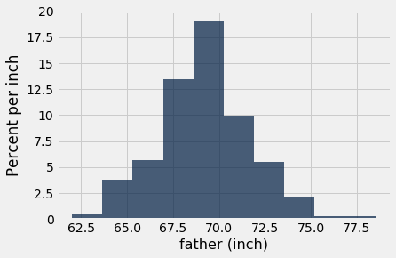
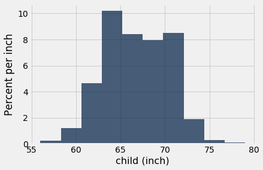
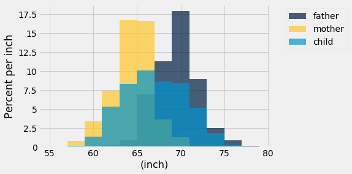
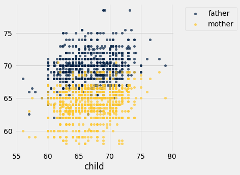
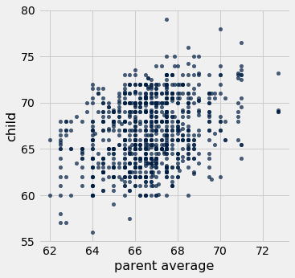
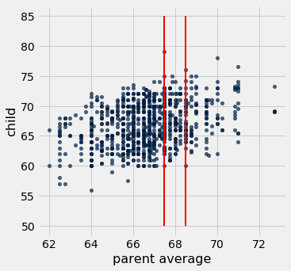
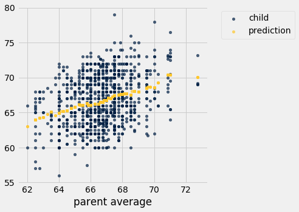

```python
from datascience import *
import numpy as np

%matplotlib inline
import matplotlib.pyplot as plots
plots.style.use('fivethirtyeight')
```

## Overlaid Histograms

**Please run all cells before this cell, including the import cell at the top of the notebook.**


```python
height = Table.read_table('galton.csv').select(1, 2, 7).relabeled(2, 'child')
height.show(6)
```


<table border="1" class="dataframe">
    <thead>
        <tr>
            <th>father</th> <th>mother</th> <th>child</th>
        </tr>
    </thead>
    <tbody>
        <tr>
            <td>78.5  </td> <td>67    </td> <td>73.2 </td>
        </tr>
    </tbody>
        <tr>
            <td>78.5  </td> <td>67    </td> <td>69.2 </td>
        </tr>
    </tbody>
        <tr>
            <td>78.5  </td> <td>67    </td> <td>69   </td>
        </tr>
    </tbody>
        <tr>
            <td>78.5  </td> <td>67    </td> <td>69   </td>
        </tr>
    </tbody>
        <tr>
            <td>75.5  </td> <td>66.5  </td> <td>73.5 </td>
        </tr>
    </tbody>
        <tr>
            <td>75.5  </td> <td>66.5  </td> <td>72.5 </td>
        </tr>
    </tbody>
</table>
<p>... (928 rows omitted)</p>


```python
height.hist('father', unit='inch')
```

    /usr/local/lib/python3.6/dist-packages/matplotlib/axes/_axes.py:6462: UserWarning: The 'normed' kwarg is deprecated, and has been replaced by the 'density' kwarg.
      warnings.warn("The 'normed' kwarg is deprecated, and has been "





```python
height.hist('child', unit='inch')
```

    /usr/local/lib/python3.6/dist-packages/matplotlib/axes/_axes.py:6462: UserWarning: The 'normed' kwarg is deprecated, and has been replaced by the 'density' kwarg.
      warnings.warn("The 'normed' kwarg is deprecated, and has been "





```python
height.hist(unit='inch', bins=np.arange(55, 80, 2))
```

    /usr/local/lib/python3.6/dist-packages/matplotlib/axes/_axes.py:6462: UserWarning: The 'normed' kwarg is deprecated, and has been replaced by the 'density' kwarg.
      warnings.warn("The 'normed' kwarg is deprecated, and has been "





## Functions

**Please run all cells before this cell, including the previous example cells and the import cell at the top of the notebook.**


```python
def double(x):
    """ Double x """
    return 2*x
```


```python
double(3)
```


    6


```python
double(-4)
```


    -8


```python
y = 5
double(y/4)
```


    2.5


```python
y
```


    5


```python
double(y)
```


    10


```python
y
```


    5


```python
z = double(y)
```


```python
z
```


    10


```python
counts = make_array(1, 2, 3)
total = sum(counts)
np.round((counts/total)*100, 2)
```


    array([16.67, 33.33, 50.  ])


```python
def printThis(x, y="not set"):
    print("x is " + str(x) + " and y is " + str(y)  )
    return 
```


```python
printThis("pp")
```

    x is pp and y is not set


```python
printThis("val1", "val23")
```

    x is val1 and y is val23


```python
def percents(s):
    """Convert the counts to percents out of the total."""
    total = sum(s)
    return np.round((s/total)*100, 2)
```


```python
percents(counts)
```


    array([16.67, 33.33, 50.  ])


```python
myArray=make_array(99,10,3)
percents(myArray)
```


    array([88.39,  8.93,  2.68])


```python
percents(make_array(1, 1, 1, 1))
```


    array([25., 25., 25., 25.])


```python
counts
```


    array([1, 2, 3])


```python
# percents(2)
```


```python
# sum(2)
```

* setting default vaults is done with = after the variable.   so if the funtion is called without supplying a vaule the
default is used.


```python
def percents(counts, decimal_places=2):
    """Convert the counts to percents out of the total."""
    total = sum(counts)
    return np.round((counts/total)*100, decimal_places)

parts = make_array(2, 1, 4)
print("Rounded to 1 decimal place:", percents(parts, 1), "or", percents(parts, decimal_places=1))
print("Rounded to the default number of decimal places:", percents(parts))
```

    Rounded to 1 decimal place: [28.6 14.3 57.1] or [28.6 14.3 57.1]
    Rounded to the default number of decimal places: [28.57 14.29 57.14]


```python
#GETTING help in Python on functions is as simple as typing: help functionName
help(percents)
# Notice it prints the text you typed between """    """
```

    Help on function percents in module __main__:
    
    percents(counts, decimal_places=2)
        Convert the counts to percents out of the total.
    


## Apply

* The apply method creates an array by calling a function on every element in the input column(s)
* table_name.apply(function_name, 'column_lable')
* First argument: Which functions to apply
* Other arguments: The input columsn


```python
def cut_off_at_a_billion(x):
    """The smaller of x and 1,000,000,000"""
    return min(x, 1e9)
```


```python
cut_off_at_a_billion(12)
```


    12


```python
cut_off_at_a_billion(123456)
```


    123456


```python
cut_off_at_a_billion(1234567890)
```


    1000000000.0


```python
top = Table.read_table('top_movies_2017.csv').where('Studio', 'Fox')
top
```


<table border="1" class="dataframe">
    <thead>
        <tr>
            <th>Title</th> <th>Studio</th> <th>Gross</th> <th>Gross (Adjusted)</th> <th>Year</th>
        </tr>
    </thead>
    <tbody>
        <tr>
            <td>Star Wars                                </td> <td>Fox   </td> <td>460998007</td> <td>1583483200      </td> <td>1977</td>
        </tr>
    </tbody>
        <tr>
            <td>The Sound of Music                       </td> <td>Fox   </td> <td>158671368</td> <td>1266072700      </td> <td>1965</td>
        </tr>
    </tbody>
        <tr>
            <td>The Empire Strikes Back                  </td> <td>Fox   </td> <td>290475067</td> <td>872825900       </td> <td>1980</td>
        </tr>
    </tbody>
        <tr>
            <td>Avatar                                   </td> <td>Fox   </td> <td>760507625</td> <td>865082100       </td> <td>2009</td>
        </tr>
    </tbody>
        <tr>
            <td>Return of the Jedi                       </td> <td>Fox   </td> <td>309306177</td> <td>836188200       </td> <td>1983</td>
        </tr>
    </tbody>
        <tr>
            <td>Star Wars: Episode I - The Phantom Menace</td> <td>Fox   </td> <td>474544677</td> <td>802874300       </td> <td>1999</td>
        </tr>
    </tbody>
        <tr>
            <td>Butch Cassidy and the Sundance Kid       </td> <td>Fox   </td> <td>102308889</td> <td>627259300       </td> <td>1969</td>
        </tr>
    </tbody>
        <tr>
            <td>Independence Day                         </td> <td>Fox   </td> <td>306169268</td> <td>615800300       </td> <td>1996</td>
        </tr>
    </tbody>
        <tr>
            <td>Home Alone                               </td> <td>Fox   </td> <td>285761243</td> <td>602157000       </td> <td>1990</td>
        </tr>
    </tbody>
        <tr>
            <td>Cleopatra (1963)                         </td> <td>Fox   </td> <td>57777778 </td> <td>597261000       </td> <td>1963</td>
        </tr>
    </tbody>
</table>
<p>... (14 rows omitted)</p>


```python
cut_off = top.apply(cut_off_at_a_billion, 'Gross (Adjusted)')
top.with_column('Adjusted but cut', cut_off)
```


<table border="1" class="dataframe">
    <thead>
        <tr>
            <th>Title</th> <th>Studio</th> <th>Gross</th> <th>Gross (Adjusted)</th> <th>Year</th> <th>Adjusted but cut</th>
        </tr>
    </thead>
    <tbody>
        <tr>
            <td>Star Wars                                </td> <td>Fox   </td> <td>460998007</td> <td>1583483200      </td> <td>1977</td> <td>1e+09           </td>
        </tr>
    </tbody>
        <tr>
            <td>The Sound of Music                       </td> <td>Fox   </td> <td>158671368</td> <td>1266072700      </td> <td>1965</td> <td>1e+09           </td>
        </tr>
    </tbody>
        <tr>
            <td>The Empire Strikes Back                  </td> <td>Fox   </td> <td>290475067</td> <td>872825900       </td> <td>1980</td> <td>8.72826e+08     </td>
        </tr>
    </tbody>
        <tr>
            <td>Avatar                                   </td> <td>Fox   </td> <td>760507625</td> <td>865082100       </td> <td>2009</td> <td>8.65082e+08     </td>
        </tr>
    </tbody>
        <tr>
            <td>Return of the Jedi                       </td> <td>Fox   </td> <td>309306177</td> <td>836188200       </td> <td>1983</td> <td>8.36188e+08     </td>
        </tr>
    </tbody>
        <tr>
            <td>Star Wars: Episode I - The Phantom Menace</td> <td>Fox   </td> <td>474544677</td> <td>802874300       </td> <td>1999</td> <td>8.02874e+08     </td>
        </tr>
    </tbody>
        <tr>
            <td>Butch Cassidy and the Sundance Kid       </td> <td>Fox   </td> <td>102308889</td> <td>627259300       </td> <td>1969</td> <td>6.27259e+08     </td>
        </tr>
    </tbody>
        <tr>
            <td>Independence Day                         </td> <td>Fox   </td> <td>306169268</td> <td>615800300       </td> <td>1996</td> <td>6.158e+08       </td>
        </tr>
    </tbody>
        <tr>
            <td>Home Alone                               </td> <td>Fox   </td> <td>285761243</td> <td>602157000       </td> <td>1990</td> <td>6.02157e+08     </td>
        </tr>
    </tbody>
        <tr>
            <td>Cleopatra (1963)                         </td> <td>Fox   </td> <td>57777778 </td> <td>597261000       </td> <td>1963</td> <td>5.97261e+08     </td>
        </tr>
    </tbody>
</table>
<p>... (14 rows omitted)</p>


```python
cut_off_at_a_billion
```


    <function __main__.cut_off_at_a_billion>


```python
type(cut_off_at_a_billion)
```


    function


```python
help(cut_off_at_a_billion)
```

    Help on function cut_off_at_a_billion in module __main__:
    
    cut_off_at_a_billion(x)
        The smaller of x and 1,000,000,000
    


## Prediction

**Please run all cells before this cell, including the previous example cells and the import cell at the top of the notebook.**


```python
height
```


<table border="1" class="dataframe">
    <thead>
        <tr>
            <th>father</th> <th>mother</th> <th>child</th>
        </tr>
    </thead>
    <tbody>
        <tr>
            <td>78.5  </td> <td>67    </td> <td>73.2 </td>
        </tr>
    </tbody>
        <tr>
            <td>78.5  </td> <td>67    </td> <td>69.2 </td>
        </tr>
    </tbody>
        <tr>
            <td>78.5  </td> <td>67    </td> <td>69   </td>
        </tr>
    </tbody>
        <tr>
            <td>78.5  </td> <td>67    </td> <td>69   </td>
        </tr>
    </tbody>
        <tr>
            <td>75.5  </td> <td>66.5  </td> <td>73.5 </td>
        </tr>
    </tbody>
        <tr>
            <td>75.5  </td> <td>66.5  </td> <td>72.5 </td>
        </tr>
    </tbody>
        <tr>
            <td>75.5  </td> <td>66.5  </td> <td>65.5 </td>
        </tr>
    </tbody>
        <tr>
            <td>75.5  </td> <td>66.5  </td> <td>65.5 </td>
        </tr>
    </tbody>
        <tr>
            <td>75    </td> <td>64    </td> <td>71   </td>
        </tr>
    </tbody>
        <tr>
            <td>75    </td> <td>64    </td> <td>68   </td>
        </tr>
    </tbody>
</table>
<p>... (924 rows omitted)</p>


```python
height.scatter(2)
```





```python
height = height.with_column(
    'parent average', (height.column('mother') + height.column('father')) / 2
)
height
```


<table border="1" class="dataframe">
    <thead>
        <tr>
            <th>father</th> <th>mother</th> <th>child</th> <th>parent average</th>
        </tr>
    </thead>
    <tbody>
        <tr>
            <td>78.5  </td> <td>67    </td> <td>73.2 </td> <td>72.75         </td>
        </tr>
    </tbody>
        <tr>
            <td>78.5  </td> <td>67    </td> <td>69.2 </td> <td>72.75         </td>
        </tr>
    </tbody>
        <tr>
            <td>78.5  </td> <td>67    </td> <td>69   </td> <td>72.75         </td>
        </tr>
    </tbody>
        <tr>
            <td>78.5  </td> <td>67    </td> <td>69   </td> <td>72.75         </td>
        </tr>
    </tbody>
        <tr>
            <td>75.5  </td> <td>66.5  </td> <td>73.5 </td> <td>71            </td>
        </tr>
    </tbody>
        <tr>
            <td>75.5  </td> <td>66.5  </td> <td>72.5 </td> <td>71            </td>
        </tr>
    </tbody>
        <tr>
            <td>75.5  </td> <td>66.5  </td> <td>65.5 </td> <td>71            </td>
        </tr>
    </tbody>
        <tr>
            <td>75.5  </td> <td>66.5  </td> <td>65.5 </td> <td>71            </td>
        </tr>
    </tbody>
        <tr>
            <td>75    </td> <td>64    </td> <td>71   </td> <td>69.5          </td>
        </tr>
    </tbody>
        <tr>
            <td>75    </td> <td>64    </td> <td>68   </td> <td>69.5          </td>
        </tr>
    </tbody>
</table>
<p>... (924 rows omitted)</p>


```python
height.scatter('parent average', 'child')
```





```python
height.scatter('parent average', 'child')
_ = plots.plot([67.5, 67.5], [50, 85], color='red', lw=2)
_ = plots.plot([68.5, 68.5], [50, 85], color='red', lw=2)
```





```python
close_to_68 = height.where('parent average', are.between(67.5, 68.5))
close_to_68
```


<table border="1" class="dataframe">
    <thead>
        <tr>
            <th>father</th> <th>mother</th> <th>child</th> <th>parent average</th>
        </tr>
    </thead>
    <tbody>
        <tr>
            <td>74    </td> <td>62    </td> <td>74   </td> <td>68            </td>
        </tr>
    </tbody>
        <tr>
            <td>74    </td> <td>62    </td> <td>70   </td> <td>68            </td>
        </tr>
    </tbody>
        <tr>
            <td>74    </td> <td>62    </td> <td>68   </td> <td>68            </td>
        </tr>
    </tbody>
        <tr>
            <td>74    </td> <td>62    </td> <td>67   </td> <td>68            </td>
        </tr>
    </tbody>
        <tr>
            <td>74    </td> <td>62    </td> <td>67   </td> <td>68            </td>
        </tr>
    </tbody>
        <tr>
            <td>74    </td> <td>62    </td> <td>66   </td> <td>68            </td>
        </tr>
    </tbody>
        <tr>
            <td>74    </td> <td>62    </td> <td>63.5 </td> <td>68            </td>
        </tr>
    </tbody>
        <tr>
            <td>74    </td> <td>62    </td> <td>63   </td> <td>68            </td>
        </tr>
    </tbody>
        <tr>
            <td>74    </td> <td>61    </td> <td>65   </td> <td>67.5          </td>
        </tr>
    </tbody>
        <tr>
            <td>73.2  </td> <td>63    </td> <td>62.7 </td> <td>68.1          </td>
        </tr>
    </tbody>
</table>
<p>... (175 rows omitted)</p>


```python
close_to_68.column('child').mean()
```


    67.62


```python
# pa stands for parent average
def predict_child(pa):
    close_points = height.where('parent average', are.between(pa - 0.5, pa + 0.5))
    return close_points.column('child').mean()                       
```


```python
predict_child(68)
```


    67.62


```python
predict_child(62)
```


    63.0


```python
height.with_column(
    'prediction', height.apply(predict_child, 'parent average'))
height
```


<table border="1" class="dataframe">
    <thead>
        <tr>
            <th>father</th> <th>mother</th> <th>child</th> <th>parent average</th>
        </tr>
    </thead>
    <tbody>
        <tr>
            <td>78.5  </td> <td>67    </td> <td>73.2 </td> <td>72.75         </td>
        </tr>
    </tbody>
        <tr>
            <td>78.5  </td> <td>67    </td> <td>69.2 </td> <td>72.75         </td>
        </tr>
    </tbody>
        <tr>
            <td>78.5  </td> <td>67    </td> <td>69   </td> <td>72.75         </td>
        </tr>
    </tbody>
        <tr>
            <td>78.5  </td> <td>67    </td> <td>69   </td> <td>72.75         </td>
        </tr>
    </tbody>
        <tr>
            <td>75.5  </td> <td>66.5  </td> <td>73.5 </td> <td>71            </td>
        </tr>
    </tbody>
        <tr>
            <td>75.5  </td> <td>66.5  </td> <td>72.5 </td> <td>71            </td>
        </tr>
    </tbody>
        <tr>
            <td>75.5  </td> <td>66.5  </td> <td>65.5 </td> <td>71            </td>
        </tr>
    </tbody>
        <tr>
            <td>75.5  </td> <td>66.5  </td> <td>65.5 </td> <td>71            </td>
        </tr>
    </tbody>
        <tr>
            <td>75    </td> <td>64    </td> <td>71   </td> <td>69.5          </td>
        </tr>
    </tbody>
        <tr>
            <td>75    </td> <td>64    </td> <td>68   </td> <td>69.5          </td>
        </tr>
    </tbody>
</table>
<p>... (924 rows omitted)</p>


```python
# Apply predict_child to all the midparent heights

height.with_column(
    'prediction', height.apply(predict_child, 'parent average')
).select(2, 3, 4).scatter('parent average')
```




