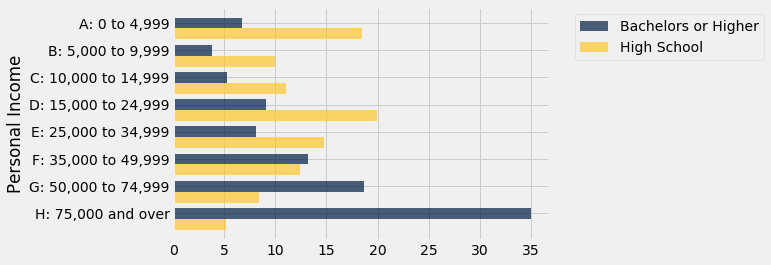

```python
from datascience import *
import numpy as np

%matplotlib inline
import matplotlib.pyplot as plots
plots.style.use('fivethirtyeight')
```

## One Attribute Group

* Grouping by column
* The grop method aggregates all rows with the same value for a column info a single row 
* First agrument: Which column by
* second arg: (Optional how to combin values
  ** len - number of groupsed values (default)
  ** list - list of all grouped vals
  ** sum - total of all grouped vals
  


```python
all_cones = Table.read_table('cones.csv')
cones = all_cones.drop('Color').exclude(5)
cones
```


<table border="1" class="dataframe">
    <thead>
        <tr>
            <th>Flavor</th> <th>Price</th>
        </tr>
    </thead>
    <tbody>
        <tr>
            <td>strawberry</td> <td>3.55 </td>
        </tr>
    </tbody>
        <tr>
            <td>chocolate </td> <td>4.75 </td>
        </tr>
    </tbody>
        <tr>
            <td>chocolate </td> <td>5.25 </td>
        </tr>
    </tbody>
        <tr>
            <td>strawberry</td> <td>5.25 </td>
        </tr>
    </tbody>
        <tr>
            <td>chocolate </td> <td>5.25 </td>
        </tr>
    </tbody>
</table>


```python
cones.group('Flavor')
```


<table border="1" class="dataframe">
    <thead>
        <tr>
            <th>Flavor</th> <th>count</th>
        </tr>
    </thead>
    <tbody>
        <tr>
            <td>chocolate </td> <td>3    </td>
        </tr>
    </tbody>
        <tr>
            <td>strawberry</td> <td>2    </td>
        </tr>
    </tbody>
</table>


```python
cones.group('Flavor', list)
```


<table border="1" class="dataframe">
    <thead>
        <tr>
            <th>Flavor</th> <th>Price list</th>
        </tr>
    </thead>
    <tbody>
        <tr>
            <td>chocolate </td> <td>[4.75, 5.25, 5.25]</td>
        </tr>
    </tbody>
        <tr>
            <td>strawberry</td> <td>[3.55, 5.25]      </td>
        </tr>
    </tbody>
</table>


```python
cones.group('Flavor', len)
```


<table border="1" class="dataframe">
    <thead>
        <tr>
            <th>Flavor</th> <th>Price len</th>
        </tr>
    </thead>
    <tbody>
        <tr>
            <td>chocolate </td> <td>3        </td>
        </tr>
    </tbody>
        <tr>
            <td>strawberry</td> <td>2        </td>
        </tr>
    </tbody>
</table>


```python
cones.group('Flavor', min)
```


<table border="1" class="dataframe">
    <thead>
        <tr>
            <th>Flavor</th> <th>Price min</th>
        </tr>
    </thead>
    <tbody>
        <tr>
            <td>chocolate </td> <td>4.75     </td>
        </tr>
    </tbody>
        <tr>
            <td>strawberry</td> <td>3.55     </td>
        </tr>
    </tbody>
</table>


```python
min(cones.where('Flavor', 'chocolate').column('Price'))
```


    4.75


```python
cones.group('Flavor', np.average)
```


<table border="1" class="dataframe">
    <thead>
        <tr>
            <th>Flavor</th> <th>Price average</th>
        </tr>
    </thead>
    <tbody>
        <tr>
            <td>chocolate </td> <td>5.08333      </td>
        </tr>
    </tbody>
        <tr>
            <td>strawberry</td> <td>4.4          </td>
        </tr>
    </tbody>
</table>


```python
def data_range(x):
    return max(x) - min(x)
# returns the difference between the most expensive and least expensive
```


```python
cones.group('Flavor', data_range)
```


<table border="1" class="dataframe">
    <thead>
        <tr>
            <th>Flavor</th> <th>Price data_range</th>
        </tr>
    </thead>
    <tbody>
        <tr>
            <td>chocolate </td> <td>0.5             </td>
        </tr>
    </tbody>
        <tr>
            <td>strawberry</td> <td>1.7             </td>
        </tr>
    </tbody>
</table>


```python
nba = Table.read_table('nba_salaries.csv').relabeled(3, 'SALARY')
nba
```


<table border="1" class="dataframe">
    <thead>
        <tr>
            <th>PLAYER</th> <th>POSITION</th> <th>TEAM</th> <th>SALARY</th>
        </tr>
    </thead>
    <tbody>
        <tr>
            <td>Paul Millsap    </td> <td>PF      </td> <td>Atlanta Hawks</td> <td>18.6717</td>
        </tr>
    </tbody>
        <tr>
            <td>Al Horford      </td> <td>C       </td> <td>Atlanta Hawks</td> <td>12     </td>
        </tr>
    </tbody>
        <tr>
            <td>Tiago Splitter  </td> <td>C       </td> <td>Atlanta Hawks</td> <td>9.75625</td>
        </tr>
    </tbody>
        <tr>
            <td>Jeff Teague     </td> <td>PG      </td> <td>Atlanta Hawks</td> <td>8      </td>
        </tr>
    </tbody>
        <tr>
            <td>Kyle Korver     </td> <td>SG      </td> <td>Atlanta Hawks</td> <td>5.74648</td>
        </tr>
    </tbody>
        <tr>
            <td>Thabo Sefolosha </td> <td>SF      </td> <td>Atlanta Hawks</td> <td>4      </td>
        </tr>
    </tbody>
        <tr>
            <td>Mike Scott      </td> <td>PF      </td> <td>Atlanta Hawks</td> <td>3.33333</td>
        </tr>
    </tbody>
        <tr>
            <td>Kent Bazemore   </td> <td>SF      </td> <td>Atlanta Hawks</td> <td>2      </td>
        </tr>
    </tbody>
        <tr>
            <td>Dennis Schroder </td> <td>PG      </td> <td>Atlanta Hawks</td> <td>1.7634 </td>
        </tr>
    </tbody>
        <tr>
            <td>Tim Hardaway Jr.</td> <td>SG      </td> <td>Atlanta Hawks</td> <td>1.30452</td>
        </tr>
    </tbody>
</table>
<p>... (407 rows omitted)</p>


```python
teams_and_money = nba.select('TEAM', 'SALARY')
# focus on variables of interest!!!!!!!!!!!!!!!!!!!!
teams_and_money.group('TEAM', sum).sort(1, descending=True)
# returns how much each team spent on salaries.
```


<table border="1" class="dataframe">
    <thead>
        <tr>
            <th>TEAM</th> <th>SALARY sum</th>
        </tr>
    </thead>
    <tbody>
        <tr>
            <td>Cleveland Cavaliers  </td> <td>102.312   </td>
        </tr>
    </tbody>
        <tr>
            <td>Oklahoma City Thunder</td> <td>96.8322   </td>
        </tr>
    </tbody>
        <tr>
            <td>Golden State Warriors</td> <td>94.0851   </td>
        </tr>
    </tbody>
        <tr>
            <td>Memphis Grizzlies    </td> <td>93.7964   </td>
        </tr>
    </tbody>
        <tr>
            <td>Washington Wizards   </td> <td>90.0475   </td>
        </tr>
    </tbody>
        <tr>
            <td>Houston Rockets      </td> <td>85.2858   </td>
        </tr>
    </tbody>
        <tr>
            <td>San Antonio Spurs    </td> <td>84.6521   </td>
        </tr>
    </tbody>
        <tr>
            <td>Charlotte Hornets    </td> <td>84.1024   </td>
        </tr>
    </tbody>
        <tr>
            <td>Miami Heat           </td> <td>81.5287   </td>
        </tr>
    </tbody>
        <tr>
            <td>New Orleans Pelicans </td> <td>80.5146   </td>
        </tr>
    </tbody>
</table>
<p>... (20 rows omitted)</p>


```python
nba.group('TEAM', sum)
# same results as above but the table messy with the empty columns due to trying to 
# sum player names in 1 and position sums 2 which don't make sense
```


<table border="1" class="dataframe">
    <thead>
        <tr>
            <th>TEAM</th> <th>PLAYER sum</th> <th>POSITION sum</th> <th>SALARY sum</th>
        </tr>
    </thead>
    <tbody>
        <tr>
            <td>Atlanta Hawks        </td> <td>          </td> <td>            </td> <td>69.5731   </td>
        </tr>
    </tbody>
        <tr>
            <td>Boston Celtics       </td> <td>          </td> <td>            </td> <td>50.2855   </td>
        </tr>
    </tbody>
        <tr>
            <td>Brooklyn Nets        </td> <td>          </td> <td>            </td> <td>57.307    </td>
        </tr>
    </tbody>
        <tr>
            <td>Charlotte Hornets    </td> <td>          </td> <td>            </td> <td>84.1024   </td>
        </tr>
    </tbody>
        <tr>
            <td>Chicago Bulls        </td> <td>          </td> <td>            </td> <td>78.8209   </td>
        </tr>
    </tbody>
        <tr>
            <td>Cleveland Cavaliers  </td> <td>          </td> <td>            </td> <td>102.312   </td>
        </tr>
    </tbody>
        <tr>
            <td>Dallas Mavericks     </td> <td>          </td> <td>            </td> <td>65.7626   </td>
        </tr>
    </tbody>
        <tr>
            <td>Denver Nuggets       </td> <td>          </td> <td>            </td> <td>62.4294   </td>
        </tr>
    </tbody>
        <tr>
            <td>Detroit Pistons      </td> <td>          </td> <td>            </td> <td>42.2118   </td>
        </tr>
    </tbody>
        <tr>
            <td>Golden State Warriors</td> <td>          </td> <td>            </td> <td>94.0851   </td>
        </tr>
    </tbody>
</table>
<p>... (20 rows omitted)</p>


```python
# if we were interested by position
position_and_money = nba.select('POSITION', 'SALARY')
position_and_money.group('POSITION')
```


<table border="1" class="dataframe">
    <thead>
        <tr>
            <th>POSITION</th> <th>count</th>
        </tr>
    </thead>
    <tbody>
        <tr>
            <td>C       </td> <td>69   </td>
        </tr>
    </tbody>
        <tr>
            <td>PF      </td> <td>85   </td>
        </tr>
    </tbody>
        <tr>
            <td>PG      </td> <td>85   </td>
        </tr>
    </tbody>
        <tr>
            <td>SF      </td> <td>82   </td>
        </tr>
    </tbody>
        <tr>
            <td>SG      </td> <td>96   </td>
        </tr>
    </tbody>
</table>


```python
position_and_money.group('POSITION', np.average)
```


<table border="1" class="dataframe">
    <thead>
        <tr>
            <th>POSITION</th> <th>SALARY average</th>
        </tr>
    </thead>
    <tbody>
        <tr>
            <td>C       </td> <td>6.08291       </td>
        </tr>
    </tbody>
        <tr>
            <td>PF      </td> <td>4.95134       </td>
        </tr>
    </tbody>
        <tr>
            <td>PG      </td> <td>5.16549       </td>
        </tr>
    </tbody>
        <tr>
            <td>SF      </td> <td>5.53267       </td>
        </tr>
    </tbody>
        <tr>
            <td>SG      </td> <td>3.9882        </td>
        </tr>
    </tbody>
</table>


## Cross Classification

* classifying indiviuals by more than one attribute; aggregates all rows that share the combination of values
* first arg( licolumns to group by)
* second arg optioal


```python
all_cones
# using a small daatset is easier to see what is happening behind the scenes
```


<table border="1" class="dataframe">
    <thead>
        <tr>
            <th>Flavor</th> <th>Color</th> <th>Price</th>
        </tr>
    </thead>
    <tbody>
        <tr>
            <td>strawberry</td> <td>pink       </td> <td>3.55 </td>
        </tr>
    </tbody>
        <tr>
            <td>chocolate </td> <td>light brown</td> <td>4.75 </td>
        </tr>
    </tbody>
        <tr>
            <td>chocolate </td> <td>dark brown </td> <td>5.25 </td>
        </tr>
    </tbody>
        <tr>
            <td>strawberry</td> <td>pink       </td> <td>5.25 </td>
        </tr>
    </tbody>
        <tr>
            <td>chocolate </td> <td>dark brown </td> <td>5.25 </td>
        </tr>
    </tbody>
        <tr>
            <td>bubblegum </td> <td>pink       </td> <td>4.75 </td>
        </tr>
    </tbody>
</table>


```python
all_cones.group('Flavor')
```


<table border="1" class="dataframe">
    <thead>
        <tr>
            <th>Flavor</th> <th>count</th>
        </tr>
    </thead>
    <tbody>
        <tr>
            <td>bubblegum </td> <td>1    </td>
        </tr>
    </tbody>
        <tr>
            <td>chocolate </td> <td>3    </td>
        </tr>
    </tbody>
        <tr>
            <td>strawberry</td> <td>2    </td>
        </tr>
    </tbody>
</table>


```python
all_cones.group(['Flavor', 'Color'])
```


<table border="1" class="dataframe">
    <thead>
        <tr>
            <th>Flavor</th> <th>Color</th> <th>count</th>
        </tr>
    </thead>
    <tbody>
        <tr>
            <td>bubblegum </td> <td>pink       </td> <td>1    </td>
        </tr>
    </tbody>
        <tr>
            <td>chocolate </td> <td>dark brown </td> <td>2    </td>
        </tr>
    </tbody>
        <tr>
            <td>chocolate </td> <td>light brown</td> <td>1    </td>
        </tr>
    </tbody>
        <tr>
            <td>strawberry</td> <td>pink       </td> <td>2    </td>
        </tr>
    </tbody>
</table>


```python
all_cones.group(['Flavor', 'Color'], max)
```


<table border="1" class="dataframe">
    <thead>
        <tr>
            <th>Flavor</th> <th>Color</th> <th>Price max</th>
        </tr>
    </thead>
    <tbody>
        <tr>
            <td>bubblegum </td> <td>pink       </td> <td>4.75     </td>
        </tr>
    </tbody>
        <tr>
            <td>chocolate </td> <td>dark brown </td> <td>5.25     </td>
        </tr>
    </tbody>
        <tr>
            <td>chocolate </td> <td>light brown</td> <td>4.75     </td>
        </tr>
    </tbody>
        <tr>
            <td>strawberry</td> <td>pink       </td> <td>5.25     </td>
        </tr>
    </tbody>
</table>


```python
nba
# looking at a larger dataset
```


<table border="1" class="dataframe">
    <thead>
        <tr>
            <th>PLAYER</th> <th>POSITION</th> <th>TEAM</th> <th>SALARY</th>
        </tr>
    </thead>
    <tbody>
        <tr>
            <td>Paul Millsap    </td> <td>PF      </td> <td>Atlanta Hawks</td> <td>18.6717</td>
        </tr>
    </tbody>
        <tr>
            <td>Al Horford      </td> <td>C       </td> <td>Atlanta Hawks</td> <td>12     </td>
        </tr>
    </tbody>
        <tr>
            <td>Tiago Splitter  </td> <td>C       </td> <td>Atlanta Hawks</td> <td>9.75625</td>
        </tr>
    </tbody>
        <tr>
            <td>Jeff Teague     </td> <td>PG      </td> <td>Atlanta Hawks</td> <td>8      </td>
        </tr>
    </tbody>
        <tr>
            <td>Kyle Korver     </td> <td>SG      </td> <td>Atlanta Hawks</td> <td>5.74648</td>
        </tr>
    </tbody>
        <tr>
            <td>Thabo Sefolosha </td> <td>SF      </td> <td>Atlanta Hawks</td> <td>4      </td>
        </tr>
    </tbody>
        <tr>
            <td>Mike Scott      </td> <td>PF      </td> <td>Atlanta Hawks</td> <td>3.33333</td>
        </tr>
    </tbody>
        <tr>
            <td>Kent Bazemore   </td> <td>SF      </td> <td>Atlanta Hawks</td> <td>2      </td>
        </tr>
    </tbody>
        <tr>
            <td>Dennis Schroder </td> <td>PG      </td> <td>Atlanta Hawks</td> <td>1.7634 </td>
        </tr>
    </tbody>
        <tr>
            <td>Tim Hardaway Jr.</td> <td>SG      </td> <td>Atlanta Hawks</td> <td>1.30452</td>
        </tr>
    </tbody>
</table>
<p>... (407 rows omitted)</p>


```python
# see how much each team pays per position
# drop get's rid of player column
nba.drop(0).group(['TEAM', 'POSITION'], np.average)
```


<table border="1" class="dataframe">
    <thead>
        <tr>
            <th>TEAM</th> <th>POSITION</th> <th>SALARY average</th>
        </tr>
    </thead>
    <tbody>
        <tr>
            <td>Atlanta Hawks </td> <td>C       </td> <td>7.58542       </td>
        </tr>
    </tbody>
        <tr>
            <td>Atlanta Hawks </td> <td>PF      </td> <td>11.0025       </td>
        </tr>
    </tbody>
        <tr>
            <td>Atlanta Hawks </td> <td>PG      </td> <td>4.8817        </td>
        </tr>
    </tbody>
        <tr>
            <td>Atlanta Hawks </td> <td>SF      </td> <td>3             </td>
        </tr>
    </tbody>
        <tr>
            <td>Atlanta Hawks </td> <td>SG      </td> <td>1.80969       </td>
        </tr>
    </tbody>
        <tr>
            <td>Boston Celtics</td> <td>C       </td> <td>2.45046       </td>
        </tr>
    </tbody>
        <tr>
            <td>Boston Celtics</td> <td>PF      </td> <td>3.08548       </td>
        </tr>
    </tbody>
        <tr>
            <td>Boston Celtics</td> <td>PG      </td> <td>4.97465       </td>
        </tr>
    </tbody>
        <tr>
            <td>Boston Celtics</td> <td>SF      </td> <td>4.41716       </td>
        </tr>
    </tbody>
        <tr>
            <td>Boston Celtics</td> <td>SG      </td> <td>2.00755       </td>
        </tr>
    </tbody>
</table>
<p>... (137 rows omitted)</p>


```python
nba.drop(0, 2).group('POSITION', np.average)
```


<table border="1" class="dataframe">
    <thead>
        <tr>
            <th>POSITION</th> <th>SALARY average</th>
        </tr>
    </thead>
    <tbody>
        <tr>
            <td>C       </td> <td>6.08291       </td>
        </tr>
    </tbody>
        <tr>
            <td>PF      </td> <td>4.95134       </td>
        </tr>
    </tbody>
        <tr>
            <td>PG      </td> <td>5.16549       </td>
        </tr>
    </tbody>
        <tr>
            <td>SF      </td> <td>5.53267       </td>
        </tr>
    </tbody>
        <tr>
            <td>SG      </td> <td>3.9882        </td>
        </tr>
    </tbody>
</table>


```python
# Looking at another table income by education, gender, age
full_table = Table.read_table('educ_inc.csv')
ca_2014 = full_table.where('Year', are.equal_to('1/1/14 0:00')).where('Age', are.not_equal_to('00 to 17')).drop(0).sort('Population Count')
ca_2014
```


<table border="1" class="dataframe">
    <thead>
        <tr>
            <th>Age</th> <th>Gender</th> <th>Educational Attainment</th> <th>Personal Income</th> <th>Population Count</th>
        </tr>
    </thead>
    <tbody>
        <tr>
            <td>18 to 64 </td> <td>Female</td> <td>No high school diploma        </td> <td>H: 75,000 and over </td> <td>2058            </td>
        </tr>
    </tbody>
        <tr>
            <td>65 to 80+</td> <td>Male  </td> <td>No high school diploma        </td> <td>H: 75,000 and over </td> <td>2153            </td>
        </tr>
    </tbody>
        <tr>
            <td>65 to 80+</td> <td>Female</td> <td>No high school diploma        </td> <td>G: 50,000 to 74,999</td> <td>4666            </td>
        </tr>
    </tbody>
        <tr>
            <td>65 to 80+</td> <td>Female</td> <td>High school or equivalent     </td> <td>H: 75,000 and over </td> <td>7122            </td>
        </tr>
    </tbody>
        <tr>
            <td>65 to 80+</td> <td>Female</td> <td>No high school diploma        </td> <td>F: 35,000 to 49,999</td> <td>7261            </td>
        </tr>
    </tbody>
        <tr>
            <td>65 to 80+</td> <td>Male  </td> <td>No high school diploma        </td> <td>G: 50,000 to 74,999</td> <td>8569            </td>
        </tr>
    </tbody>
        <tr>
            <td>18 to 64 </td> <td>Female</td> <td>No high school diploma        </td> <td>G: 50,000 to 74,999</td> <td>14635           </td>
        </tr>
    </tbody>
        <tr>
            <td>65 to 80+</td> <td>Male  </td> <td>No high school diploma        </td> <td>F: 35,000 to 49,999</td> <td>15212           </td>
        </tr>
    </tbody>
        <tr>
            <td>65 to 80+</td> <td>Male  </td> <td>College, less than 4-yr degree</td> <td>B: 5,000 to 9,999  </td> <td>15423           </td>
        </tr>
    </tbody>
        <tr>
            <td>65 to 80+</td> <td>Female</td> <td>Bachelor's degree or higher   </td> <td>A: 0 to 4,999      </td> <td>15459           </td>
        </tr>
    </tbody>
</table>
<p>... (117 rows omitted)</p>


```python
# look at table without ages tag
no_ages = ca_2014.drop(0)
no_ages
```


<table border="1" class="dataframe">
    <thead>
        <tr>
            <th>Gender</th> <th>Educational Attainment</th> <th>Personal Income</th> <th>Population Count</th>
        </tr>
    </thead>
    <tbody>
        <tr>
            <td>Female</td> <td>No high school diploma        </td> <td>H: 75,000 and over </td> <td>2058            </td>
        </tr>
    </tbody>
        <tr>
            <td>Male  </td> <td>No high school diploma        </td> <td>H: 75,000 and over </td> <td>2153            </td>
        </tr>
    </tbody>
        <tr>
            <td>Female</td> <td>No high school diploma        </td> <td>G: 50,000 to 74,999</td> <td>4666            </td>
        </tr>
    </tbody>
        <tr>
            <td>Female</td> <td>High school or equivalent     </td> <td>H: 75,000 and over </td> <td>7122            </td>
        </tr>
    </tbody>
        <tr>
            <td>Female</td> <td>No high school diploma        </td> <td>F: 35,000 to 49,999</td> <td>7261            </td>
        </tr>
    </tbody>
        <tr>
            <td>Male  </td> <td>No high school diploma        </td> <td>G: 50,000 to 74,999</td> <td>8569            </td>
        </tr>
    </tbody>
        <tr>
            <td>Female</td> <td>No high school diploma        </td> <td>G: 50,000 to 74,999</td> <td>14635           </td>
        </tr>
    </tbody>
        <tr>
            <td>Male  </td> <td>No high school diploma        </td> <td>F: 35,000 to 49,999</td> <td>15212           </td>
        </tr>
    </tbody>
        <tr>
            <td>Male  </td> <td>College, less than 4-yr degree</td> <td>B: 5,000 to 9,999  </td> <td>15423           </td>
        </tr>
    </tbody>
        <tr>
            <td>Female</td> <td>Bachelor's degree or higher   </td> <td>A: 0 to 4,999      </td> <td>15459           </td>
        </tr>
    </tbody>
</table>
<p>... (117 rows omitted)</p>


```python
no_ages.group([0, 1, 2], sum)
# cross classified by three variables resulting in 64 combinbations in the results
```


<table border="1" class="dataframe">
    <thead>
        <tr>
            <th>Gender</th> <th>Educational Attainment</th> <th>Personal Income</th> <th>Population Count sum</th>
        </tr>
    </thead>
    <tbody>
        <tr>
            <td>Female</td> <td>Bachelor's degree or higher   </td> <td>A: 0 to 4,999      </td> <td>374723              </td>
        </tr>
    </tbody>
        <tr>
            <td>Female</td> <td>Bachelor's degree or higher   </td> <td>B: 5,000 to 9,999  </td> <td>211446              </td>
        </tr>
    </tbody>
        <tr>
            <td>Female</td> <td>Bachelor's degree or higher   </td> <td>C: 10,000 to 14,999</td> <td>311524              </td>
        </tr>
    </tbody>
        <tr>
            <td>Female</td> <td>Bachelor's degree or higher   </td> <td>D: 15,000 to 24,999</td> <td>435732              </td>
        </tr>
    </tbody>
        <tr>
            <td>Female</td> <td>Bachelor's degree or higher   </td> <td>E: 25,000 to 34,999</td> <td>400218              </td>
        </tr>
    </tbody>
        <tr>
            <td>Female</td> <td>Bachelor's degree or higher   </td> <td>F: 35,000 to 49,999</td> <td>644603              </td>
        </tr>
    </tbody>
        <tr>
            <td>Female</td> <td>Bachelor's degree or higher   </td> <td>G: 50,000 to 74,999</td> <td>757705              </td>
        </tr>
    </tbody>
        <tr>
            <td>Female</td> <td>Bachelor's degree or higher   </td> <td>H: 75,000 and over </td> <td>1063291             </td>
        </tr>
    </tbody>
        <tr>
            <td>Female</td> <td>College, less than 4-yr degree</td> <td>A: 0 to 4,999      </td> <td>614511              </td>
        </tr>
    </tbody>
        <tr>
            <td>Female</td> <td>College, less than 4-yr degree</td> <td>B: 5,000 to 9,999  </td> <td>540089              </td>
        </tr>
    </tbody>
</table>
<p>... (54 rows omitted)</p>


## Example 1: NBA Salaries with group

**Please run all cells before this cell, including the previous example cells and the import cell at the top of the notebook.**


```python
nba
```


<table border="1" class="dataframe">
    <thead>
        <tr>
            <th>PLAYER</th> <th>POSITION</th> <th>TEAM</th> <th>SALARY</th>
        </tr>
    </thead>
    <tbody>
        <tr>
            <td>Paul Millsap    </td> <td>PF      </td> <td>Atlanta Hawks</td> <td>18.6717</td>
        </tr>
    </tbody>
        <tr>
            <td>Al Horford      </td> <td>C       </td> <td>Atlanta Hawks</td> <td>12     </td>
        </tr>
    </tbody>
        <tr>
            <td>Tiago Splitter  </td> <td>C       </td> <td>Atlanta Hawks</td> <td>9.75625</td>
        </tr>
    </tbody>
        <tr>
            <td>Jeff Teague     </td> <td>PG      </td> <td>Atlanta Hawks</td> <td>8      </td>
        </tr>
    </tbody>
        <tr>
            <td>Kyle Korver     </td> <td>SG      </td> <td>Atlanta Hawks</td> <td>5.74648</td>
        </tr>
    </tbody>
        <tr>
            <td>Thabo Sefolosha </td> <td>SF      </td> <td>Atlanta Hawks</td> <td>4      </td>
        </tr>
    </tbody>
        <tr>
            <td>Mike Scott      </td> <td>PF      </td> <td>Atlanta Hawks</td> <td>3.33333</td>
        </tr>
    </tbody>
        <tr>
            <td>Kent Bazemore   </td> <td>SF      </td> <td>Atlanta Hawks</td> <td>2      </td>
        </tr>
    </tbody>
        <tr>
            <td>Dennis Schroder </td> <td>PG      </td> <td>Atlanta Hawks</td> <td>1.7634 </td>
        </tr>
    </tbody>
        <tr>
            <td>Tim Hardaway Jr.</td> <td>SG      </td> <td>Atlanta Hawks</td> <td>1.30452</td>
        </tr>
    </tbody>
</table>
<p>... (407 rows omitted)</p>


```python
starter_salaries = nba.drop(0).group(['TEAM', 'POSITION'], max)
# Which team spent the most on their starters?
# A starter is assumed to be the highest paid player is said position.
starter_salaries
```


<table border="1" class="dataframe">
    <thead>
        <tr>
            <th>TEAM</th> <th>POSITION</th> <th>SALARY max</th>
        </tr>
    </thead>
    <tbody>
        <tr>
            <td>Atlanta Hawks </td> <td>C       </td> <td>12        </td>
        </tr>
    </tbody>
        <tr>
            <td>Atlanta Hawks </td> <td>PF      </td> <td>18.6717   </td>
        </tr>
    </tbody>
        <tr>
            <td>Atlanta Hawks </td> <td>PG      </td> <td>8         </td>
        </tr>
    </tbody>
        <tr>
            <td>Atlanta Hawks </td> <td>SF      </td> <td>4         </td>
        </tr>
    </tbody>
        <tr>
            <td>Atlanta Hawks </td> <td>SG      </td> <td>5.74648   </td>
        </tr>
    </tbody>
        <tr>
            <td>Boston Celtics</td> <td>C       </td> <td>2.61698   </td>
        </tr>
    </tbody>
        <tr>
            <td>Boston Celtics</td> <td>PF      </td> <td>5         </td>
        </tr>
    </tbody>
        <tr>
            <td>Boston Celtics</td> <td>PG      </td> <td>7.73034   </td>
        </tr>
    </tbody>
        <tr>
            <td>Boston Celtics</td> <td>SF      </td> <td>6.79612   </td>
        </tr>
    </tbody>
        <tr>
            <td>Boston Celtics</td> <td>SG      </td> <td>3.42551   </td>
        </tr>
    </tbody>
</table>
<p>... (137 rows omitted)</p>


```python
starter_salaries.drop(1).group('TEAM', sum).sort(1, descending=True)
# and this is the answer...
```


<table border="1" class="dataframe">
    <thead>
        <tr>
            <th>TEAM</th> <th>SALARY max sum</th>
        </tr>
    </thead>
    <tbody>
        <tr>
            <td>Cleveland Cavaliers  </td> <td>82.3166       </td>
        </tr>
    </tbody>
        <tr>
            <td>Oklahoma City Thunder</td> <td>70.6988       </td>
        </tr>
    </tbody>
        <tr>
            <td>Miami Heat           </td> <td>67.1273       </td>
        </tr>
    </tbody>
        <tr>
            <td>San Antonio Spurs    </td> <td>67.034        </td>
        </tr>
    </tbody>
        <tr>
            <td>Golden State Warriors</td> <td>66.6431       </td>
        </tr>
    </tbody>
        <tr>
            <td>Houston Rockets      </td> <td>61.2029       </td>
        </tr>
    </tbody>
        <tr>
            <td>Chicago Bulls        </td> <td>57.8247       </td>
        </tr>
    </tbody>
        <tr>
            <td>Los Angeles Lakers   </td> <td>55.8276       </td>
        </tr>
    </tbody>
        <tr>
            <td>New York Knicks      </td> <td>55.0595       </td>
        </tr>
    </tbody>
        <tr>
            <td>Memphis Grizzlies    </td> <td>53.5235       </td>
        </tr>
    </tbody>
</table>
<p>... (20 rows omitted)</p>


## Pivot Tables

* When cross classifying by two variables it is better to use pivot tables than groups.
* produces a grid of counts or agregated valutes
* two required values
* tbl.pivot(col1, col2) returns a pivot table where each unique value in col1 has its own column and each unique value in col2 has its own row. Each cell of the pivot table contains the number of rows that have the combination of values in col1 and col2

* tbl.pivot(col1, col2, values, collect) returns a pivot table where each unique value in col1 has its own column and each unique value in col2 has its own row. The cells of the grid contain row counts (two arguments) or the values from a third column, aggregated by the collect function


```python
all_cones
```


<table border="1" class="dataframe">
    <thead>
        <tr>
            <th>Flavor</th> <th>Color</th> <th>Price</th>
        </tr>
    </thead>
    <tbody>
        <tr>
            <td>strawberry</td> <td>pink       </td> <td>3.55 </td>
        </tr>
    </tbody>
        <tr>
            <td>chocolate </td> <td>light brown</td> <td>4.75 </td>
        </tr>
    </tbody>
        <tr>
            <td>chocolate </td> <td>dark brown </td> <td>5.25 </td>
        </tr>
    </tbody>
        <tr>
            <td>strawberry</td> <td>pink       </td> <td>5.25 </td>
        </tr>
    </tbody>
        <tr>
            <td>chocolate </td> <td>dark brown </td> <td>5.25 </td>
        </tr>
    </tbody>
        <tr>
            <td>bubblegum </td> <td>pink       </td> <td>4.75 </td>
        </tr>
    </tbody>
</table>


```python
all_cones.group(['Flavor', 'Color'])
```


<table border="1" class="dataframe">
    <thead>
        <tr>
            <th>Flavor</th> <th>Color</th> <th>count</th>
        </tr>
    </thead>
    <tbody>
        <tr>
            <td>bubblegum </td> <td>pink       </td> <td>1    </td>
        </tr>
    </tbody>
        <tr>
            <td>chocolate </td> <td>dark brown </td> <td>2    </td>
        </tr>
    </tbody>
        <tr>
            <td>chocolate </td> <td>light brown</td> <td>1    </td>
        </tr>
    </tbody>
        <tr>
            <td>strawberry</td> <td>pink       </td> <td>2    </td>
        </tr>
    </tbody>
</table>


```python
all_cones.pivot('Flavor', 'Color')   # pivot table, aka contingency table in Statistics
```


<table border="1" class="dataframe">
    <thead>
        <tr>
            <th>Color</th> <th>bubblegum</th> <th>chocolate</th> <th>strawberry</th>
        </tr>
    </thead>
    <tbody>
        <tr>
            <td>dark brown </td> <td>0        </td> <td>2        </td> <td>0         </td>
        </tr>
    </tbody>
        <tr>
            <td>light brown</td> <td>0        </td> <td>1        </td> <td>0         </td>
        </tr>
    </tbody>
        <tr>
            <td>pink       </td> <td>1        </td> <td>0        </td> <td>2         </td>
        </tr>
    </tbody>
</table>


```python
all_cones.pivot('Color', 'Flavor') # Notice that first arg forms the columns, second forms the rows
```


<table border="1" class="dataframe">
    <thead>
        <tr>
            <th>Flavor</th> <th>dark brown</th> <th>light brown</th> <th>pink</th>
        </tr>
    </thead>
    <tbody>
        <tr>
            <td>bubblegum </td> <td>0         </td> <td>0          </td> <td>1   </td>
        </tr>
    </tbody>
        <tr>
            <td>chocolate </td> <td>2         </td> <td>1          </td> <td>0   </td>
        </tr>
    </tbody>
        <tr>
            <td>strawberry</td> <td>0         </td> <td>0          </td> <td>2   </td>
        </tr>
    </tbody>
</table>


```python
all_cones.pivot('Color', 'Flavor', values = 'Price', collect = max)
# Instead of counts, show price (max in this case)
# shorthand way of writing this is too is all_cones.pivot('Color', 'Flavor', 'Price', max)
```


<table border="1" class="dataframe">
    <thead>
        <tr>
            <th>Flavor</th> <th>dark brown</th> <th>light brown</th> <th>pink</th>
        </tr>
    </thead>
    <tbody>
        <tr>
            <td>bubblegum </td> <td>0         </td> <td>0          </td> <td>4.75</td>
        </tr>
    </tbody>
        <tr>
            <td>chocolate </td> <td>5.25      </td> <td>4.75       </td> <td>0   </td>
        </tr>
    </tbody>
        <tr>
            <td>strawberry</td> <td>0         </td> <td>0          </td> <td>5.25</td>
        </tr>
    </tbody>
</table>


```python
nba
```


<table border="1" class="dataframe">
    <thead>
        <tr>
            <th>PLAYER</th> <th>POSITION</th> <th>TEAM</th> <th>SALARY</th>
        </tr>
    </thead>
    <tbody>
        <tr>
            <td>Paul Millsap    </td> <td>PF      </td> <td>Atlanta Hawks</td> <td>18.6717</td>
        </tr>
    </tbody>
        <tr>
            <td>Al Horford      </td> <td>C       </td> <td>Atlanta Hawks</td> <td>12     </td>
        </tr>
    </tbody>
        <tr>
            <td>Tiago Splitter  </td> <td>C       </td> <td>Atlanta Hawks</td> <td>9.75625</td>
        </tr>
    </tbody>
        <tr>
            <td>Jeff Teague     </td> <td>PG      </td> <td>Atlanta Hawks</td> <td>8      </td>
        </tr>
    </tbody>
        <tr>
            <td>Kyle Korver     </td> <td>SG      </td> <td>Atlanta Hawks</td> <td>5.74648</td>
        </tr>
    </tbody>
        <tr>
            <td>Thabo Sefolosha </td> <td>SF      </td> <td>Atlanta Hawks</td> <td>4      </td>
        </tr>
    </tbody>
        <tr>
            <td>Mike Scott      </td> <td>PF      </td> <td>Atlanta Hawks</td> <td>3.33333</td>
        </tr>
    </tbody>
        <tr>
            <td>Kent Bazemore   </td> <td>SF      </td> <td>Atlanta Hawks</td> <td>2      </td>
        </tr>
    </tbody>
        <tr>
            <td>Dennis Schroder </td> <td>PG      </td> <td>Atlanta Hawks</td> <td>1.7634 </td>
        </tr>
    </tbody>
        <tr>
            <td>Tim Hardaway Jr.</td> <td>SG      </td> <td>Atlanta Hawks</td> <td>1.30452</td>
        </tr>
    </tbody>
</table>
<p>... (407 rows omitted)</p>


```python
nba.drop(0).group(['TEAM', 'POSITION'], np.average)
```


<table border="1" class="dataframe">
    <thead>
        <tr>
            <th>TEAM</th> <th>POSITION</th> <th>SALARY average</th>
        </tr>
    </thead>
    <tbody>
        <tr>
            <td>Atlanta Hawks </td> <td>C       </td> <td>7.58542       </td>
        </tr>
    </tbody>
        <tr>
            <td>Atlanta Hawks </td> <td>PF      </td> <td>11.0025       </td>
        </tr>
    </tbody>
        <tr>
            <td>Atlanta Hawks </td> <td>PG      </td> <td>4.8817        </td>
        </tr>
    </tbody>
        <tr>
            <td>Atlanta Hawks </td> <td>SF      </td> <td>3             </td>
        </tr>
    </tbody>
        <tr>
            <td>Atlanta Hawks </td> <td>SG      </td> <td>1.80969       </td>
        </tr>
    </tbody>
        <tr>
            <td>Boston Celtics</td> <td>C       </td> <td>2.45046       </td>
        </tr>
    </tbody>
        <tr>
            <td>Boston Celtics</td> <td>PF      </td> <td>3.08548       </td>
        </tr>
    </tbody>
        <tr>
            <td>Boston Celtics</td> <td>PG      </td> <td>4.97465       </td>
        </tr>
    </tbody>
        <tr>
            <td>Boston Celtics</td> <td>SF      </td> <td>4.41716       </td>
        </tr>
    </tbody>
        <tr>
            <td>Boston Celtics</td> <td>SG      </td> <td>2.00755       </td>
        </tr>
    </tbody>
</table>
<p>... (137 rows omitted)</p>


```python
nba.pivot('POSITION', 'TEAM', 'SALARY', np.average)
```


<table border="1" class="dataframe">
    <thead>
        <tr>
            <th>TEAM</th> <th>C</th> <th>PF</th> <th>PG</th> <th>SF</th> <th>SG</th>
        </tr>
    </thead>
    <tbody>
        <tr>
            <td>Atlanta Hawks        </td> <td>7.58542</td> <td>11.0025</td> <td>4.8817 </td> <td>3      </td> <td>1.80969 </td>
        </tr>
    </tbody>
        <tr>
            <td>Boston Celtics       </td> <td>2.45046</td> <td>3.08548</td> <td>4.97465</td> <td>4.41716</td> <td>2.00755 </td>
        </tr>
    </tbody>
        <tr>
            <td>Brooklyn Nets        </td> <td>1.3629 </td> <td>4.45251</td> <td>3.9    </td> <td>13.0403</td> <td>1.74118 </td>
        </tr>
    </tbody>
        <tr>
            <td>Charlotte Hornets    </td> <td>6.77224</td> <td>4.68577</td> <td>4.4853 </td> <td>3.76642</td> <td>4.04238 </td>
        </tr>
    </tbody>
        <tr>
            <td>Chicago Bulls        </td> <td>10.4244</td> <td>3.46744</td> <td>11.1715</td> <td>1.95816</td> <td>6.19447 </td>
        </tr>
    </tbody>
        <tr>
            <td>Cleveland Cavaliers  </td> <td>7.75234</td> <td>19.689 </td> <td>6.55159</td> <td>22.9705</td> <td>8.98876 </td>
        </tr>
    </tbody>
        <tr>
            <td>Dallas Mavericks     </td> <td>3.23548</td> <td>11.9135</td> <td>4.41818</td> <td>15.3615</td> <td>1.21517 </td>
        </tr>
    </tbody>
        <tr>
            <td>Denver Nuggets       </td> <td>2.6163 </td> <td>7.02498</td> <td>3.72362</td> <td>7.19577</td> <td>0.841949</td>
        </tr>
    </tbody>
        <tr>
            <td>Detroit Pistons      </td> <td>4.0907 </td> <td>0      </td> <td>13.913 </td> <td>1.71622</td> <td>4.58088 </td>
        </tr>
    </tbody>
        <tr>
            <td>Golden State Warriors</td> <td>6.54125</td> <td>7.18637</td> <td>8.45726</td> <td>4.49669</td> <td>9.0005  </td>
        </tr>
    </tbody>
</table>
<p>... (20 rows omitted)</p>


## Example 2: NBA Salaries with pivot

* Identify the highest paid salary by position


```python
step_1 = nba.pivot('POSITION', 'TEAM', 'SALARY', max)
step_1
```


<table border="1" class="dataframe">
    <thead>
        <tr>
            <th>TEAM</th> <th>C</th> <th>PF</th> <th>PG</th> <th>SF</th> <th>SG</th>
        </tr>
    </thead>
    <tbody>
        <tr>
            <td>Atlanta Hawks        </td> <td>12     </td> <td>18.6717</td> <td>8      </td> <td>4      </td> <td>5.74648</td>
        </tr>
    </tbody>
        <tr>
            <td>Boston Celtics       </td> <td>2.61698</td> <td>5      </td> <td>7.73034</td> <td>6.79612</td> <td>3.42551</td>
        </tr>
    </tbody>
        <tr>
            <td>Brooklyn Nets        </td> <td>1.3629 </td> <td>11.236 </td> <td>6.3    </td> <td>24.8949</td> <td>3.42551</td>
        </tr>
    </tbody>
        <tr>
            <td>Charlotte Hornets    </td> <td>13.5   </td> <td>7      </td> <td>12     </td> <td>6.3314 </td> <td>13.1253</td>
        </tr>
    </tbody>
        <tr>
            <td>Chicago Bulls        </td> <td>13.4   </td> <td>5.54373</td> <td>20.0931</td> <td>2.38044</td> <td>16.4075</td>
        </tr>
    </tbody>
        <tr>
            <td>Cleveland Cavaliers  </td> <td>14.2609</td> <td>19.689 </td> <td>16.4075</td> <td>22.9705</td> <td>8.98876</td>
        </tr>
    </tbody>
        <tr>
            <td>Dallas Mavericks     </td> <td>5.2    </td> <td>15.4937</td> <td>5.37897</td> <td>15.3615</td> <td>1.449  </td>
        </tr>
    </tbody>
        <tr>
            <td>Denver Nuggets       </td> <td>5.6135 </td> <td>11.236 </td> <td>4.345  </td> <td>14     </td> <td>1.58448</td>
        </tr>
    </tbody>
        <tr>
            <td>Detroit Pistons      </td> <td>6.5    </td> <td>0      </td> <td>13.913 </td> <td>2.84196</td> <td>6.27   </td>
        </tr>
    </tbody>
        <tr>
            <td>Golden State Warriors</td> <td>13.8   </td> <td>14.2609</td> <td>11.3708</td> <td>11.7105</td> <td>15.501 </td>
        </tr>
    </tbody>
</table>
<p>... (20 rows omitted)</p>


```python
totals = step_1.drop(0).apply(sum) # add upp the row totals and make array
totals 
```


    array([48.418138, 25.568939, 47.219225, 51.95671 , 57.824729, 82.316636,
           42.883154, 36.778935, 29.525004, 66.643112, 61.202857, 42.470106,
           51.938023, 55.827577, 53.52352 , 67.127342, 30.515694, 42.44192 ,
           47.205044, 55.059532, 70.69877 , 48.980046, 26.247027, 39.62784 ,
           28.335864, 43.815657, 67.034   , 46.579157, 36.325774, 48.160124])


```python
step_1.with_columns('TOTAL', totals).sort(6, descending=True)
# tac on the totals tables to the step1 table
```


<table border="1" class="dataframe">
    <thead>
        <tr>
            <th>TEAM</th> <th>C</th> <th>PF</th> <th>PG</th> <th>SF</th> <th>SG</th> <th>TOTAL</th>
        </tr>
    </thead>
    <tbody>
        <tr>
            <td>Cleveland Cavaliers  </td> <td>14.2609</td> <td>19.689 </td> <td>16.4075</td> <td>22.9705</td> <td>8.98876</td> <td>82.3166</td>
        </tr>
    </tbody>
        <tr>
            <td>Oklahoma City Thunder</td> <td>16.4075</td> <td>12.25  </td> <td>16.7442</td> <td>20.1586</td> <td>5.13843</td> <td>70.6988</td>
        </tr>
    </tbody>
        <tr>
            <td>Miami Heat           </td> <td>0      </td> <td>22.1927</td> <td>14.783 </td> <td>10.1516</td> <td>20     </td> <td>67.1273</td>
        </tr>
    </tbody>
        <tr>
            <td>San Antonio Spurs    </td> <td>7.5    </td> <td>19.689 </td> <td>13.4375</td> <td>16.4075</td> <td>10     </td> <td>67.034 </td>
        </tr>
    </tbody>
        <tr>
            <td>Golden State Warriors</td> <td>13.8   </td> <td>14.2609</td> <td>11.3708</td> <td>11.7105</td> <td>15.501 </td> <td>66.6431</td>
        </tr>
    </tbody>
        <tr>
            <td>Houston Rockets      </td> <td>22.3594</td> <td>2.48953</td> <td>12.4045</td> <td>8.19303</td> <td>15.7564</td> <td>61.2029</td>
        </tr>
    </tbody>
        <tr>
            <td>Chicago Bulls        </td> <td>13.4   </td> <td>5.54373</td> <td>20.0931</td> <td>2.38044</td> <td>16.4075</td> <td>57.8247</td>
        </tr>
    </tbody>
        <tr>
            <td>Los Angeles Lakers   </td> <td>15.5922</td> <td>3.13224</td> <td>5.10312</td> <td>25     </td> <td>7      </td> <td>55.8276</td>
        </tr>
    </tbody>
        <tr>
            <td>New York Knicks      </td> <td>12.65  </td> <td>4.13172</td> <td>7.40281</td> <td>22.875 </td> <td>8      </td> <td>55.0595</td>
        </tr>
    </tbody>
        <tr>
            <td>Memphis Grizzlies    </td> <td>19.688 </td> <td>9.63856</td> <td>9.58843</td> <td>9.45   </td> <td>5.15854</td> <td>53.5235</td>
        </tr>
    </tbody>
</table>
<p>... (20 rows omitted)</p>


## Comparing Distributions

* Performing an analysis using several techniques so far
* Population of cross classified by age, geners, edu, and income
* Goal: to see if there's an association of edu level and income


```python
ca_2014
```


<table border="1" class="dataframe">
    <thead>
        <tr>
            <th>Age</th> <th>Gender</th> <th>Educational Attainment</th> <th>Personal Income</th> <th>Population Count</th>
        </tr>
    </thead>
    <tbody>
        <tr>
            <td>18 to 64 </td> <td>Female</td> <td>No high school diploma        </td> <td>H: 75,000 and over </td> <td>2058            </td>
        </tr>
    </tbody>
        <tr>
            <td>65 to 80+</td> <td>Male  </td> <td>No high school diploma        </td> <td>H: 75,000 and over </td> <td>2153            </td>
        </tr>
    </tbody>
        <tr>
            <td>65 to 80+</td> <td>Female</td> <td>No high school diploma        </td> <td>G: 50,000 to 74,999</td> <td>4666            </td>
        </tr>
    </tbody>
        <tr>
            <td>65 to 80+</td> <td>Female</td> <td>High school or equivalent     </td> <td>H: 75,000 and over </td> <td>7122            </td>
        </tr>
    </tbody>
        <tr>
            <td>65 to 80+</td> <td>Female</td> <td>No high school diploma        </td> <td>F: 35,000 to 49,999</td> <td>7261            </td>
        </tr>
    </tbody>
        <tr>
            <td>65 to 80+</td> <td>Male  </td> <td>No high school diploma        </td> <td>G: 50,000 to 74,999</td> <td>8569            </td>
        </tr>
    </tbody>
        <tr>
            <td>18 to 64 </td> <td>Female</td> <td>No high school diploma        </td> <td>G: 50,000 to 74,999</td> <td>14635           </td>
        </tr>
    </tbody>
        <tr>
            <td>65 to 80+</td> <td>Male  </td> <td>No high school diploma        </td> <td>F: 35,000 to 49,999</td> <td>15212           </td>
        </tr>
    </tbody>
        <tr>
            <td>65 to 80+</td> <td>Male  </td> <td>College, less than 4-yr degree</td> <td>B: 5,000 to 9,999  </td> <td>15423           </td>
        </tr>
    </tbody>
        <tr>
            <td>65 to 80+</td> <td>Female</td> <td>Bachelor's degree or higher   </td> <td>A: 0 to 4,999      </td> <td>15459           </td>
        </tr>
    </tbody>
</table>
<p>... (117 rows omitted)</p>


```python
educ_income = ca_2014.pivot(2, 3, 4, sum)
educ_income
```


<table border="1" class="dataframe">
    <thead>
        <tr>
            <th>Personal Income</th> <th>Bachelor's degree or higher</th> <th>College, less than 4-yr degree</th> <th>High school or equivalent</th> <th>No high school diploma</th>
        </tr>
    </thead>
    <tbody>
        <tr>
            <td>A: 0 to 4,999      </td> <td>575491                     </td> <td>985011                        </td> <td>1161873                  </td> <td>1204529               </td>
        </tr>
    </tbody>
        <tr>
            <td>B: 5,000 to 9,999  </td> <td>326020                     </td> <td>810641                        </td> <td>626499                   </td> <td>597039                </td>
        </tr>
    </tbody>
        <tr>
            <td>C: 10,000 to 14,999</td> <td>452449                     </td> <td>798596                        </td> <td>692661                   </td> <td>664607                </td>
        </tr>
    </tbody>
        <tr>
            <td>D: 15,000 to 24,999</td> <td>773684                     </td> <td>1345257                       </td> <td>1252377                  </td> <td>875498                </td>
        </tr>
    </tbody>
        <tr>
            <td>E: 25,000 to 34,999</td> <td>693884                     </td> <td>1091642                       </td> <td>929218                   </td> <td>464564                </td>
        </tr>
    </tbody>
        <tr>
            <td>F: 35,000 to 49,999</td> <td>1122791                    </td> <td>1112421                       </td> <td>782804                   </td> <td>260579                </td>
        </tr>
    </tbody>
        <tr>
            <td>G: 50,000 to 74,999</td> <td>1594681                    </td> <td>883826                        </td> <td>525517                   </td> <td>132516                </td>
        </tr>
    </tbody>
        <tr>
            <td>H: 75,000 and over </td> <td>2986698                    </td> <td>748103                        </td> <td>323192                   </td> <td>58945                 </td>
        </tr>
    </tbody>
</table>


```python
def percent(x):
    """Convert an array of counts into percents"""
    return np.round((x / sum(x)) * 100, 2)
```


```python
distributions = educ_income.select(0).with_columns(
    'Bachelors or Higher', percent(educ_income.column(1)),
    'High School', percent(educ_income.column(3))
)
distributions
```


<table border="1" class="dataframe">
    <thead>
        <tr>
            <th>Personal Income</th> <th>Bachelors or Higher</th> <th>High School</th>
        </tr>
    </thead>
    <tbody>
        <tr>
            <td>A: 0 to 4,999      </td> <td>6.75               </td> <td>18.46      </td>
        </tr>
    </tbody>
        <tr>
            <td>B: 5,000 to 9,999  </td> <td>3.82               </td> <td>9.95       </td>
        </tr>
    </tbody>
        <tr>
            <td>C: 10,000 to 14,999</td> <td>5.31               </td> <td>11         </td>
        </tr>
    </tbody>
        <tr>
            <td>D: 15,000 to 24,999</td> <td>9.07               </td> <td>19.9       </td>
        </tr>
    </tbody>
        <tr>
            <td>E: 25,000 to 34,999</td> <td>8.14               </td> <td>14.76      </td>
        </tr>
    </tbody>
        <tr>
            <td>F: 35,000 to 49,999</td> <td>13.17              </td> <td>12.44      </td>
        </tr>
    </tbody>
        <tr>
            <td>G: 50,000 to 74,999</td> <td>18.7               </td> <td>8.35       </td>
        </tr>
    </tbody>
        <tr>
            <td>H: 75,000 and over </td> <td>35.03              </td> <td>5.13       </td>
        </tr>
    </tbody>
</table>


```python
sum(distributions.column(1))
```


    99.99000000000001


```python
distributions.barh(0)
```




