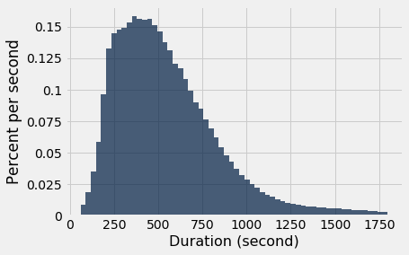
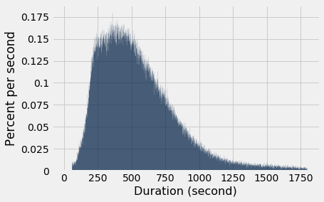

# Joins
* tblA.join(colA, tblB, colB) returns a table with the columns of tblA and tblB, 
* containing rows for all values of a colA and colB that appear in both table
#### section reading
* https://www.inferentialthinking.com/chapters/08/4/joining-tables-by-columns.html
* https://www.inferentialthinking.com/chapters/08/5/bike-sharing-in-the-bay-area.html


```python
from datascience import *
import numpy as np

%matplotlib inline
import matplotlib.pyplot as plots
plots.style.use('fivethirtyeight')
```

## Drinks

* constructing two tables to be used with join further below


```python
drinks = Table(['Drink', 'Cafe', 'Price']).with_rows([
    ['Milk Tea', 'Tea One', 4],
    ['Espresso', 'Nefeli',  2],
    ['Latte',    'Nefeli',  3],
    ['Espresso', "Abe's",   2]
])
drinks
```


<table border="1" class="dataframe">
    <thead>
        <tr>
            <th>Drink</th> <th>Cafe</th> <th>Price</th>
        </tr>
    </thead>
    <tbody>
        <tr>
            <td>Milk Tea</td> <td>Tea One</td> <td>4    </td>
        </tr>
    </tbody>
        <tr>
            <td>Espresso</td> <td>Nefeli </td> <td>2    </td>
        </tr>
    </tbody>
        <tr>
            <td>Latte   </td> <td>Nefeli </td> <td>3    </td>
        </tr>
    </tbody>
        <tr>
            <td>Espresso</td> <td>Abe's  </td> <td>2    </td>
        </tr>
    </tbody>
</table>


```python
discounts = Table().with_columns(
    'Coupon % off', make_array(25, 50, 5),
    'Location', make_array('Tea One', 'Nefeli', 'Tea One')
)
discounts
```


<table border="1" class="dataframe">
    <thead>
        <tr>
            <th>Coupon % off</th> <th>Location</th>
        </tr>
    </thead>
    <tbody>
        <tr>
            <td>25          </td> <td>Tea One </td>
        </tr>
    </tbody>
        <tr>
            <td>50          </td> <td>Nefeli  </td>
        </tr>
    </tbody>
        <tr>
            <td>5           </td> <td>Tea One </td>
        </tr>
    </tbody>
</table>


* Join Cafe column from drinks, with Location colufrom discounts table


```python
t = drinks.join('Cafe', discounts, 'Location')
t
```


<table border="1" class="dataframe">
    <thead>
        <tr>
            <th>Cafe</th> <th>Drink</th> <th>Price</th> <th>Coupon % off</th>
        </tr>
    </thead>
    <tbody>
        <tr>
            <td>Nefeli </td> <td>Espresso</td> <td>2    </td> <td>50          </td>
        </tr>
    </tbody>
        <tr>
            <td>Nefeli </td> <td>Latte   </td> <td>3    </td> <td>50          </td>
        </tr>
    </tbody>
        <tr>
            <td>Tea One</td> <td>Milk Tea</td> <td>4    </td> <td>25          </td>
        </tr>
    </tbody>
        <tr>
            <td>Tea One</td> <td>Milk Tea</td> <td>4    </td> <td>5           </td>
        </tr>
    </tbody>
</table>


```python
# The results are a combination of the two tables
# Where Location from discounts tables matches up with cafe from drnks table
# i.e. Location and Cafe columns are the same
# if there is no matching values from the two tables, like Abe's, it doesn't appear in joined table

```


```python
t.with_column('Discounted', t.column(2) * (1 - t.column(3)/ 100))
```


<table border="1" class="dataframe">
    <thead>
        <tr>
            <th>Cafe</th> <th>Drink</th> <th>Price</th> <th>Coupon % off</th> <th>Discounted</th>
        </tr>
    </thead>
    <tbody>
        <tr>
            <td>Nefeli </td> <td>Espresso</td> <td>2    </td> <td>50          </td> <td>1         </td>
        </tr>
    </tbody>
        <tr>
            <td>Nefeli </td> <td>Latte   </td> <td>3    </td> <td>50          </td> <td>1.5       </td>
        </tr>
    </tbody>
        <tr>
            <td>Tea One</td> <td>Milk Tea</td> <td>4    </td> <td>25          </td> <td>3         </td>
        </tr>
    </tbody>
        <tr>
            <td>Tea One</td> <td>Milk Tea</td> <td>4    </td> <td>5           </td> <td>3.8       </td>
        </tr>
    </tbody>
</table>


```python
two = drinks.join('Cafe', drinks) # implicitly if you leave off the column name from the second 
# table argument it will use the same column name from the first.
two
```


<table border="1" class="dataframe">
    <thead>
        <tr>
            <th>Cafe</th> <th>Drink</th> <th>Price</th> <th>Drink_2</th> <th>Price_2</th>
        </tr>
    </thead>
    <tbody>
        <tr>
            <td>Abe's  </td> <td>Espresso</td> <td>2    </td> <td>Espresso</td> <td>2      </td>
        </tr>
    </tbody>
        <tr>
            <td>Nefeli </td> <td>Espresso</td> <td>2    </td> <td>Espresso</td> <td>2      </td>
        </tr>
    </tbody>
        <tr>
            <td>Nefeli </td> <td>Espresso</td> <td>2    </td> <td>Latte   </td> <td>3      </td>
        </tr>
    </tbody>
        <tr>
            <td>Nefeli </td> <td>Latte   </td> <td>3    </td> <td>Espresso</td> <td>2      </td>
        </tr>
    </tbody>
        <tr>
            <td>Nefeli </td> <td>Latte   </td> <td>3    </td> <td>Latte   </td> <td>3      </td>
        </tr>
    </tbody>
        <tr>
            <td>Tea One</td> <td>Milk Tea</td> <td>4    </td> <td>Milk Tea</td> <td>4      </td>
        </tr>
    </tbody>
</table>


```python
two.with_column('Total', two.column('Price') + two.column('Price_2'))
```


<table border="1" class="dataframe">
    <thead>
        <tr>
            <th>Cafe</th> <th>Drink</th> <th>Price</th> <th>Drink_2</th> <th>Price_2</th> <th>Total</th>
        </tr>
    </thead>
    <tbody>
        <tr>
            <td>Abe's  </td> <td>Espresso</td> <td>2    </td> <td>Espresso</td> <td>2      </td> <td>4    </td>
        </tr>
    </tbody>
        <tr>
            <td>Nefeli </td> <td>Espresso</td> <td>2    </td> <td>Espresso</td> <td>2      </td> <td>4    </td>
        </tr>
    </tbody>
        <tr>
            <td>Nefeli </td> <td>Espresso</td> <td>2    </td> <td>Latte   </td> <td>3      </td> <td>5    </td>
        </tr>
    </tbody>
        <tr>
            <td>Nefeli </td> <td>Latte   </td> <td>3    </td> <td>Espresso</td> <td>2      </td> <td>5    </td>
        </tr>
    </tbody>
        <tr>
            <td>Nefeli </td> <td>Latte   </td> <td>3    </td> <td>Latte   </td> <td>3      </td> <td>6    </td>
        </tr>
    </tbody>
        <tr>
            <td>Tea One</td> <td>Milk Tea</td> <td>4    </td> <td>Milk Tea</td> <td>4      </td> <td>8    </td>
        </tr>
    </tbody>
</table>


## Bikes

* Analysis of very large dataset.
* Crashes Jupyter with 1GBheap


```python
trips = Table.read_table('trip.csv')
trips
```


<table border="1" class="dataframe">
    <thead>
        <tr>
            <th>Trip ID</th> <th>Duration</th> <th>Start Date</th> <th>Start Station</th> <th>Start Terminal</th> <th>End Date</th> <th>End Station</th> <th>End Terminal</th> <th>Bike #</th> <th>Subscriber Type</th> <th>Zip Code</th>
        </tr>
    </thead>
    <tbody>
        <tr>
            <td>913460 </td> <td>765     </td> <td>8/31/2015 23:26</td> <td>Harry Bridges Plaza (Ferry Building)         </td> <td>50            </td> <td>8/31/2015 23:39</td> <td>San Francisco Caltrain (Townsend at 4th)     </td> <td>70          </td> <td>288   </td> <td>Subscriber     </td> <td>2139    </td>
        </tr>
    </tbody>
        <tr>
            <td>913459 </td> <td>1036    </td> <td>8/31/2015 23:11</td> <td>San Antonio Shopping Center                  </td> <td>31            </td> <td>8/31/2015 23:28</td> <td>Mountain View City Hall                      </td> <td>27          </td> <td>35    </td> <td>Subscriber     </td> <td>95032   </td>
        </tr>
    </tbody>
        <tr>
            <td>913455 </td> <td>307     </td> <td>8/31/2015 23:13</td> <td>Post at Kearny                               </td> <td>47            </td> <td>8/31/2015 23:18</td> <td>2nd at South Park                            </td> <td>64          </td> <td>468   </td> <td>Subscriber     </td> <td>94107   </td>
        </tr>
    </tbody>
        <tr>
            <td>913454 </td> <td>409     </td> <td>8/31/2015 23:10</td> <td>San Jose City Hall                           </td> <td>10            </td> <td>8/31/2015 23:17</td> <td>San Salvador at 1st                          </td> <td>8           </td> <td>68    </td> <td>Subscriber     </td> <td>95113   </td>
        </tr>
    </tbody>
        <tr>
            <td>913453 </td> <td>789     </td> <td>8/31/2015 23:09</td> <td>Embarcadero at Folsom                        </td> <td>51            </td> <td>8/31/2015 23:22</td> <td>Embarcadero at Sansome                       </td> <td>60          </td> <td>487   </td> <td>Customer       </td> <td>9069    </td>
        </tr>
    </tbody>
        <tr>
            <td>913452 </td> <td>293     </td> <td>8/31/2015 23:07</td> <td>Yerba Buena Center of the Arts (3rd @ Howard)</td> <td>68            </td> <td>8/31/2015 23:12</td> <td>San Francisco Caltrain (Townsend at 4th)     </td> <td>70          </td> <td>538   </td> <td>Subscriber     </td> <td>94118   </td>
        </tr>
    </tbody>
        <tr>
            <td>913451 </td> <td>896     </td> <td>8/31/2015 23:07</td> <td>Embarcadero at Folsom                        </td> <td>51            </td> <td>8/31/2015 23:22</td> <td>Embarcadero at Sansome                       </td> <td>60          </td> <td>363   </td> <td>Customer       </td> <td>92562   </td>
        </tr>
    </tbody>
        <tr>
            <td>913450 </td> <td>255     </td> <td>8/31/2015 22:16</td> <td>Embarcadero at Sansome                       </td> <td>60            </td> <td>8/31/2015 22:20</td> <td>Steuart at Market                            </td> <td>74          </td> <td>470   </td> <td>Subscriber     </td> <td>94111   </td>
        </tr>
    </tbody>
        <tr>
            <td>913449 </td> <td>126     </td> <td>8/31/2015 22:12</td> <td>Beale at Market                              </td> <td>56            </td> <td>8/31/2015 22:15</td> <td>Temporary Transbay Terminal (Howard at Beale)</td> <td>55          </td> <td>439   </td> <td>Subscriber     </td> <td>94130   </td>
        </tr>
    </tbody>
        <tr>
            <td>913448 </td> <td>932     </td> <td>8/31/2015 21:57</td> <td>Post at Kearny                               </td> <td>47            </td> <td>8/31/2015 22:12</td> <td>South Van Ness at Market                     </td> <td>66          </td> <td>472   </td> <td>Subscriber     </td> <td>94702   </td>
        </tr>
    </tbody>
</table>
<p>... (354142 rows omitted)</p>


```python
commute = trips.where('Duration', are.below(1800))
commute.hist('Duration')
# 1800 seconds is 30 minutes which how this bike sharing program worked.
# trips over 1800 there is something od happening, like stolen on one extreme or long extended trips
```

    /usr/local/lib/python3.6/dist-packages/matplotlib/axes/_axes.py:6462: UserWarning: The 'normed' kwarg is deprecated, and has been replaced by the 'density' kwarg.
      warnings.warn("The 'normed' kwarg is deprecated, and has been "


```python
commute.hist('Duration', bins=60, unit='second')
# let's but duration into 60 bins, with units of seconds
```

    /usr/local/lib/python3.6/dist-packages/matplotlib/axes/_axes.py:6462: UserWarning: The 'normed' kwarg is deprecated, and has been replaced by the 'density' kwarg.
      warnings.warn("The 'normed' kwarg is deprecated, and has been "





```python
(550-250) * 0.15
# Looking at the peak 550 to 250 to get the area of that range
# 45% of trips is within that range
```


    45.0


```python
commute.hist('Duration', bins=np.arange(1801), unit='second')
```

    /usr/local/lib/python3.6/dist-packages/matplotlib/axes/_axes.py:6462: UserWarning: The 'normed' kwarg is deprecated, and has been replaced by the 'density' kwarg.
      warnings.warn("The 'normed' kwarg is deprecated, and has been "





```python
starts = commute.group('Start Station').sort('count', descending=True)
starts
```


<table border="1" class="dataframe">
    <thead>
        <tr>
            <th>Start Station</th> <th>count</th>
        </tr>
    </thead>
    <tbody>
        <tr>
            <td>San Francisco Caltrain (Townsend at 4th)     </td> <td>25858</td>
        </tr>
    </tbody>
        <tr>
            <td>San Francisco Caltrain 2 (330 Townsend)      </td> <td>21523</td>
        </tr>
    </tbody>
        <tr>
            <td>Harry Bridges Plaza (Ferry Building)         </td> <td>15543</td>
        </tr>
    </tbody>
        <tr>
            <td>Temporary Transbay Terminal (Howard at Beale)</td> <td>14298</td>
        </tr>
    </tbody>
        <tr>
            <td>2nd at Townsend                              </td> <td>13674</td>
        </tr>
    </tbody>
        <tr>
            <td>Townsend at 7th                              </td> <td>13579</td>
        </tr>
    </tbody>
        <tr>
            <td>Steuart at Market                            </td> <td>13215</td>
        </tr>
    </tbody>
        <tr>
            <td>Embarcadero at Sansome                       </td> <td>12842</td>
        </tr>
    </tbody>
        <tr>
            <td>Market at 10th                               </td> <td>11523</td>
        </tr>
    </tbody>
        <tr>
            <td>Market at Sansome                            </td> <td>11023</td>
        </tr>
    </tbody>
</table>
<p>... (60 rows omitted)</p>


```python
commute.pivot('Start Station', 'End Station')
```


<table border="1" class="dataframe">
    <thead>
        <tr>
            <th>End Station</th> <th>2nd at Folsom</th> <th>2nd at South Park</th> <th>2nd at Townsend</th> <th>5th at Howard</th> <th>Adobe on Almaden</th> <th>Arena Green / SAP Center</th> <th>Beale at Market</th> <th>Broadway St at Battery St</th> <th>California Ave Caltrain Station</th> <th>Castro Street and El Camino Real</th> <th>Civic Center BART (7th at Market)</th> <th>Clay at Battery</th> <th>Commercial at Montgomery</th> <th>Cowper at University</th> <th>Davis at Jackson</th> <th>Embarcadero at Bryant</th> <th>Embarcadero at Folsom</th> <th>Embarcadero at Sansome</th> <th>Embarcadero at Vallejo</th> <th>Evelyn Park and Ride</th> <th>Franklin at Maple</th> <th>Golden Gate at Polk</th> <th>Grant Avenue at Columbus Avenue</th> <th>Harry Bridges Plaza (Ferry Building)</th> <th>Howard at 2nd</th> <th>Japantown</th> <th>MLK Library</th> <th>Market at 10th</th> <th>Market at 4th</th> <th>Market at Sansome</th> <th>Mechanics Plaza (Market at Battery)</th> <th>Mezes Park</th> <th>Mountain View Caltrain Station</th> <th>Mountain View City Hall</th> <th>Palo Alto Caltrain Station</th> <th>Park at Olive</th> <th>Paseo de San Antonio</th> <th>Post at Kearny</th> <th>Powell Street BART</th> <th>Powell at Post (Union Square)</th> <th>Redwood City Caltrain Station</th> <th>Redwood City Medical Center</th> <th>Redwood City Public Library</th> <th>Rengstorff Avenue / California Street</th> <th>Ryland Park</th> <th>SJSU - San Salvador at 9th</th> <th>SJSU 4th at San Carlos</th> <th>San Antonio Caltrain Station</th> <th>San Antonio Shopping Center</th> <th>San Francisco Caltrain (Townsend at 4th)</th> <th>San Francisco Caltrain 2 (330 Townsend)</th> <th>San Francisco City Hall</th> <th>San Jose City Hall</th> <th>San Jose Civic Center</th> <th>San Jose Diridon Caltrain Station</th> <th>San Mateo County Center</th> <th>San Pedro Square</th> <th>San Salvador at 1st</th> <th>Santa Clara County Civic Center</th> <th>Santa Clara at Almaden</th> <th>South Van Ness at Market</th> <th>Spear at Folsom</th> <th>St James Park</th> <th>Stanford in Redwood City</th> <th>Steuart at Market</th> <th>Temporary Transbay Terminal (Howard at Beale)</th> <th>Townsend at 7th</th> <th>University and Emerson</th> <th>Washington at Kearny</th> <th>Yerba Buena Center of the Arts (3rd @ Howard)</th>
        </tr>
    </thead>
    <tbody>
        <tr>
            <td>2nd at Folsom                   </td> <td>54           </td> <td>190              </td> <td>554            </td> <td>107          </td> <td>0               </td> <td>0                       </td> <td>40             </td> <td>21                       </td> <td>0                              </td> <td>0                               </td> <td>44                               </td> <td>78             </td> <td>54                      </td> <td>0                   </td> <td>9               </td> <td>77                   </td> <td>32                   </td> <td>41                    </td> <td>14                    </td> <td>0                   </td> <td>0                </td> <td>11                 </td> <td>30                             </td> <td>416                                 </td> <td>53           </td> <td>0        </td> <td>0          </td> <td>169           </td> <td>114          </td> <td>302              </td> <td>33                                 </td> <td>0         </td> <td>0                             </td> <td>0                      </td> <td>0                         </td> <td>0            </td> <td>0                   </td> <td>60            </td> <td>121               </td> <td>88                           </td> <td>0                            </td> <td>0                          </td> <td>0                          </td> <td>0                                    </td> <td>0          </td> <td>0                         </td> <td>0                     </td> <td>0                           </td> <td>0                          </td> <td>694                                     </td> <td>445                                    </td> <td>21                     </td> <td>0                 </td> <td>0                    </td> <td>0                                </td> <td>0                      </td> <td>0               </td> <td>0                  </td> <td>0                              </td> <td>0                     </td> <td>38                      </td> <td>57             </td> <td>0            </td> <td>0                       </td> <td>39               </td> <td>237                                          </td> <td>342            </td> <td>0                     </td> <td>17                  </td> <td>31                                           </td>
        </tr>
    </tbody>
        <tr>
            <td>2nd at South Park               </td> <td>295          </td> <td>164              </td> <td>71             </td> <td>180          </td> <td>0               </td> <td>0                       </td> <td>208            </td> <td>85                       </td> <td>0                              </td> <td>0                               </td> <td>112                              </td> <td>87             </td> <td>160                     </td> <td>0                   </td> <td>37              </td> <td>56                   </td> <td>178                  </td> <td>83                    </td> <td>116                   </td> <td>0                   </td> <td>0                </td> <td>57                 </td> <td>73                             </td> <td>574                                 </td> <td>500          </td> <td>0        </td> <td>0          </td> <td>139           </td> <td>199          </td> <td>1633             </td> <td>119                                </td> <td>0         </td> <td>0                             </td> <td>0                      </td> <td>0                         </td> <td>0            </td> <td>0                   </td> <td>299           </td> <td>84                </td> <td>113                          </td> <td>0                            </td> <td>0                          </td> <td>0                          </td> <td>0                                    </td> <td>0          </td> <td>0                         </td> <td>0                     </td> <td>0                           </td> <td>0                          </td> <td>559                                     </td> <td>480                                    </td> <td>48                     </td> <td>0                 </td> <td>0                    </td> <td>0                                </td> <td>0                      </td> <td>0               </td> <td>0                  </td> <td>0                              </td> <td>0                     </td> <td>66                      </td> <td>152            </td> <td>0            </td> <td>0                       </td> <td>374              </td> <td>429                                          </td> <td>143            </td> <td>0                     </td> <td>63                  </td> <td>209                                          </td>
        </tr>
    </tbody>
        <tr>
            <td>2nd at Townsend                 </td> <td>437          </td> <td>151              </td> <td>185            </td> <td>92           </td> <td>0               </td> <td>0                       </td> <td>608            </td> <td>350                      </td> <td>0                              </td> <td>0                               </td> <td>80                               </td> <td>329            </td> <td>168                     </td> <td>0                   </td> <td>386             </td> <td>361                  </td> <td>658                  </td> <td>506                   </td> <td>254                   </td> <td>0                   </td> <td>0                </td> <td>27                 </td> <td>315                            </td> <td>2607                                </td> <td>295          </td> <td>0        </td> <td>0          </td> <td>110           </td> <td>225          </td> <td>845              </td> <td>177                                </td> <td>0         </td> <td>0                             </td> <td>0                      </td> <td>0                         </td> <td>0            </td> <td>0                   </td> <td>120           </td> <td>100               </td> <td>141                          </td> <td>0                            </td> <td>0                          </td> <td>0                          </td> <td>0                                    </td> <td>0          </td> <td>0                         </td> <td>0                     </td> <td>0                           </td> <td>0                          </td> <td>905                                     </td> <td>299                                    </td> <td>14                     </td> <td>0                 </td> <td>0                    </td> <td>0                                </td> <td>0                      </td> <td>0               </td> <td>0                  </td> <td>0                              </td> <td>0                     </td> <td>72                      </td> <td>508            </td> <td>0            </td> <td>0                       </td> <td>2349             </td> <td>784                                          </td> <td>417            </td> <td>0                     </td> <td>57                  </td> <td>166                                          </td>
        </tr>
    </tbody>
        <tr>
            <td>5th at Howard                   </td> <td>113          </td> <td>177              </td> <td>148            </td> <td>83           </td> <td>0               </td> <td>0                       </td> <td>59             </td> <td>130                      </td> <td>0                              </td> <td>0                               </td> <td>203                              </td> <td>76             </td> <td>129                     </td> <td>0                   </td> <td>30              </td> <td>57                   </td> <td>49                   </td> <td>166                   </td> <td>54                    </td> <td>0                   </td> <td>0                </td> <td>85                 </td> <td>78                             </td> <td>371                                 </td> <td>478          </td> <td>0        </td> <td>0          </td> <td>303           </td> <td>158          </td> <td>168              </td> <td>90                                 </td> <td>0         </td> <td>0                             </td> <td>0                      </td> <td>0                         </td> <td>0            </td> <td>0                   </td> <td>93            </td> <td>183               </td> <td>169                          </td> <td>0                            </td> <td>0                          </td> <td>0                          </td> <td>0                                    </td> <td>0          </td> <td>0                         </td> <td>0                     </td> <td>0                           </td> <td>0                          </td> <td>690                                     </td> <td>1859                                   </td> <td>48                     </td> <td>0                 </td> <td>0                    </td> <td>0                                </td> <td>0                      </td> <td>0               </td> <td>0                  </td> <td>0                              </td> <td>0                     </td> <td>116                     </td> <td>102            </td> <td>0            </td> <td>0                       </td> <td>182              </td> <td>750                                          </td> <td>200            </td> <td>0                     </td> <td>43                  </td> <td>267                                          </td>
        </tr>
    </tbody>
        <tr>
            <td>Adobe on Almaden                </td> <td>0            </td> <td>0                </td> <td>0              </td> <td>0            </td> <td>11              </td> <td>4                       </td> <td>0              </td> <td>0                        </td> <td>0                              </td> <td>0                               </td> <td>0                                </td> <td>0              </td> <td>0                       </td> <td>0                   </td> <td>0               </td> <td>0                    </td> <td>0                    </td> <td>0                     </td> <td>0                     </td> <td>0                   </td> <td>0                </td> <td>0                  </td> <td>0                              </td> <td>0                                   </td> <td>0            </td> <td>17       </td> <td>7          </td> <td>0             </td> <td>0            </td> <td>0                </td> <td>0                                  </td> <td>0         </td> <td>0                             </td> <td>0                      </td> <td>0                         </td> <td>0            </td> <td>25                  </td> <td>0             </td> <td>0                 </td> <td>0                            </td> <td>0                            </td> <td>0                          </td> <td>0                          </td> <td>0                                    </td> <td>7          </td> <td>7                         </td> <td>16                    </td> <td>0                           </td> <td>0                          </td> <td>0                                       </td> <td>0                                      </td> <td>0                      </td> <td>19                </td> <td>23                   </td> <td>265                              </td> <td>0                      </td> <td>20              </td> <td>4                  </td> <td>5                              </td> <td>10                    </td> <td>0                       </td> <td>0              </td> <td>14           </td> <td>0                       </td> <td>0                </td> <td>0                                            </td> <td>0              </td> <td>0                     </td> <td>0                   </td> <td>0                                            </td>
        </tr>
    </tbody>
        <tr>
            <td>Arena Green / SAP Center        </td> <td>0            </td> <td>0                </td> <td>0              </td> <td>0            </td> <td>7               </td> <td>64                      </td> <td>0              </td> <td>0                        </td> <td>0                              </td> <td>0                               </td> <td>0                                </td> <td>0              </td> <td>0                       </td> <td>0                   </td> <td>0               </td> <td>0                    </td> <td>0                    </td> <td>0                     </td> <td>0                     </td> <td>0                   </td> <td>0                </td> <td>0                  </td> <td>0                              </td> <td>0                                   </td> <td>0            </td> <td>16       </td> <td>5          </td> <td>0             </td> <td>0            </td> <td>0                </td> <td>0                                  </td> <td>0         </td> <td>0                             </td> <td>0                      </td> <td>0                         </td> <td>0            </td> <td>21                  </td> <td>0             </td> <td>0                 </td> <td>0                            </td> <td>0                            </td> <td>0                          </td> <td>0                          </td> <td>0                                    </td> <td>24         </td> <td>3                         </td> <td>7                     </td> <td>0                           </td> <td>0                          </td> <td>0                                       </td> <td>0                                      </td> <td>0                      </td> <td>6                 </td> <td>20                   </td> <td>7                                </td> <td>0                      </td> <td>56              </td> <td>12                 </td> <td>38                             </td> <td>259                   </td> <td>0                       </td> <td>0              </td> <td>13           </td> <td>0                       </td> <td>0                </td> <td>0                                            </td> <td>0              </td> <td>0                     </td> <td>0                   </td> <td>0                                            </td>
        </tr>
    </tbody>
        <tr>
            <td>Beale at Market                 </td> <td>127          </td> <td>79               </td> <td>183            </td> <td>59           </td> <td>0               </td> <td>0                       </td> <td>59             </td> <td>661                      </td> <td>0                              </td> <td>0                               </td> <td>201                              </td> <td>75             </td> <td>101                     </td> <td>0                   </td> <td>247             </td> <td>178                  </td> <td>38                   </td> <td>590                   </td> <td>165                   </td> <td>0                   </td> <td>0                </td> <td>54                 </td> <td>435                            </td> <td>57                                  </td> <td>72           </td> <td>0        </td> <td>0          </td> <td>286           </td> <td>236          </td> <td>163              </td> <td>26                                 </td> <td>0         </td> <td>0                             </td> <td>0                      </td> <td>0                         </td> <td>0            </td> <td>0                   </td> <td>49            </td> <td>227               </td> <td>179                          </td> <td>0                            </td> <td>0                          </td> <td>0                          </td> <td>0                                    </td> <td>0          </td> <td>0                         </td> <td>0                     </td> <td>0                           </td> <td>0                          </td> <td>640                                     </td> <td>269                                    </td> <td>25                     </td> <td>0                 </td> <td>0                    </td> <td>0                                </td> <td>0                      </td> <td>0               </td> <td>0                  </td> <td>0                              </td> <td>0                     </td> <td>243                     </td> <td>128            </td> <td>0            </td> <td>0                       </td> <td>16               </td> <td>167                                          </td> <td>35             </td> <td>0                     </td> <td>64                  </td> <td>45                                           </td>
        </tr>
    </tbody>
        <tr>
            <td>Broadway St at Battery St       </td> <td>67           </td> <td>89               </td> <td>279            </td> <td>119          </td> <td>0               </td> <td>0                       </td> <td>1022           </td> <td>110                      </td> <td>0                              </td> <td>0                               </td> <td>62                               </td> <td>283            </td> <td>226                     </td> <td>0                   </td> <td>191             </td> <td>198                  </td> <td>79                   </td> <td>231                   </td> <td>35                    </td> <td>0                   </td> <td>0                </td> <td>5                  </td> <td>70                             </td> <td>168                                 </td> <td>49           </td> <td>0        </td> <td>0          </td> <td>32            </td> <td>97           </td> <td>341              </td> <td>214                                </td> <td>0         </td> <td>0                             </td> <td>0                      </td> <td>0                         </td> <td>0            </td> <td>0                   </td> <td>169           </td> <td>71                </td> <td>218                          </td> <td>0                            </td> <td>0                          </td> <td>0                          </td> <td>0                                    </td> <td>0          </td> <td>0                         </td> <td>0                     </td> <td>0                           </td> <td>0                          </td> <td>685                                     </td> <td>438                                    </td> <td>7                      </td> <td>0                 </td> <td>0                    </td> <td>0                                </td> <td>0                      </td> <td>0               </td> <td>0                  </td> <td>0                              </td> <td>0                     </td> <td>18                      </td> <td>106            </td> <td>0            </td> <td>0                       </td> <td>344              </td> <td>748                                          </td> <td>50             </td> <td>0                     </td> <td>79                  </td> <td>47                                           </td>
        </tr>
    </tbody>
        <tr>
            <td>California Ave Caltrain Station </td> <td>0            </td> <td>0                </td> <td>0              </td> <td>0            </td> <td>0               </td> <td>0                       </td> <td>0              </td> <td>0                        </td> <td>38                             </td> <td>1                               </td> <td>0                                </td> <td>0              </td> <td>0                       </td> <td>29                  </td> <td>0               </td> <td>0                    </td> <td>0                    </td> <td>0                     </td> <td>0                     </td> <td>0                   </td> <td>0                </td> <td>0                  </td> <td>0                              </td> <td>0                                   </td> <td>0            </td> <td>0        </td> <td>0          </td> <td>0             </td> <td>0            </td> <td>0                </td> <td>0                                  </td> <td>0         </td> <td>1                             </td> <td>0                      </td> <td>192                       </td> <td>40           </td> <td>0                   </td> <td>0             </td> <td>0                 </td> <td>0                            </td> <td>0                            </td> <td>0                          </td> <td>0                          </td> <td>6                                    </td> <td>0          </td> <td>0                         </td> <td>0                     </td> <td>17                          </td> <td>10                         </td> <td>0                                       </td> <td>0                                      </td> <td>0                      </td> <td>0                 </td> <td>0                    </td> <td>0                                </td> <td>0                      </td> <td>0               </td> <td>0                  </td> <td>0                              </td> <td>0                     </td> <td>0                       </td> <td>0              </td> <td>0            </td> <td>0                       </td> <td>0                </td> <td>0                                            </td> <td>0              </td> <td>57                    </td> <td>0                   </td> <td>0                                            </td>
        </tr>
    </tbody>
        <tr>
            <td>Castro Street and El Camino Real</td> <td>0            </td> <td>0                </td> <td>0              </td> <td>0            </td> <td>0               </td> <td>0                       </td> <td>0              </td> <td>0                        </td> <td>0                              </td> <td>30                              </td> <td>0                                </td> <td>0              </td> <td>0                       </td> <td>0                   </td> <td>0               </td> <td>0                    </td> <td>0                    </td> <td>0                     </td> <td>0                     </td> <td>14                  </td> <td>0                </td> <td>0                  </td> <td>0                              </td> <td>0                                   </td> <td>0            </td> <td>0        </td> <td>0          </td> <td>0             </td> <td>0            </td> <td>0                </td> <td>0                                  </td> <td>0         </td> <td>931                           </td> <td>34                     </td> <td>0                         </td> <td>0            </td> <td>0                   </td> <td>0             </td> <td>0                 </td> <td>0                            </td> <td>0                            </td> <td>0                          </td> <td>0                          </td> <td>7                                    </td> <td>0          </td> <td>0                         </td> <td>0                     </td> <td>4                           </td> <td>12                         </td> <td>0                                       </td> <td>0                                      </td> <td>0                      </td> <td>0                 </td> <td>0                    </td> <td>0                                </td> <td>0                      </td> <td>0               </td> <td>0                  </td> <td>0                              </td> <td>0                     </td> <td>0                       </td> <td>0              </td> <td>0            </td> <td>0                       </td> <td>0                </td> <td>0                                            </td> <td>0              </td> <td>0                     </td> <td>0                   </td> <td>0                                            </td>
        </tr>
    </tbody>
</table>
<p>... (60 rows omitted)</p>


```python
duration = trips.select(3, 6, 1)
duration
```


<table border="1" class="dataframe">
    <thead>
        <tr>
            <th>Start Station</th> <th>End Station</th> <th>Duration</th>
        </tr>
    </thead>
    <tbody>
        <tr>
            <td>Harry Bridges Plaza (Ferry Building)         </td> <td>San Francisco Caltrain (Townsend at 4th)     </td> <td>765     </td>
        </tr>
    </tbody>
        <tr>
            <td>San Antonio Shopping Center                  </td> <td>Mountain View City Hall                      </td> <td>1036    </td>
        </tr>
    </tbody>
        <tr>
            <td>Post at Kearny                               </td> <td>2nd at South Park                            </td> <td>307     </td>
        </tr>
    </tbody>
        <tr>
            <td>San Jose City Hall                           </td> <td>San Salvador at 1st                          </td> <td>409     </td>
        </tr>
    </tbody>
        <tr>
            <td>Embarcadero at Folsom                        </td> <td>Embarcadero at Sansome                       </td> <td>789     </td>
        </tr>
    </tbody>
        <tr>
            <td>Yerba Buena Center of the Arts (3rd @ Howard)</td> <td>San Francisco Caltrain (Townsend at 4th)     </td> <td>293     </td>
        </tr>
    </tbody>
        <tr>
            <td>Embarcadero at Folsom                        </td> <td>Embarcadero at Sansome                       </td> <td>896     </td>
        </tr>
    </tbody>
        <tr>
            <td>Embarcadero at Sansome                       </td> <td>Steuart at Market                            </td> <td>255     </td>
        </tr>
    </tbody>
        <tr>
            <td>Beale at Market                              </td> <td>Temporary Transbay Terminal (Howard at Beale)</td> <td>126     </td>
        </tr>
    </tbody>
        <tr>
            <td>Post at Kearny                               </td> <td>South Van Ness at Market                     </td> <td>932     </td>
        </tr>
    </tbody>
</table>
<p>... (354142 rows omitted)</p>


```python
shortest = duration.group([0, 1], min)
shortest
```


```python
from_cc = shortest.where(0, are.containing('Civic Center BART')).sort(2)
from_cc
```


    ---------------------------------------------------------------------------

    NameError                                 Traceback (most recent call last)

    <ipython-input-30-14fa48cc9da3> in <module>()
    ----> 1 from_cc = shortest.where(0, are.containing('Civic Center BART')).sort(2)
          2 from_cc


    NameError: name 'shortest' is not defined


## Maps

* A table containing column of lat and long values, can be used to generate a map of markers
* TYPE.map_table(table,...)
* TYPE=Marker or Circle
* Where table is layed out as
* Column 0: lats coord
* Column 1: long coords
* Column 2: labels
* Column 3: colors of markers or circles
* Column 4: sizes of markers or cirlcles


```python
stations = Table.read_table('station.csv')
stations
```


<table border="1" class="dataframe">
    <thead>
        <tr>
            <th>station_id</th> <th>name</th> <th>lat</th> <th>long</th> <th>dockcount</th> <th>landmark</th> <th>installation</th>
        </tr>
    </thead>
    <tbody>
        <tr>
            <td>2         </td> <td>San Jose Diridon Caltrain Station</td> <td>37.3297</td> <td>-121.902</td> <td>27       </td> <td>San Jose</td> <td>8/6/2013    </td>
        </tr>
    </tbody>
        <tr>
            <td>3         </td> <td>San Jose Civic Center            </td> <td>37.3307</td> <td>-121.889</td> <td>15       </td> <td>San Jose</td> <td>8/5/2013    </td>
        </tr>
    </tbody>
        <tr>
            <td>4         </td> <td>Santa Clara at Almaden           </td> <td>37.334 </td> <td>-121.895</td> <td>11       </td> <td>San Jose</td> <td>8/6/2013    </td>
        </tr>
    </tbody>
        <tr>
            <td>5         </td> <td>Adobe on Almaden                 </td> <td>37.3314</td> <td>-121.893</td> <td>19       </td> <td>San Jose</td> <td>8/5/2013    </td>
        </tr>
    </tbody>
        <tr>
            <td>6         </td> <td>San Pedro Square                 </td> <td>37.3367</td> <td>-121.894</td> <td>15       </td> <td>San Jose</td> <td>8/7/2013    </td>
        </tr>
    </tbody>
        <tr>
            <td>7         </td> <td>Paseo de San Antonio             </td> <td>37.3338</td> <td>-121.887</td> <td>15       </td> <td>San Jose</td> <td>8/7/2013    </td>
        </tr>
    </tbody>
        <tr>
            <td>8         </td> <td>San Salvador at 1st              </td> <td>37.3302</td> <td>-121.886</td> <td>15       </td> <td>San Jose</td> <td>8/5/2013    </td>
        </tr>
    </tbody>
        <tr>
            <td>9         </td> <td>Japantown                        </td> <td>37.3487</td> <td>-121.895</td> <td>15       </td> <td>San Jose</td> <td>8/5/2013    </td>
        </tr>
    </tbody>
        <tr>
            <td>10        </td> <td>San Jose City Hall               </td> <td>37.3374</td> <td>-121.887</td> <td>15       </td> <td>San Jose</td> <td>8/6/2013    </td>
        </tr>
    </tbody>
        <tr>
            <td>11        </td> <td>MLK Library                      </td> <td>37.3359</td> <td>-121.886</td> <td>19       </td> <td>San Jose</td> <td>8/6/2013    </td>
        </tr>
    </tbody>
</table>
<p>... (60 rows omitted)</p>


```python
Marker.map_table(stations.select('lat', 'long', 'name'))
# The Marker function takes lat, long coords to make a map
```


<iframe srcdoc="<!DOCTYPE html>
<head>
   <meta http-equiv=&quot;content-type&quot; content=&quot;text/html; charset=UTF-8&quot; />
   <link rel=&quot;stylesheet&quot; href=&quot;https://cdnjs.cloudflare.com/ajax/libs/leaflet/0.7.3/leaflet.css&quot; />
   <script src=&quot;https://cdnjs.cloudflare.com/ajax/libs/leaflet/0.7.3/leaflet.js&quot;></script>

   <script src=&quot;https://ajax.googleapis.com/ajax/libs/jquery/1.11.1/jquery.min.js&quot;></script>

   <link rel=&quot;stylesheet&quot; href=&quot;https://maxcdn.bootstrapcdn.com/bootstrap/3.2.0/css/bootstrap.min.css&quot;>
   <link rel=&quot;stylesheet&quot; href=&quot;https://maxcdn.bootstrapcdn.com/bootstrap/3.2.0/css/bootstrap-theme.min.css&quot;>
   <script src=&quot;https://maxcdn.bootstrapcdn.com/bootstrap/3.2.0/js/bootstrap.min.js&quot;></script>

   <link href=&quot;https://maxcdn.bootstrapcdn.com/font-awesome/4.1.0/css/font-awesome.min.css&quot; rel=&quot;stylesheet&quot;>

   <link rel=&quot;stylesheet&quot; href=&quot;https://rawgit.com/lvoogdt/Leaflet.awesome-markers/2.0/develop/dist/leaflet.awesome-markers.css&quot;>
   <script src=&quot;https://rawgithub.com/lvoogdt/Leaflet.awesome-markers/2.0/develop/dist/leaflet.awesome-markers.js&quot;></script>


   <link rel=&quot;stylesheet&quot; href=&quot;https://cdnjs.cloudflare.com/ajax/libs/leaflet.markercluster/0.4.0/MarkerCluster.Default.css&quot;>
   <link rel=&quot;stylesheet&quot; href=&quot;https://cdnjs.cloudflare.com/ajax/libs/leaflet.markercluster/0.4.0/MarkerCluster.css&quot;>
   <script src=&quot;https://cdnjs.cloudflare.com/ajax/libs/leaflet.markercluster/0.4.0/leaflet.markercluster-src.js&quot;></script>
   <script src=&quot;https://cdnjs.cloudflare.com/ajax/libs/leaflet.markercluster/0.4.0/leaflet.markercluster.js&quot;></script>

   <link rel=&quot;stylesheet&quot; href=&quot;https://birdage.github.io/Leaflet.awesome-markers/dist/leaflet.awesome.rotate.css&quot;>

   
   
   
   

   <style>

      html, body {
        width: 100%;
        height: 100%;
        margin: 0;
        padding: 0;
      }

      #map {
        position:absolute;
        top:0;
        bottom:0;
        right:0;
        left:0;
      }

   </style>
</head>

<body>

   <div class=&quot;folium-map&quot; id=&quot;folium_ff48ad7caa0246f9bc7a21871c8e3234&quot; style=&quot;width: 960px; height: 500px&quot;></div>

   <script>

      

      var base_tile = L.tileLayer('https://{s}.tile.openstreetmap.org/{z}/{x}/{y}.png', {
          maxZoom: 17,
          minZoom: 8.0,
          attribution: 'Map data (c) <a href=&quot;http://openstreetmap.org&quot;>OpenStreetMap</a> contributors'
      });

      var baseLayer = {
        &quot;Base Layer&quot;: base_tile
      };

      /*
      addition of the wms layers
      */

      

      /*
      addition of the tile layers
      */
      

      /*
      list of layers to be added
      */
      var layer_list = {
      
      };

      /*
      Bounding box.
      */
      var southWest = L.latLng(-90, -180),
          northEast = L.latLng(90, 180),
          bounds = L.latLngBounds(southWest, northEast);

      /*
      Creates the map and adds the selected layers
      */
      var map = L.map('folium_ff48ad7caa0246f9bc7a21871c8e3234', {
                                       center:[37.567251, -122.1481515],
                                       zoom: 10.0,
                                       maxBounds: bounds,
                                       layers: [base_tile]
                                     });

      L.control.layers(baseLayer, layer_list).addTo(map);

      //cluster group
      var clusteredmarkers = L.markerClusterGroup();
      //section for adding clustered markers
      
      //add the clustered markers to the group anyway
      map.addLayer(clusteredmarkers);

      
      var marker_1_icon = L.AwesomeMarkers.icon({ icon: 'info-sign',markerColor: 'blue',prefix: 'glyphicon',extraClasses: 'fa-rotate-0'});
      var marker_1 = L.marker([37.329732, 
							-121.90178200000001],
							{'icon':marker_1_icon}
							);
      marker_1.bindPopup(&quot;San Jose Diridon Caltrain Station&quot;);
      marker_1._popup.options.maxWidth = 300;
      map.addLayer(marker_1)
      
      var marker_2_icon = L.AwesomeMarkers.icon({ icon: 'info-sign',markerColor: 'blue',prefix: 'glyphicon',extraClasses: 'fa-rotate-0'});
      var marker_2 = L.marker([37.330698, 
							-121.888979],
							{'icon':marker_2_icon}
							);
      marker_2.bindPopup(&quot;San Jose Civic Center&quot;);
      marker_2._popup.options.maxWidth = 300;
      map.addLayer(marker_2)
      
      var marker_3_icon = L.AwesomeMarkers.icon({ icon: 'info-sign',markerColor: 'blue',prefix: 'glyphicon',extraClasses: 'fa-rotate-0'});
      var marker_3 = L.marker([37.333988, 
							-121.894902],
							{'icon':marker_3_icon}
							);
      marker_3.bindPopup(&quot;Santa Clara at Almaden&quot;);
      marker_3._popup.options.maxWidth = 300;
      map.addLayer(marker_3)
      
      var marker_4_icon = L.AwesomeMarkers.icon({ icon: 'info-sign',markerColor: 'blue',prefix: 'glyphicon',extraClasses: 'fa-rotate-0'});
      var marker_4 = L.marker([37.331415, 
							-121.8932],
							{'icon':marker_4_icon}
							);
      marker_4.bindPopup(&quot;Adobe on Almaden&quot;);
      marker_4._popup.options.maxWidth = 300;
      map.addLayer(marker_4)
      
      var marker_5_icon = L.AwesomeMarkers.icon({ icon: 'info-sign',markerColor: 'blue',prefix: 'glyphicon',extraClasses: 'fa-rotate-0'});
      var marker_5 = L.marker([37.336721000000004, 
							-121.894074],
							{'icon':marker_5_icon}
							);
      marker_5.bindPopup(&quot;San Pedro Square&quot;);
      marker_5._popup.options.maxWidth = 300;
      map.addLayer(marker_5)
      
      var marker_6_icon = L.AwesomeMarkers.icon({ icon: 'info-sign',markerColor: 'blue',prefix: 'glyphicon',extraClasses: 'fa-rotate-0'});
      var marker_6 = L.marker([37.333798, 
							-121.88694299999999],
							{'icon':marker_6_icon}
							);
      marker_6.bindPopup(&quot;Paseo de San Antonio&quot;);
      marker_6._popup.options.maxWidth = 300;
      map.addLayer(marker_6)
      
      var marker_7_icon = L.AwesomeMarkers.icon({ icon: 'info-sign',markerColor: 'blue',prefix: 'glyphicon',extraClasses: 'fa-rotate-0'});
      var marker_7 = L.marker([37.330165, 
							-121.88583100000001],
							{'icon':marker_7_icon}
							);
      marker_7.bindPopup(&quot;San Salvador at 1st&quot;);
      marker_7._popup.options.maxWidth = 300;
      map.addLayer(marker_7)
      
      var marker_8_icon = L.AwesomeMarkers.icon({ icon: 'info-sign',markerColor: 'blue',prefix: 'glyphicon',extraClasses: 'fa-rotate-0'});
      var marker_8 = L.marker([37.348742, 
							-121.89471499999999],
							{'icon':marker_8_icon}
							);
      marker_8.bindPopup(&quot;Japantown&quot;);
      marker_8._popup.options.maxWidth = 300;
      map.addLayer(marker_8)
      
      var marker_9_icon = L.AwesomeMarkers.icon({ icon: 'info-sign',markerColor: 'blue',prefix: 'glyphicon',extraClasses: 'fa-rotate-0'});
      var marker_9 = L.marker([37.337391, 
							-121.886995],
							{'icon':marker_9_icon}
							);
      marker_9.bindPopup(&quot;San Jose City Hall&quot;);
      marker_9._popup.options.maxWidth = 300;
      map.addLayer(marker_9)
      
      var marker_10_icon = L.AwesomeMarkers.icon({ icon: 'info-sign',markerColor: 'blue',prefix: 'glyphicon',extraClasses: 'fa-rotate-0'});
      var marker_10 = L.marker([37.335885, 
							-121.88566000000002],
							{'icon':marker_10_icon}
							);
      marker_10.bindPopup(&quot;MLK Library&quot;);
      marker_10._popup.options.maxWidth = 300;
      map.addLayer(marker_10)
      
      var marker_11_icon = L.AwesomeMarkers.icon({ icon: 'info-sign',markerColor: 'blue',prefix: 'glyphicon',extraClasses: 'fa-rotate-0'});
      var marker_11 = L.marker([37.332808, 
							-121.88389099999999],
							{'icon':marker_11_icon}
							);
      marker_11.bindPopup(&quot;SJSU 4th at San Carlos&quot;);
      marker_11._popup.options.maxWidth = 300;
      map.addLayer(marker_11)
      
      var marker_12_icon = L.AwesomeMarkers.icon({ icon: 'info-sign',markerColor: 'blue',prefix: 'glyphicon',extraClasses: 'fa-rotate-0'});
      var marker_12 = L.marker([37.339301, 
							-121.88993700000002],
							{'icon':marker_12_icon}
							);
      marker_12.bindPopup(&quot;St James Park&quot;);
      marker_12._popup.options.maxWidth = 300;
      map.addLayer(marker_12)
      
      var marker_13_icon = L.AwesomeMarkers.icon({ icon: 'info-sign',markerColor: 'blue',prefix: 'glyphicon',extraClasses: 'fa-rotate-0'});
      var marker_13 = L.marker([37.332692, 
							-121.900084],
							{'icon':marker_13_icon}
							);
      marker_13.bindPopup(&quot;Arena Green / SAP Center&quot;);
      marker_13._popup.options.maxWidth = 300;
      map.addLayer(marker_13)
      
      var marker_14_icon = L.AwesomeMarkers.icon({ icon: 'info-sign',markerColor: 'blue',prefix: 'glyphicon',extraClasses: 'fa-rotate-0'});
      var marker_14 = L.marker([37.333954999999996, 
							-121.877349],
							{'icon':marker_14_icon}
							);
      marker_14.bindPopup(&quot;SJSU - San Salvador at 9th&quot;);
      marker_14._popup.options.maxWidth = 300;
      map.addLayer(marker_14)
      
      var marker_15_icon = L.AwesomeMarkers.icon({ icon: 'info-sign',markerColor: 'blue',prefix: 'glyphicon',extraClasses: 'fa-rotate-0'});
      var marker_15 = L.marker([37.481758, 
							-122.226904],
							{'icon':marker_15_icon}
							);
      marker_15.bindPopup(&quot;Franklin at Maple&quot;);
      marker_15._popup.options.maxWidth = 300;
      map.addLayer(marker_15)
      
      var marker_16_icon = L.AwesomeMarkers.icon({ icon: 'info-sign',markerColor: 'blue',prefix: 'glyphicon',extraClasses: 'fa-rotate-0'});
      var marker_16 = L.marker([37.486078000000006, 
							-122.23208899999999],
							{'icon':marker_16_icon}
							);
      marker_16.bindPopup(&quot;Redwood City Caltrain Station&quot;);
      marker_16._popup.options.maxWidth = 300;
      map.addLayer(marker_16)
      
      var marker_17_icon = L.AwesomeMarkers.icon({ icon: 'info-sign',markerColor: 'blue',prefix: 'glyphicon',extraClasses: 'fa-rotate-0'});
      var marker_17 = L.marker([37.487615999999996, 
							-122.229951],
							{'icon':marker_17_icon}
							);
      marker_17.bindPopup(&quot;San Mateo County Center&quot;);
      marker_17._popup.options.maxWidth = 300;
      map.addLayer(marker_17)
      
      var marker_18_icon = L.AwesomeMarkers.icon({ icon: 'info-sign',markerColor: 'blue',prefix: 'glyphicon',extraClasses: 'fa-rotate-0'});
      var marker_18 = L.marker([37.484219, 
							-122.227424],
							{'icon':marker_18_icon}
							);
      marker_18.bindPopup(&quot;Redwood City Public Library&quot;);
      marker_18._popup.options.maxWidth = 300;
      map.addLayer(marker_18)
      
      var marker_19_icon = L.AwesomeMarkers.icon({ icon: 'info-sign',markerColor: 'blue',prefix: 'glyphicon',extraClasses: 'fa-rotate-0'});
      var marker_19 = L.marker([37.48537, 
							-122.20328799999999],
							{'icon':marker_19_icon}
							);
      marker_19.bindPopup(&quot;Stanford in Redwood City&quot;);
      marker_19._popup.options.maxWidth = 300;
      map.addLayer(marker_19)
      
      var marker_20_icon = L.AwesomeMarkers.icon({ icon: 'info-sign',markerColor: 'blue',prefix: 'glyphicon',extraClasses: 'fa-rotate-0'});
      var marker_20 = L.marker([37.487682, 
							-122.223492],
							{'icon':marker_20_icon}
							);
      marker_20.bindPopup(&quot;Redwood City Medical Center&quot;);
      marker_20._popup.options.maxWidth = 300;
      map.addLayer(marker_20)
      
      var marker_21_icon = L.AwesomeMarkers.icon({ icon: 'info-sign',markerColor: 'blue',prefix: 'glyphicon',extraClasses: 'fa-rotate-0'});
      var marker_21 = L.marker([37.389218, 
							-122.081896],
							{'icon':marker_21_icon}
							);
      marker_21.bindPopup(&quot;Mountain View City Hall&quot;);
      marker_21._popup.options.maxWidth = 300;
      map.addLayer(marker_21)
      
      var marker_22_icon = L.AwesomeMarkers.icon({ icon: 'info-sign',markerColor: 'blue',prefix: 'glyphicon',extraClasses: 'fa-rotate-0'});
      var marker_22 = L.marker([37.394358000000004, 
							-122.07671299999998],
							{'icon':marker_22_icon}
							);
      marker_22.bindPopup(&quot;Mountain View Caltrain Station&quot;);
      marker_22._popup.options.maxWidth = 300;
      map.addLayer(marker_22)
      
      var marker_23_icon = L.AwesomeMarkers.icon({ icon: 'info-sign',markerColor: 'blue',prefix: 'glyphicon',extraClasses: 'fa-rotate-0'});
      var marker_23 = L.marker([37.406940000000006, 
							-122.10675800000001],
							{'icon':marker_23_icon}
							);
      marker_23.bindPopup(&quot;San Antonio Caltrain Station&quot;);
      marker_23._popup.options.maxWidth = 300;
      map.addLayer(marker_23)
      
      var marker_24_icon = L.AwesomeMarkers.icon({ icon: 'info-sign',markerColor: 'blue',prefix: 'glyphicon',extraClasses: 'fa-rotate-0'});
      var marker_24 = L.marker([37.390277000000005, 
							-122.066553],
							{'icon':marker_24_icon}
							);
      marker_24.bindPopup(&quot;Evelyn Park and Ride&quot;);
      marker_24._popup.options.maxWidth = 300;
      map.addLayer(marker_24)
      
      var marker_25_icon = L.AwesomeMarkers.icon({ icon: 'info-sign',markerColor: 'blue',prefix: 'glyphicon',extraClasses: 'fa-rotate-0'});
      var marker_25 = L.marker([37.400443, 
							-122.10833799999999],
							{'icon':marker_25_icon}
							);
      marker_25.bindPopup(&quot;San Antonio Shopping Center&quot;);
      marker_25._popup.options.maxWidth = 300;
      map.addLayer(marker_25)
      
      var marker_26_icon = L.AwesomeMarkers.icon({ icon: 'info-sign',markerColor: 'blue',prefix: 'glyphicon',extraClasses: 'fa-rotate-0'});
      var marker_26 = L.marker([37.385956, 
							-122.083678],
							{'icon':marker_26_icon}
							);
      marker_26.bindPopup(&quot;Castro Street and El Camino Real&quot;);
      marker_26._popup.options.maxWidth = 300;
      map.addLayer(marker_26)
      
      var marker_27_icon = L.AwesomeMarkers.icon({ icon: 'info-sign',markerColor: 'blue',prefix: 'glyphicon',extraClasses: 'fa-rotate-0'});
      var marker_27 = L.marker([37.400240999999994, 
							-122.099076],
							{'icon':marker_27_icon}
							);
      marker_27.bindPopup(&quot;Rengstorff Avenue / California Street&quot;);
      marker_27._popup.options.maxWidth = 300;
      map.addLayer(marker_27)
      
      var marker_28_icon = L.AwesomeMarkers.icon({ icon: 'info-sign',markerColor: 'blue',prefix: 'glyphicon',extraClasses: 'fa-rotate-0'});
      var marker_28 = L.marker([37.443988, 
							-122.164759],
							{'icon':marker_28_icon}
							);
      marker_28.bindPopup(&quot;Palo Alto Caltrain Station&quot;);
      marker_28._popup.options.maxWidth = 300;
      map.addLayer(marker_28)
      
      var marker_29_icon = L.AwesomeMarkers.icon({ icon: 'info-sign',markerColor: 'blue',prefix: 'glyphicon',extraClasses: 'fa-rotate-0'});
      var marker_29 = L.marker([37.444521, 
							-122.16309299999999],
							{'icon':marker_29_icon}
							);
      marker_29.bindPopup(&quot;University and Emerson&quot;);
      marker_29._popup.options.maxWidth = 300;
      map.addLayer(marker_29)
      
      var marker_30_icon = L.AwesomeMarkers.icon({ icon: 'info-sign',markerColor: 'blue',prefix: 'glyphicon',extraClasses: 'fa-rotate-0'});
      var marker_30 = L.marker([37.429082, 
							-122.14280500000001],
							{'icon':marker_30_icon}
							);
      marker_30.bindPopup(&quot;California Ave Caltrain Station&quot;);
      marker_30._popup.options.maxWidth = 300;
      map.addLayer(marker_30)
      
      var marker_31_icon = L.AwesomeMarkers.icon({ icon: 'info-sign',markerColor: 'blue',prefix: 'glyphicon',extraClasses: 'fa-rotate-0'});
      var marker_31 = L.marker([37.448598, 
							-122.159504],
							{'icon':marker_31_icon}
							);
      marker_31.bindPopup(&quot;Cowper at University&quot;);
      marker_31._popup.options.maxWidth = 300;
      map.addLayer(marker_31)
      
      var marker_32_icon = L.AwesomeMarkers.icon({ icon: 'info-sign',markerColor: 'blue',prefix: 'glyphicon',extraClasses: 'fa-rotate-0'});
      var marker_32 = L.marker([37.425683899999996, 
							-122.13777749999998],
							{'icon':marker_32_icon}
							);
      marker_32.bindPopup(&quot;Park at Olive&quot;);
      marker_32._popup.options.maxWidth = 300;
      map.addLayer(marker_32)
      
      var marker_33_icon = L.AwesomeMarkers.icon({ icon: 'info-sign',markerColor: 'blue',prefix: 'glyphicon',extraClasses: 'fa-rotate-0'});
      var marker_33 = L.marker([37.795001, 
							-122.39997],
							{'icon':marker_33_icon}
							);
      marker_33.bindPopup(&quot;Clay at Battery&quot;);
      marker_33._popup.options.maxWidth = 300;
      map.addLayer(marker_33)
      
      var marker_34_icon = L.AwesomeMarkers.icon({ icon: 'info-sign',markerColor: 'blue',prefix: 'glyphicon',extraClasses: 'fa-rotate-0'});
      var marker_34 = L.marker([37.79728, 
							-122.398436],
							{'icon':marker_34_icon}
							);
      marker_34.bindPopup(&quot;Davis at Jackson&quot;);
      marker_34._popup.options.maxWidth = 300;
      map.addLayer(marker_34)
      
      var marker_35_icon = L.AwesomeMarkers.icon({ icon: 'info-sign',markerColor: 'blue',prefix: 'glyphicon',extraClasses: 'fa-rotate-0'});
      var marker_35 = L.marker([37.794230999999996, 
							-122.402923],
							{'icon':marker_35_icon}
							);
      marker_35.bindPopup(&quot;Commercial at Montgomery&quot;);
      marker_35._popup.options.maxWidth = 300;
      map.addLayer(marker_35)
      
      var marker_36_icon = L.AwesomeMarkers.icon({ icon: 'info-sign',markerColor: 'blue',prefix: 'glyphicon',extraClasses: 'fa-rotate-0'});
      var marker_36 = L.marker([37.795425, 
							-122.40476699999999],
							{'icon':marker_36_icon}
							);
      marker_36.bindPopup(&quot;Washington at Kearney&quot;);
      marker_36._popup.options.maxWidth = 300;
      map.addLayer(marker_36)
      
      var marker_37_icon = L.AwesomeMarkers.icon({ icon: 'info-sign',markerColor: 'blue',prefix: 'glyphicon',extraClasses: 'fa-rotate-0'});
      var marker_37 = L.marker([37.788975, 
							-122.403452],
							{'icon':marker_37_icon}
							);
      marker_37.bindPopup(&quot;Post at Kearney&quot;);
      marker_37._popup.options.maxWidth = 300;
      map.addLayer(marker_37)
      
      var marker_38_icon = L.AwesomeMarkers.icon({ icon: 'info-sign',markerColor: 'blue',prefix: 'glyphicon',extraClasses: 'fa-rotate-0'});
      var marker_38 = L.marker([37.799953, 
							-122.398525],
							{'icon':marker_38_icon}
							);
      marker_38.bindPopup(&quot;Embarcadero at Vallejo&quot;);
      marker_38._popup.options.maxWidth = 300;
      map.addLayer(marker_38)
      
      var marker_39_icon = L.AwesomeMarkers.icon({ icon: 'info-sign',markerColor: 'blue',prefix: 'glyphicon',extraClasses: 'fa-rotate-0'});
      var marker_39 = L.marker([37.790302000000004, 
							-122.39063700000001],
							{'icon':marker_39_icon}
							);
      marker_39.bindPopup(&quot;Spear at Folsom&quot;);
      marker_39._popup.options.maxWidth = 300;
      map.addLayer(marker_39)
      
      var marker_40_icon = L.AwesomeMarkers.icon({ icon: 'info-sign',markerColor: 'blue',prefix: 'glyphicon',extraClasses: 'fa-rotate-0'});
      var marker_40 = L.marker([37.795392, 
							-122.394203],
							{'icon':marker_40_icon}
							);
      marker_40.bindPopup(&quot;Harry Bridges Plaza (Ferry Building)&quot;);
      marker_40._popup.options.maxWidth = 300;
      map.addLayer(marker_40)
      
      var marker_41_icon = L.AwesomeMarkers.icon({ icon: 'info-sign',markerColor: 'blue',prefix: 'glyphicon',extraClasses: 'fa-rotate-0'});
      var marker_41 = L.marker([37.791464000000005, 
							-122.391034],
							{'icon':marker_41_icon}
							);
      marker_41.bindPopup(&quot;Embarcadero at Folsom&quot;);
      marker_41._popup.options.maxWidth = 300;
      map.addLayer(marker_41)
      
      var marker_42_icon = L.AwesomeMarkers.icon({ icon: 'info-sign',markerColor: 'blue',prefix: 'glyphicon',extraClasses: 'fa-rotate-0'});
      var marker_42 = L.marker([37.783871000000005, 
							-122.408433],
							{'icon':marker_42_icon}
							);
      marker_42.bindPopup(&quot;Powell Street BART&quot;);
      marker_42._popup.options.maxWidth = 300;
      map.addLayer(marker_42)
      
      var marker_43_icon = L.AwesomeMarkers.icon({ icon: 'info-sign',markerColor: 'blue',prefix: 'glyphicon',extraClasses: 'fa-rotate-0'});
      var marker_43 = L.marker([37.787152, 
							-122.38801299999999],
							{'icon':marker_43_icon}
							);
      marker_43.bindPopup(&quot;Embarcadero at Bryant&quot;);
      marker_43._popup.options.maxWidth = 300;
      map.addLayer(marker_43)
      
      var marker_44_icon = L.AwesomeMarkers.icon({ icon: 'info-sign',markerColor: 'blue',prefix: 'glyphicon',extraClasses: 'fa-rotate-0'});
      var marker_44 = L.marker([37.789756, 
							-122.39464299999999],
							{'icon':marker_44_icon}
							);
      marker_44.bindPopup(&quot;Temporary Transbay Terminal (Howard at Beale)&quot;);
      marker_44._popup.options.maxWidth = 300;
      map.addLayer(marker_44)
      
      var marker_45_icon = L.AwesomeMarkers.icon({ icon: 'info-sign',markerColor: 'blue',prefix: 'glyphicon',extraClasses: 'fa-rotate-0'});
      var marker_45 = L.marker([37.792251, 
							-122.39708600000002],
							{'icon':marker_45_icon}
							);
      marker_45.bindPopup(&quot;Beale at Market&quot;);
      marker_45._popup.options.maxWidth = 300;
      map.addLayer(marker_45)
      
      var marker_46_icon = L.AwesomeMarkers.icon({ icon: 'info-sign',markerColor: 'blue',prefix: 'glyphicon',extraClasses: 'fa-rotate-0'});
      var marker_46 = L.marker([37.781752000000004, 
							-122.40512700000001],
							{'icon':marker_46_icon}
							);
      marker_46.bindPopup(&quot;5th at Howard&quot;);
      marker_46._popup.options.maxWidth = 300;
      map.addLayer(marker_46)
      
      var marker_47_icon = L.AwesomeMarkers.icon({ icon: 'info-sign',markerColor: 'blue',prefix: 'glyphicon',extraClasses: 'fa-rotate-0'});
      var marker_47 = L.marker([37.77865, 
							-122.41823500000001],
							{'icon':marker_47_icon}
							);
      marker_47.bindPopup(&quot;San Francisco City Hall&quot;);
      marker_47._popup.options.maxWidth = 300;
      map.addLayer(marker_47)
      
      var marker_48_icon = L.AwesomeMarkers.icon({ icon: 'info-sign',markerColor: 'blue',prefix: 'glyphicon',extraClasses: 'fa-rotate-0'});
      var marker_48 = L.marker([37.781332, 
							-122.418603],
							{'icon':marker_48_icon}
							);
      marker_48.bindPopup(&quot;Golden Gate at Polk&quot;);
      marker_48._popup.options.maxWidth = 300;
      map.addLayer(marker_48)
      
      var marker_49_icon = L.AwesomeMarkers.icon({ icon: 'info-sign',markerColor: 'blue',prefix: 'glyphicon',extraClasses: 'fa-rotate-0'});
      var marker_49 = L.marker([37.80477, 
							-122.40323400000001],
							{'icon':marker_49_icon}
							);
      marker_49.bindPopup(&quot;Embarcadero at Sansome&quot;);
      marker_49._popup.options.maxWidth = 300;
      map.addLayer(marker_49)
      
      var marker_50_icon = L.AwesomeMarkers.icon({ icon: 'info-sign',markerColor: 'blue',prefix: 'glyphicon',extraClasses: 'fa-rotate-0'});
      var marker_50 = L.marker([37.780526, 
							-122.39028799999998],
							{'icon':marker_50_icon}
							);
      marker_50.bindPopup(&quot;2nd at Townsend&quot;);
      marker_50._popup.options.maxWidth = 300;
      map.addLayer(marker_50)
      
      var marker_51_icon = L.AwesomeMarkers.icon({ icon: 'info-sign',markerColor: 'blue',prefix: 'glyphicon',extraClasses: 'fa-rotate-0'});
      var marker_51 = L.marker([37.785299, 
							-122.39623600000002],
							{'icon':marker_51_icon}
							);
      marker_51.bindPopup(&quot;2nd at Folsom&quot;);
      marker_51._popup.options.maxWidth = 300;
      map.addLayer(marker_51)
      
      var marker_52_icon = L.AwesomeMarkers.icon({ icon: 'info-sign',markerColor: 'blue',prefix: 'glyphicon',extraClasses: 'fa-rotate-0'});
      var marker_52 = L.marker([37.786978000000005, 
							-122.39810800000001],
							{'icon':marker_52_icon}
							);
      marker_52.bindPopup(&quot;Howard at 2nd&quot;);
      marker_52._popup.options.maxWidth = 300;
      map.addLayer(marker_52)
      
      var marker_53_icon = L.AwesomeMarkers.icon({ icon: 'info-sign',markerColor: 'blue',prefix: 'glyphicon',extraClasses: 'fa-rotate-0'});
      var marker_53 = L.marker([37.782259, 
							-122.392738],
							{'icon':marker_53_icon}
							);
      marker_53.bindPopup(&quot;2nd at South Park&quot;);
      marker_53._popup.options.maxWidth = 300;
      map.addLayer(marker_53)
      
      var marker_54_icon = L.AwesomeMarkers.icon({ icon: 'info-sign',markerColor: 'blue',prefix: 'glyphicon',extraClasses: 'fa-rotate-0'});
      var marker_54 = L.marker([37.771058000000004, 
							-122.402717],
							{'icon':marker_54_icon}
							);
      marker_54.bindPopup(&quot;Townsend at 7th&quot;);
      marker_54._popup.options.maxWidth = 300;
      map.addLayer(marker_54)
      
      var marker_55_icon = L.AwesomeMarkers.icon({ icon: 'info-sign',markerColor: 'blue',prefix: 'glyphicon',extraClasses: 'fa-rotate-0'});
      var marker_55 = L.marker([37.774814, 
							-122.418954],
							{'icon':marker_55_icon}
							);
      marker_55.bindPopup(&quot;South Van Ness at Market&quot;);
      marker_55._popup.options.maxWidth = 300;
      map.addLayer(marker_55)
      
      var marker_56_icon = L.AwesomeMarkers.icon({ icon: 'info-sign',markerColor: 'blue',prefix: 'glyphicon',extraClasses: 'fa-rotate-0'});
      var marker_56 = L.marker([37.776619000000004, 
							-122.41738500000001],
							{'icon':marker_56_icon}
							);
      marker_56.bindPopup(&quot;Market at 10th&quot;);
      marker_56._popup.options.maxWidth = 300;
      map.addLayer(marker_56)
      
      var marker_57_icon = L.AwesomeMarkers.icon({ icon: 'info-sign',markerColor: 'blue',prefix: 'glyphicon',extraClasses: 'fa-rotate-0'});
      var marker_57 = L.marker([37.784878000000006, 
							-122.40101399999999],
							{'icon':marker_57_icon}
							);
      marker_57.bindPopup(&quot;Yerba Buena Center of the Arts (3rd @ Howard)&quot;);
      marker_57._popup.options.maxWidth = 300;
      map.addLayer(marker_57)
      
      var marker_58_icon = L.AwesomeMarkers.icon({ icon: 'info-sign',markerColor: 'blue',prefix: 'glyphicon',extraClasses: 'fa-rotate-0'});
      var marker_58 = L.marker([37.7766, 
							-122.39546999999999],
							{'icon':marker_58_icon}
							);
      marker_58.bindPopup(&quot;San Francisco Caltrain 2 (330 Townsend)&quot;);
      marker_58._popup.options.maxWidth = 300;
      map.addLayer(marker_58)
      
      var marker_59_icon = L.AwesomeMarkers.icon({ icon: 'info-sign',markerColor: 'blue',prefix: 'glyphicon',extraClasses: 'fa-rotate-0'});
      var marker_59 = L.marker([37.776617, 
							-122.39526000000001],
							{'icon':marker_59_icon}
							);
      marker_59.bindPopup(&quot;San Francisco Caltrain (Townsend at 4th)&quot;);
      marker_59._popup.options.maxWidth = 300;
      map.addLayer(marker_59)
      
      var marker_60_icon = L.AwesomeMarkers.icon({ icon: 'info-sign',markerColor: 'blue',prefix: 'glyphicon',extraClasses: 'fa-rotate-0'});
      var marker_60 = L.marker([37.788446, 
							-122.408499],
							{'icon':marker_60_icon}
							);
      marker_60.bindPopup(&quot;Powell at Post (Union Square)&quot;);
      marker_60._popup.options.maxWidth = 300;
      map.addLayer(marker_60)
      
      var marker_61_icon = L.AwesomeMarkers.icon({ icon: 'info-sign',markerColor: 'blue',prefix: 'glyphicon',extraClasses: 'fa-rotate-0'});
      var marker_61 = L.marker([37.781039, 
							-122.411748],
							{'icon':marker_61_icon}
							);
      marker_61.bindPopup(&quot;Civic Center BART (7th at Market)&quot;);
      marker_61._popup.options.maxWidth = 300;
      map.addLayer(marker_61)
      
      var marker_62_icon = L.AwesomeMarkers.icon({ icon: 'info-sign',markerColor: 'blue',prefix: 'glyphicon',extraClasses: 'fa-rotate-0'});
      var marker_62 = L.marker([37.798522, 
							-122.40724499999999],
							{'icon':marker_62_icon}
							);
      marker_62.bindPopup(&quot;Grant Avenue at Columbus Avenue&quot;);
      marker_62._popup.options.maxWidth = 300;
      map.addLayer(marker_62)
      
      var marker_63_icon = L.AwesomeMarkers.icon({ icon: 'info-sign',markerColor: 'blue',prefix: 'glyphicon',extraClasses: 'fa-rotate-0'});
      var marker_63 = L.marker([37.794139, 
							-122.394434],
							{'icon':marker_63_icon}
							);
      marker_63.bindPopup(&quot;Steuart at Market&quot;);
      marker_63._popup.options.maxWidth = 300;
      map.addLayer(marker_63)
      
      var marker_64_icon = L.AwesomeMarkers.icon({ icon: 'info-sign',markerColor: 'blue',prefix: 'glyphicon',extraClasses: 'fa-rotate-0'});
      var marker_64 = L.marker([37.7913, 
							-122.399051],
							{'icon':marker_64_icon}
							);
      marker_64.bindPopup(&quot;Mechanics Plaza (Market at Battery)&quot;);
      marker_64._popup.options.maxWidth = 300;
      map.addLayer(marker_64)
      
      var marker_65_icon = L.AwesomeMarkers.icon({ icon: 'info-sign',markerColor: 'blue',prefix: 'glyphicon',extraClasses: 'fa-rotate-0'});
      var marker_65 = L.marker([37.786305, 
							-122.40496599999999],
							{'icon':marker_65_icon}
							);
      marker_65.bindPopup(&quot;Market at 4th&quot;);
      marker_65._popup.options.maxWidth = 300;
      map.addLayer(marker_65)
      
      var marker_66_icon = L.AwesomeMarkers.icon({ icon: 'info-sign',markerColor: 'blue',prefix: 'glyphicon',extraClasses: 'fa-rotate-0'});
      var marker_66 = L.marker([37.789625, 
							-122.400811],
							{'icon':marker_66_icon}
							);
      marker_66.bindPopup(&quot;Market at Sansome&quot;);
      marker_66._popup.options.maxWidth = 300;
      map.addLayer(marker_66)
      
      var marker_67_icon = L.AwesomeMarkers.icon({ icon: 'info-sign',markerColor: 'blue',prefix: 'glyphicon',extraClasses: 'fa-rotate-0'});
      var marker_67 = L.marker([37.352601, 
							-121.90573300000001],
							{'icon':marker_67_icon}
							);
      marker_67.bindPopup(&quot;Santa Clara County Civic Center&quot;);
      marker_67._popup.options.maxWidth = 300;
      map.addLayer(marker_67)
      
      var marker_68_icon = L.AwesomeMarkers.icon({ icon: 'info-sign',markerColor: 'blue',prefix: 'glyphicon',extraClasses: 'fa-rotate-0'});
      var marker_68 = L.marker([37.798541, 
							-122.40086200000002],
							{'icon':marker_68_icon}
							);
      marker_68.bindPopup(&quot;Broadway St at Battery St&quot;);
      marker_68._popup.options.maxWidth = 300;
      map.addLayer(marker_68)
      
      var marker_69_icon = L.AwesomeMarkers.icon({ icon: 'info-sign',markerColor: 'blue',prefix: 'glyphicon',extraClasses: 'fa-rotate-0'});
      var marker_69 = L.marker([37.491269, 
							-122.23623400000001],
							{'icon':marker_69_icon}
							);
      marker_69.bindPopup(&quot;Mezes Park&quot;);
      marker_69._popup.options.maxWidth = 300;
      map.addLayer(marker_69)
      
      var marker_70_icon = L.AwesomeMarkers.icon({ icon: 'info-sign',markerColor: 'blue',prefix: 'glyphicon',extraClasses: 'fa-rotate-0'});
      var marker_70 = L.marker([37.342725, 
							-121.89561699999999],
							{'icon':marker_70_icon}
							);
      marker_70.bindPopup(&quot;Ryland Park&quot;);
      marker_70._popup.options.maxWidth = 300;
      map.addLayer(marker_70)
      

      

      

      

      

      


   </script>

</body>" style="width: 960px; height: 500px"; border: none"></iframe>


```python
sf = stations.where('landmark', 'San Francisco')
Circle.map_table(sf.select('lat', 'long', 'name'), color='green', radius=150)
# same as above but with Circles
```


<iframe srcdoc="<!DOCTYPE html>
<head>
   <meta http-equiv=&quot;content-type&quot; content=&quot;text/html; charset=UTF-8&quot; />
   <link rel=&quot;stylesheet&quot; href=&quot;https://cdnjs.cloudflare.com/ajax/libs/leaflet/0.7.3/leaflet.css&quot; />
   <script src=&quot;https://cdnjs.cloudflare.com/ajax/libs/leaflet/0.7.3/leaflet.js&quot;></script>

   <script src=&quot;https://ajax.googleapis.com/ajax/libs/jquery/1.11.1/jquery.min.js&quot;></script>

   <link rel=&quot;stylesheet&quot; href=&quot;https://maxcdn.bootstrapcdn.com/bootstrap/3.2.0/css/bootstrap.min.css&quot;>
   <link rel=&quot;stylesheet&quot; href=&quot;https://maxcdn.bootstrapcdn.com/bootstrap/3.2.0/css/bootstrap-theme.min.css&quot;>
   <script src=&quot;https://maxcdn.bootstrapcdn.com/bootstrap/3.2.0/js/bootstrap.min.js&quot;></script>

   <link href=&quot;https://maxcdn.bootstrapcdn.com/font-awesome/4.1.0/css/font-awesome.min.css&quot; rel=&quot;stylesheet&quot;>

   <link rel=&quot;stylesheet&quot; href=&quot;https://rawgit.com/lvoogdt/Leaflet.awesome-markers/2.0/develop/dist/leaflet.awesome-markers.css&quot;>
   <script src=&quot;https://rawgithub.com/lvoogdt/Leaflet.awesome-markers/2.0/develop/dist/leaflet.awesome-markers.js&quot;></script>


   <link rel=&quot;stylesheet&quot; href=&quot;https://cdnjs.cloudflare.com/ajax/libs/leaflet.markercluster/0.4.0/MarkerCluster.Default.css&quot;>
   <link rel=&quot;stylesheet&quot; href=&quot;https://cdnjs.cloudflare.com/ajax/libs/leaflet.markercluster/0.4.0/MarkerCluster.css&quot;>
   <script src=&quot;https://cdnjs.cloudflare.com/ajax/libs/leaflet.markercluster/0.4.0/leaflet.markercluster-src.js&quot;></script>
   <script src=&quot;https://cdnjs.cloudflare.com/ajax/libs/leaflet.markercluster/0.4.0/leaflet.markercluster.js&quot;></script>

   <link rel=&quot;stylesheet&quot; href=&quot;https://birdage.github.io/Leaflet.awesome-markers/dist/leaflet.awesome.rotate.css&quot;>

   
   
   
   

   <style>

      html, body {
        width: 100%;
        height: 100%;
        margin: 0;
        padding: 0;
      }

      #map {
        position:absolute;
        top:0;
        bottom:0;
        right:0;
        left:0;
      }

   </style>
</head>

<body>

   <div class=&quot;folium-map&quot; id=&quot;folium_db2751b4b60245958c43f6987ed25aa1&quot; style=&quot;width: 960px; height: 500px&quot;></div>

   <script>

      

      var base_tile = L.tileLayer('https://{s}.tile.openstreetmap.org/{z}/{x}/{y}.png', {
          maxZoom: 17,
          minZoom: 10.0,
          attribution: 'Map data (c) <a href=&quot;http://openstreetmap.org&quot;>OpenStreetMap</a> contributors'
      });

      var baseLayer = {
        &quot;Base Layer&quot;: base_tile
      };

      /*
      addition of the wms layers
      */

      

      /*
      addition of the tile layers
      */
      

      /*
      list of layers to be added
      */
      var layer_list = {
      
      };

      /*
      Bounding box.
      */
      var southWest = L.latLng(-90, -180),
          northEast = L.latLng(90, 180),
          bounds = L.latLngBounds(southWest, northEast);

      /*
      Creates the map and adds the selected layers
      */
      var map = L.map('folium_db2751b4b60245958c43f6987ed25aa1', {
                                       center:[37.787914, -122.4034835],
                                       zoom: 12.0,
                                       maxBounds: bounds,
                                       layers: [base_tile]
                                     });

      L.control.layers(baseLayer, layer_list).addTo(map);

      //cluster group
      var clusteredmarkers = L.markerClusterGroup();
      //section for adding clustered markers
      
      //add the clustered markers to the group anyway
      map.addLayer(clusteredmarkers);

      

      
      var circle_1 = L.circle([37.795001, -122.39997], 150, {
                            color: 'None',
                            fillColor: 'green',
                            fillOpacity: 0.6
                            });
      circle_1.bindPopup(&quot;Clay at Battery&quot;);
      circle_1._popup.options.maxWidth = 300;
      map.addLayer(circle_1)
      
      var circle_2 = L.circle([37.79728, -122.398436], 150, {
                            color: 'None',
                            fillColor: 'green',
                            fillOpacity: 0.6
                            });
      circle_2.bindPopup(&quot;Davis at Jackson&quot;);
      circle_2._popup.options.maxWidth = 300;
      map.addLayer(circle_2)
      
      var circle_3 = L.circle([37.794230999999996, -122.402923], 150, {
                            color: 'None',
                            fillColor: 'green',
                            fillOpacity: 0.6
                            });
      circle_3.bindPopup(&quot;Commercial at Montgomery&quot;);
      circle_3._popup.options.maxWidth = 300;
      map.addLayer(circle_3)
      
      var circle_4 = L.circle([37.795425, -122.40476699999999], 150, {
                            color: 'None',
                            fillColor: 'green',
                            fillOpacity: 0.6
                            });
      circle_4.bindPopup(&quot;Washington at Kearney&quot;);
      circle_4._popup.options.maxWidth = 300;
      map.addLayer(circle_4)
      
      var circle_5 = L.circle([37.788975, -122.403452], 150, {
                            color: 'None',
                            fillColor: 'green',
                            fillOpacity: 0.6
                            });
      circle_5.bindPopup(&quot;Post at Kearney&quot;);
      circle_5._popup.options.maxWidth = 300;
      map.addLayer(circle_5)
      
      var circle_6 = L.circle([37.799953, -122.398525], 150, {
                            color: 'None',
                            fillColor: 'green',
                            fillOpacity: 0.6
                            });
      circle_6.bindPopup(&quot;Embarcadero at Vallejo&quot;);
      circle_6._popup.options.maxWidth = 300;
      map.addLayer(circle_6)
      
      var circle_7 = L.circle([37.790302000000004, -122.39063700000001], 150, {
                            color: 'None',
                            fillColor: 'green',
                            fillOpacity: 0.6
                            });
      circle_7.bindPopup(&quot;Spear at Folsom&quot;);
      circle_7._popup.options.maxWidth = 300;
      map.addLayer(circle_7)
      
      var circle_8 = L.circle([37.795392, -122.394203], 150, {
                            color: 'None',
                            fillColor: 'green',
                            fillOpacity: 0.6
                            });
      circle_8.bindPopup(&quot;Harry Bridges Plaza (Ferry Building)&quot;);
      circle_8._popup.options.maxWidth = 300;
      map.addLayer(circle_8)
      
      var circle_9 = L.circle([37.791464000000005, -122.391034], 150, {
                            color: 'None',
                            fillColor: 'green',
                            fillOpacity: 0.6
                            });
      circle_9.bindPopup(&quot;Embarcadero at Folsom&quot;);
      circle_9._popup.options.maxWidth = 300;
      map.addLayer(circle_9)
      
      var circle_10 = L.circle([37.783871000000005, -122.408433], 150, {
                            color: 'None',
                            fillColor: 'green',
                            fillOpacity: 0.6
                            });
      circle_10.bindPopup(&quot;Powell Street BART&quot;);
      circle_10._popup.options.maxWidth = 300;
      map.addLayer(circle_10)
      
      var circle_11 = L.circle([37.787152, -122.38801299999999], 150, {
                            color: 'None',
                            fillColor: 'green',
                            fillOpacity: 0.6
                            });
      circle_11.bindPopup(&quot;Embarcadero at Bryant&quot;);
      circle_11._popup.options.maxWidth = 300;
      map.addLayer(circle_11)
      
      var circle_12 = L.circle([37.789756, -122.39464299999999], 150, {
                            color: 'None',
                            fillColor: 'green',
                            fillOpacity: 0.6
                            });
      circle_12.bindPopup(&quot;Temporary Transbay Terminal (Howard at Beale)&quot;);
      circle_12._popup.options.maxWidth = 300;
      map.addLayer(circle_12)
      
      var circle_13 = L.circle([37.792251, -122.39708600000002], 150, {
                            color: 'None',
                            fillColor: 'green',
                            fillOpacity: 0.6
                            });
      circle_13.bindPopup(&quot;Beale at Market&quot;);
      circle_13._popup.options.maxWidth = 300;
      map.addLayer(circle_13)
      
      var circle_14 = L.circle([37.781752000000004, -122.40512700000001], 150, {
                            color: 'None',
                            fillColor: 'green',
                            fillOpacity: 0.6
                            });
      circle_14.bindPopup(&quot;5th at Howard&quot;);
      circle_14._popup.options.maxWidth = 300;
      map.addLayer(circle_14)
      
      var circle_15 = L.circle([37.77865, -122.41823500000001], 150, {
                            color: 'None',
                            fillColor: 'green',
                            fillOpacity: 0.6
                            });
      circle_15.bindPopup(&quot;San Francisco City Hall&quot;);
      circle_15._popup.options.maxWidth = 300;
      map.addLayer(circle_15)
      
      var circle_16 = L.circle([37.781332, -122.418603], 150, {
                            color: 'None',
                            fillColor: 'green',
                            fillOpacity: 0.6
                            });
      circle_16.bindPopup(&quot;Golden Gate at Polk&quot;);
      circle_16._popup.options.maxWidth = 300;
      map.addLayer(circle_16)
      
      var circle_17 = L.circle([37.80477, -122.40323400000001], 150, {
                            color: 'None',
                            fillColor: 'green',
                            fillOpacity: 0.6
                            });
      circle_17.bindPopup(&quot;Embarcadero at Sansome&quot;);
      circle_17._popup.options.maxWidth = 300;
      map.addLayer(circle_17)
      
      var circle_18 = L.circle([37.780526, -122.39028799999998], 150, {
                            color: 'None',
                            fillColor: 'green',
                            fillOpacity: 0.6
                            });
      circle_18.bindPopup(&quot;2nd at Townsend&quot;);
      circle_18._popup.options.maxWidth = 300;
      map.addLayer(circle_18)
      
      var circle_19 = L.circle([37.785299, -122.39623600000002], 150, {
                            color: 'None',
                            fillColor: 'green',
                            fillOpacity: 0.6
                            });
      circle_19.bindPopup(&quot;2nd at Folsom&quot;);
      circle_19._popup.options.maxWidth = 300;
      map.addLayer(circle_19)
      
      var circle_20 = L.circle([37.786978000000005, -122.39810800000001], 150, {
                            color: 'None',
                            fillColor: 'green',
                            fillOpacity: 0.6
                            });
      circle_20.bindPopup(&quot;Howard at 2nd&quot;);
      circle_20._popup.options.maxWidth = 300;
      map.addLayer(circle_20)
      
      var circle_21 = L.circle([37.782259, -122.392738], 150, {
                            color: 'None',
                            fillColor: 'green',
                            fillOpacity: 0.6
                            });
      circle_21.bindPopup(&quot;2nd at South Park&quot;);
      circle_21._popup.options.maxWidth = 300;
      map.addLayer(circle_21)
      
      var circle_22 = L.circle([37.771058000000004, -122.402717], 150, {
                            color: 'None',
                            fillColor: 'green',
                            fillOpacity: 0.6
                            });
      circle_22.bindPopup(&quot;Townsend at 7th&quot;);
      circle_22._popup.options.maxWidth = 300;
      map.addLayer(circle_22)
      
      var circle_23 = L.circle([37.774814, -122.418954], 150, {
                            color: 'None',
                            fillColor: 'green',
                            fillOpacity: 0.6
                            });
      circle_23.bindPopup(&quot;South Van Ness at Market&quot;);
      circle_23._popup.options.maxWidth = 300;
      map.addLayer(circle_23)
      
      var circle_24 = L.circle([37.776619000000004, -122.41738500000001], 150, {
                            color: 'None',
                            fillColor: 'green',
                            fillOpacity: 0.6
                            });
      circle_24.bindPopup(&quot;Market at 10th&quot;);
      circle_24._popup.options.maxWidth = 300;
      map.addLayer(circle_24)
      
      var circle_25 = L.circle([37.784878000000006, -122.40101399999999], 150, {
                            color: 'None',
                            fillColor: 'green',
                            fillOpacity: 0.6
                            });
      circle_25.bindPopup(&quot;Yerba Buena Center of the Arts (3rd @ Howard)&quot;);
      circle_25._popup.options.maxWidth = 300;
      map.addLayer(circle_25)
      
      var circle_26 = L.circle([37.7766, -122.39546999999999], 150, {
                            color: 'None',
                            fillColor: 'green',
                            fillOpacity: 0.6
                            });
      circle_26.bindPopup(&quot;San Francisco Caltrain 2 (330 Townsend)&quot;);
      circle_26._popup.options.maxWidth = 300;
      map.addLayer(circle_26)
      
      var circle_27 = L.circle([37.776617, -122.39526000000001], 150, {
                            color: 'None',
                            fillColor: 'green',
                            fillOpacity: 0.6
                            });
      circle_27.bindPopup(&quot;San Francisco Caltrain (Townsend at 4th)&quot;);
      circle_27._popup.options.maxWidth = 300;
      map.addLayer(circle_27)
      
      var circle_28 = L.circle([37.788446, -122.408499], 150, {
                            color: 'None',
                            fillColor: 'green',
                            fillOpacity: 0.6
                            });
      circle_28.bindPopup(&quot;Powell at Post (Union Square)&quot;);
      circle_28._popup.options.maxWidth = 300;
      map.addLayer(circle_28)
      
      var circle_29 = L.circle([37.781039, -122.411748], 150, {
                            color: 'None',
                            fillColor: 'green',
                            fillOpacity: 0.6
                            });
      circle_29.bindPopup(&quot;Civic Center BART (7th at Market)&quot;);
      circle_29._popup.options.maxWidth = 300;
      map.addLayer(circle_29)
      
      var circle_30 = L.circle([37.798522, -122.40724499999999], 150, {
                            color: 'None',
                            fillColor: 'green',
                            fillOpacity: 0.6
                            });
      circle_30.bindPopup(&quot;Grant Avenue at Columbus Avenue&quot;);
      circle_30._popup.options.maxWidth = 300;
      map.addLayer(circle_30)
      
      var circle_31 = L.circle([37.794139, -122.394434], 150, {
                            color: 'None',
                            fillColor: 'green',
                            fillOpacity: 0.6
                            });
      circle_31.bindPopup(&quot;Steuart at Market&quot;);
      circle_31._popup.options.maxWidth = 300;
      map.addLayer(circle_31)
      
      var circle_32 = L.circle([37.7913, -122.399051], 150, {
                            color: 'None',
                            fillColor: 'green',
                            fillOpacity: 0.6
                            });
      circle_32.bindPopup(&quot;Mechanics Plaza (Market at Battery)&quot;);
      circle_32._popup.options.maxWidth = 300;
      map.addLayer(circle_32)
      
      var circle_33 = L.circle([37.786305, -122.40496599999999], 150, {
                            color: 'None',
                            fillColor: 'green',
                            fillOpacity: 0.6
                            });
      circle_33.bindPopup(&quot;Market at 4th&quot;);
      circle_33._popup.options.maxWidth = 300;
      map.addLayer(circle_33)
      
      var circle_34 = L.circle([37.789625, -122.400811], 150, {
                            color: 'None',
                            fillColor: 'green',
                            fillOpacity: 0.6
                            });
      circle_34.bindPopup(&quot;Market at Sansome&quot;);
      circle_34._popup.options.maxWidth = 300;
      map.addLayer(circle_34)
      
      var circle_35 = L.circle([37.798541, -122.40086200000002], 150, {
                            color: 'None',
                            fillColor: 'green',
                            fillOpacity: 0.6
                            });
      circle_35.bindPopup(&quot;Broadway St at Battery St&quot;);
      circle_35._popup.options.maxWidth = 300;
      map.addLayer(circle_35)
      

      

      

      

      


   </script>

</body>" style="width: 960px; height: 500px"; border: none"></iframe>


```python
from_cc
```


    ---------------------------------------------------------------------------

    NameError                                 Traceback (most recent call last)

    <ipython-input-32-04833f8fe208> in <module>()
    ----> 1 from_cc
    

    NameError: name 'from_cc' is not defined


```python
colors = stations.group('landmark').with_column(
    'color', make_array('blue', 'red', 'green', 'orange', 'purple'))
colors
```


<table border="1" class="dataframe">
    <thead>
        <tr>
            <th>landmark</th> <th>count</th> <th>color</th>
        </tr>
    </thead>
    <tbody>
        <tr>
            <td>Mountain View</td> <td>7    </td> <td>blue  </td>
        </tr>
    </tbody>
        <tr>
            <td>Palo Alto    </td> <td>5    </td> <td>red   </td>
        </tr>
    </tbody>
        <tr>
            <td>Redwood City </td> <td>7    </td> <td>green </td>
        </tr>
    </tbody>
        <tr>
            <td>San Francisco</td> <td>35   </td> <td>orange</td>
        </tr>
    </tbody>
        <tr>
            <td>San Jose     </td> <td>16   </td> <td>purple</td>
        </tr>
    </tbody>
</table>


```python
colored = stations.join('landmark', colors).select('lat', 'long', 'name', 'color')
Marker.map_table(colored)
```


<iframe srcdoc="<!DOCTYPE html>
<head>
   <meta http-equiv=&quot;content-type&quot; content=&quot;text/html; charset=UTF-8&quot; />
   <link rel=&quot;stylesheet&quot; href=&quot;https://cdnjs.cloudflare.com/ajax/libs/leaflet/0.7.3/leaflet.css&quot; />
   <script src=&quot;https://cdnjs.cloudflare.com/ajax/libs/leaflet/0.7.3/leaflet.js&quot;></script>

   <script src=&quot;https://ajax.googleapis.com/ajax/libs/jquery/1.11.1/jquery.min.js&quot;></script>

   <link rel=&quot;stylesheet&quot; href=&quot;https://maxcdn.bootstrapcdn.com/bootstrap/3.2.0/css/bootstrap.min.css&quot;>
   <link rel=&quot;stylesheet&quot; href=&quot;https://maxcdn.bootstrapcdn.com/bootstrap/3.2.0/css/bootstrap-theme.min.css&quot;>
   <script src=&quot;https://maxcdn.bootstrapcdn.com/bootstrap/3.2.0/js/bootstrap.min.js&quot;></script>

   <link href=&quot;https://maxcdn.bootstrapcdn.com/font-awesome/4.1.0/css/font-awesome.min.css&quot; rel=&quot;stylesheet&quot;>

   <link rel=&quot;stylesheet&quot; href=&quot;https://rawgit.com/lvoogdt/Leaflet.awesome-markers/2.0/develop/dist/leaflet.awesome-markers.css&quot;>
   <script src=&quot;https://rawgithub.com/lvoogdt/Leaflet.awesome-markers/2.0/develop/dist/leaflet.awesome-markers.js&quot;></script>


   <link rel=&quot;stylesheet&quot; href=&quot;https://cdnjs.cloudflare.com/ajax/libs/leaflet.markercluster/0.4.0/MarkerCluster.Default.css&quot;>
   <link rel=&quot;stylesheet&quot; href=&quot;https://cdnjs.cloudflare.com/ajax/libs/leaflet.markercluster/0.4.0/MarkerCluster.css&quot;>
   <script src=&quot;https://cdnjs.cloudflare.com/ajax/libs/leaflet.markercluster/0.4.0/leaflet.markercluster-src.js&quot;></script>
   <script src=&quot;https://cdnjs.cloudflare.com/ajax/libs/leaflet.markercluster/0.4.0/leaflet.markercluster.js&quot;></script>

   <link rel=&quot;stylesheet&quot; href=&quot;https://birdage.github.io/Leaflet.awesome-markers/dist/leaflet.awesome.rotate.css&quot;>

   
   
   
   

   <style>

      html, body {
        width: 100%;
        height: 100%;
        margin: 0;
        padding: 0;
      }

      #map {
        position:absolute;
        top:0;
        bottom:0;
        right:0;
        left:0;
      }

   </style>
</head>

<body>

   <div class=&quot;folium-map&quot; id=&quot;folium_332a6489dd184e37bce5ce83d3ef2bf4&quot; style=&quot;width: 960px; height: 500px&quot;></div>

   <script>

      

      var base_tile = L.tileLayer('https://{s}.tile.openstreetmap.org/{z}/{x}/{y}.png', {
          maxZoom: 17,
          minZoom: 8.0,
          attribution: 'Map data (c) <a href=&quot;http://openstreetmap.org&quot;>OpenStreetMap</a> contributors'
      });

      var baseLayer = {
        &quot;Base Layer&quot;: base_tile
      };

      /*
      addition of the wms layers
      */

      

      /*
      addition of the tile layers
      */
      

      /*
      list of layers to be added
      */
      var layer_list = {
      
      };

      /*
      Bounding box.
      */
      var southWest = L.latLng(-90, -180),
          northEast = L.latLng(90, 180),
          bounds = L.latLngBounds(southWest, northEast);

      /*
      Creates the map and adds the selected layers
      */
      var map = L.map('folium_332a6489dd184e37bce5ce83d3ef2bf4', {
                                       center:[37.567251, -122.1481515],
                                       zoom: 10.0,
                                       maxBounds: bounds,
                                       layers: [base_tile]
                                     });

      L.control.layers(baseLayer, layer_list).addTo(map);

      //cluster group
      var clusteredmarkers = L.markerClusterGroup();
      //section for adding clustered markers
      
      //add the clustered markers to the group anyway
      map.addLayer(clusteredmarkers);

      
      var marker_1_icon = L.AwesomeMarkers.icon({ icon: 'info-sign',markerColor: 'blue',prefix: 'glyphicon',extraClasses: 'fa-rotate-0'});
      var marker_1 = L.marker([37.389218, 
							-122.081896],
							{'icon':marker_1_icon}
							);
      marker_1.bindPopup(&quot;Mountain View City Hall&quot;);
      marker_1._popup.options.maxWidth = 300;
      map.addLayer(marker_1)
      
      var marker_2_icon = L.AwesomeMarkers.icon({ icon: 'info-sign',markerColor: 'blue',prefix: 'glyphicon',extraClasses: 'fa-rotate-0'});
      var marker_2 = L.marker([37.394358000000004, 
							-122.07671299999998],
							{'icon':marker_2_icon}
							);
      marker_2.bindPopup(&quot;Mountain View Caltrain Station&quot;);
      marker_2._popup.options.maxWidth = 300;
      map.addLayer(marker_2)
      
      var marker_3_icon = L.AwesomeMarkers.icon({ icon: 'info-sign',markerColor: 'blue',prefix: 'glyphicon',extraClasses: 'fa-rotate-0'});
      var marker_3 = L.marker([37.406940000000006, 
							-122.10675800000001],
							{'icon':marker_3_icon}
							);
      marker_3.bindPopup(&quot;San Antonio Caltrain Station&quot;);
      marker_3._popup.options.maxWidth = 300;
      map.addLayer(marker_3)
      
      var marker_4_icon = L.AwesomeMarkers.icon({ icon: 'info-sign',markerColor: 'blue',prefix: 'glyphicon',extraClasses: 'fa-rotate-0'});
      var marker_4 = L.marker([37.390277000000005, 
							-122.066553],
							{'icon':marker_4_icon}
							);
      marker_4.bindPopup(&quot;Evelyn Park and Ride&quot;);
      marker_4._popup.options.maxWidth = 300;
      map.addLayer(marker_4)
      
      var marker_5_icon = L.AwesomeMarkers.icon({ icon: 'info-sign',markerColor: 'blue',prefix: 'glyphicon',extraClasses: 'fa-rotate-0'});
      var marker_5 = L.marker([37.400443, 
							-122.10833799999999],
							{'icon':marker_5_icon}
							);
      marker_5.bindPopup(&quot;San Antonio Shopping Center&quot;);
      marker_5._popup.options.maxWidth = 300;
      map.addLayer(marker_5)
      
      var marker_6_icon = L.AwesomeMarkers.icon({ icon: 'info-sign',markerColor: 'blue',prefix: 'glyphicon',extraClasses: 'fa-rotate-0'});
      var marker_6 = L.marker([37.385956, 
							-122.083678],
							{'icon':marker_6_icon}
							);
      marker_6.bindPopup(&quot;Castro Street and El Camino Real&quot;);
      marker_6._popup.options.maxWidth = 300;
      map.addLayer(marker_6)
      
      var marker_7_icon = L.AwesomeMarkers.icon({ icon: 'info-sign',markerColor: 'blue',prefix: 'glyphicon',extraClasses: 'fa-rotate-0'});
      var marker_7 = L.marker([37.400240999999994, 
							-122.099076],
							{'icon':marker_7_icon}
							);
      marker_7.bindPopup(&quot;Rengstorff Avenue / California Street&quot;);
      marker_7._popup.options.maxWidth = 300;
      map.addLayer(marker_7)
      
      var marker_8_icon = L.AwesomeMarkers.icon({ icon: 'info-sign',markerColor: 'red',prefix: 'glyphicon',extraClasses: 'fa-rotate-0'});
      var marker_8 = L.marker([37.443988, 
							-122.164759],
							{'icon':marker_8_icon}
							);
      marker_8.bindPopup(&quot;Palo Alto Caltrain Station&quot;);
      marker_8._popup.options.maxWidth = 300;
      map.addLayer(marker_8)
      
      var marker_9_icon = L.AwesomeMarkers.icon({ icon: 'info-sign',markerColor: 'red',prefix: 'glyphicon',extraClasses: 'fa-rotate-0'});
      var marker_9 = L.marker([37.444521, 
							-122.16309299999999],
							{'icon':marker_9_icon}
							);
      marker_9.bindPopup(&quot;University and Emerson&quot;);
      marker_9._popup.options.maxWidth = 300;
      map.addLayer(marker_9)
      
      var marker_10_icon = L.AwesomeMarkers.icon({ icon: 'info-sign',markerColor: 'red',prefix: 'glyphicon',extraClasses: 'fa-rotate-0'});
      var marker_10 = L.marker([37.429082, 
							-122.14280500000001],
							{'icon':marker_10_icon}
							);
      marker_10.bindPopup(&quot;California Ave Caltrain Station&quot;);
      marker_10._popup.options.maxWidth = 300;
      map.addLayer(marker_10)
      
      var marker_11_icon = L.AwesomeMarkers.icon({ icon: 'info-sign',markerColor: 'red',prefix: 'glyphicon',extraClasses: 'fa-rotate-0'});
      var marker_11 = L.marker([37.448598, 
							-122.159504],
							{'icon':marker_11_icon}
							);
      marker_11.bindPopup(&quot;Cowper at University&quot;);
      marker_11._popup.options.maxWidth = 300;
      map.addLayer(marker_11)
      
      var marker_12_icon = L.AwesomeMarkers.icon({ icon: 'info-sign',markerColor: 'red',prefix: 'glyphicon',extraClasses: 'fa-rotate-0'});
      var marker_12 = L.marker([37.425683899999996, 
							-122.13777749999998],
							{'icon':marker_12_icon}
							);
      marker_12.bindPopup(&quot;Park at Olive&quot;);
      marker_12._popup.options.maxWidth = 300;
      map.addLayer(marker_12)
      
      var marker_13_icon = L.AwesomeMarkers.icon({ icon: 'info-sign',markerColor: 'green',prefix: 'glyphicon',extraClasses: 'fa-rotate-0'});
      var marker_13 = L.marker([37.481758, 
							-122.226904],
							{'icon':marker_13_icon}
							);
      marker_13.bindPopup(&quot;Franklin at Maple&quot;);
      marker_13._popup.options.maxWidth = 300;
      map.addLayer(marker_13)
      
      var marker_14_icon = L.AwesomeMarkers.icon({ icon: 'info-sign',markerColor: 'green',prefix: 'glyphicon',extraClasses: 'fa-rotate-0'});
      var marker_14 = L.marker([37.486078000000006, 
							-122.23208899999999],
							{'icon':marker_14_icon}
							);
      marker_14.bindPopup(&quot;Redwood City Caltrain Station&quot;);
      marker_14._popup.options.maxWidth = 300;
      map.addLayer(marker_14)
      
      var marker_15_icon = L.AwesomeMarkers.icon({ icon: 'info-sign',markerColor: 'green',prefix: 'glyphicon',extraClasses: 'fa-rotate-0'});
      var marker_15 = L.marker([37.487615999999996, 
							-122.229951],
							{'icon':marker_15_icon}
							);
      marker_15.bindPopup(&quot;San Mateo County Center&quot;);
      marker_15._popup.options.maxWidth = 300;
      map.addLayer(marker_15)
      
      var marker_16_icon = L.AwesomeMarkers.icon({ icon: 'info-sign',markerColor: 'green',prefix: 'glyphicon',extraClasses: 'fa-rotate-0'});
      var marker_16 = L.marker([37.484219, 
							-122.227424],
							{'icon':marker_16_icon}
							);
      marker_16.bindPopup(&quot;Redwood City Public Library&quot;);
      marker_16._popup.options.maxWidth = 300;
      map.addLayer(marker_16)
      
      var marker_17_icon = L.AwesomeMarkers.icon({ icon: 'info-sign',markerColor: 'green',prefix: 'glyphicon',extraClasses: 'fa-rotate-0'});
      var marker_17 = L.marker([37.48537, 
							-122.20328799999999],
							{'icon':marker_17_icon}
							);
      marker_17.bindPopup(&quot;Stanford in Redwood City&quot;);
      marker_17._popup.options.maxWidth = 300;
      map.addLayer(marker_17)
      
      var marker_18_icon = L.AwesomeMarkers.icon({ icon: 'info-sign',markerColor: 'green',prefix: 'glyphicon',extraClasses: 'fa-rotate-0'});
      var marker_18 = L.marker([37.487682, 
							-122.223492],
							{'icon':marker_18_icon}
							);
      marker_18.bindPopup(&quot;Redwood City Medical Center&quot;);
      marker_18._popup.options.maxWidth = 300;
      map.addLayer(marker_18)
      
      var marker_19_icon = L.AwesomeMarkers.icon({ icon: 'info-sign',markerColor: 'green',prefix: 'glyphicon',extraClasses: 'fa-rotate-0'});
      var marker_19 = L.marker([37.491269, 
							-122.23623400000001],
							{'icon':marker_19_icon}
							);
      marker_19.bindPopup(&quot;Mezes Park&quot;);
      marker_19._popup.options.maxWidth = 300;
      map.addLayer(marker_19)
      
      var marker_20_icon = L.AwesomeMarkers.icon({ icon: 'info-sign',markerColor: 'orange',prefix: 'glyphicon',extraClasses: 'fa-rotate-0'});
      var marker_20 = L.marker([37.795001, 
							-122.39997],
							{'icon':marker_20_icon}
							);
      marker_20.bindPopup(&quot;Clay at Battery&quot;);
      marker_20._popup.options.maxWidth = 300;
      map.addLayer(marker_20)
      
      var marker_21_icon = L.AwesomeMarkers.icon({ icon: 'info-sign',markerColor: 'orange',prefix: 'glyphicon',extraClasses: 'fa-rotate-0'});
      var marker_21 = L.marker([37.79728, 
							-122.398436],
							{'icon':marker_21_icon}
							);
      marker_21.bindPopup(&quot;Davis at Jackson&quot;);
      marker_21._popup.options.maxWidth = 300;
      map.addLayer(marker_21)
      
      var marker_22_icon = L.AwesomeMarkers.icon({ icon: 'info-sign',markerColor: 'orange',prefix: 'glyphicon',extraClasses: 'fa-rotate-0'});
      var marker_22 = L.marker([37.794230999999996, 
							-122.402923],
							{'icon':marker_22_icon}
							);
      marker_22.bindPopup(&quot;Commercial at Montgomery&quot;);
      marker_22._popup.options.maxWidth = 300;
      map.addLayer(marker_22)
      
      var marker_23_icon = L.AwesomeMarkers.icon({ icon: 'info-sign',markerColor: 'orange',prefix: 'glyphicon',extraClasses: 'fa-rotate-0'});
      var marker_23 = L.marker([37.795425, 
							-122.40476699999999],
							{'icon':marker_23_icon}
							);
      marker_23.bindPopup(&quot;Washington at Kearney&quot;);
      marker_23._popup.options.maxWidth = 300;
      map.addLayer(marker_23)
      
      var marker_24_icon = L.AwesomeMarkers.icon({ icon: 'info-sign',markerColor: 'orange',prefix: 'glyphicon',extraClasses: 'fa-rotate-0'});
      var marker_24 = L.marker([37.788975, 
							-122.403452],
							{'icon':marker_24_icon}
							);
      marker_24.bindPopup(&quot;Post at Kearney&quot;);
      marker_24._popup.options.maxWidth = 300;
      map.addLayer(marker_24)
      
      var marker_25_icon = L.AwesomeMarkers.icon({ icon: 'info-sign',markerColor: 'orange',prefix: 'glyphicon',extraClasses: 'fa-rotate-0'});
      var marker_25 = L.marker([37.799953, 
							-122.398525],
							{'icon':marker_25_icon}
							);
      marker_25.bindPopup(&quot;Embarcadero at Vallejo&quot;);
      marker_25._popup.options.maxWidth = 300;
      map.addLayer(marker_25)
      
      var marker_26_icon = L.AwesomeMarkers.icon({ icon: 'info-sign',markerColor: 'orange',prefix: 'glyphicon',extraClasses: 'fa-rotate-0'});
      var marker_26 = L.marker([37.790302000000004, 
							-122.39063700000001],
							{'icon':marker_26_icon}
							);
      marker_26.bindPopup(&quot;Spear at Folsom&quot;);
      marker_26._popup.options.maxWidth = 300;
      map.addLayer(marker_26)
      
      var marker_27_icon = L.AwesomeMarkers.icon({ icon: 'info-sign',markerColor: 'orange',prefix: 'glyphicon',extraClasses: 'fa-rotate-0'});
      var marker_27 = L.marker([37.795392, 
							-122.394203],
							{'icon':marker_27_icon}
							);
      marker_27.bindPopup(&quot;Harry Bridges Plaza (Ferry Building)&quot;);
      marker_27._popup.options.maxWidth = 300;
      map.addLayer(marker_27)
      
      var marker_28_icon = L.AwesomeMarkers.icon({ icon: 'info-sign',markerColor: 'orange',prefix: 'glyphicon',extraClasses: 'fa-rotate-0'});
      var marker_28 = L.marker([37.791464000000005, 
							-122.391034],
							{'icon':marker_28_icon}
							);
      marker_28.bindPopup(&quot;Embarcadero at Folsom&quot;);
      marker_28._popup.options.maxWidth = 300;
      map.addLayer(marker_28)
      
      var marker_29_icon = L.AwesomeMarkers.icon({ icon: 'info-sign',markerColor: 'orange',prefix: 'glyphicon',extraClasses: 'fa-rotate-0'});
      var marker_29 = L.marker([37.783871000000005, 
							-122.408433],
							{'icon':marker_29_icon}
							);
      marker_29.bindPopup(&quot;Powell Street BART&quot;);
      marker_29._popup.options.maxWidth = 300;
      map.addLayer(marker_29)
      
      var marker_30_icon = L.AwesomeMarkers.icon({ icon: 'info-sign',markerColor: 'orange',prefix: 'glyphicon',extraClasses: 'fa-rotate-0'});
      var marker_30 = L.marker([37.787152, 
							-122.38801299999999],
							{'icon':marker_30_icon}
							);
      marker_30.bindPopup(&quot;Embarcadero at Bryant&quot;);
      marker_30._popup.options.maxWidth = 300;
      map.addLayer(marker_30)
      
      var marker_31_icon = L.AwesomeMarkers.icon({ icon: 'info-sign',markerColor: 'orange',prefix: 'glyphicon',extraClasses: 'fa-rotate-0'});
      var marker_31 = L.marker([37.789756, 
							-122.39464299999999],
							{'icon':marker_31_icon}
							);
      marker_31.bindPopup(&quot;Temporary Transbay Terminal (Howard at Beale)&quot;);
      marker_31._popup.options.maxWidth = 300;
      map.addLayer(marker_31)
      
      var marker_32_icon = L.AwesomeMarkers.icon({ icon: 'info-sign',markerColor: 'orange',prefix: 'glyphicon',extraClasses: 'fa-rotate-0'});
      var marker_32 = L.marker([37.792251, 
							-122.39708600000002],
							{'icon':marker_32_icon}
							);
      marker_32.bindPopup(&quot;Beale at Market&quot;);
      marker_32._popup.options.maxWidth = 300;
      map.addLayer(marker_32)
      
      var marker_33_icon = L.AwesomeMarkers.icon({ icon: 'info-sign',markerColor: 'orange',prefix: 'glyphicon',extraClasses: 'fa-rotate-0'});
      var marker_33 = L.marker([37.781752000000004, 
							-122.40512700000001],
							{'icon':marker_33_icon}
							);
      marker_33.bindPopup(&quot;5th at Howard&quot;);
      marker_33._popup.options.maxWidth = 300;
      map.addLayer(marker_33)
      
      var marker_34_icon = L.AwesomeMarkers.icon({ icon: 'info-sign',markerColor: 'orange',prefix: 'glyphicon',extraClasses: 'fa-rotate-0'});
      var marker_34 = L.marker([37.77865, 
							-122.41823500000001],
							{'icon':marker_34_icon}
							);
      marker_34.bindPopup(&quot;San Francisco City Hall&quot;);
      marker_34._popup.options.maxWidth = 300;
      map.addLayer(marker_34)
      
      var marker_35_icon = L.AwesomeMarkers.icon({ icon: 'info-sign',markerColor: 'orange',prefix: 'glyphicon',extraClasses: 'fa-rotate-0'});
      var marker_35 = L.marker([37.781332, 
							-122.418603],
							{'icon':marker_35_icon}
							);
      marker_35.bindPopup(&quot;Golden Gate at Polk&quot;);
      marker_35._popup.options.maxWidth = 300;
      map.addLayer(marker_35)
      
      var marker_36_icon = L.AwesomeMarkers.icon({ icon: 'info-sign',markerColor: 'orange',prefix: 'glyphicon',extraClasses: 'fa-rotate-0'});
      var marker_36 = L.marker([37.80477, 
							-122.40323400000001],
							{'icon':marker_36_icon}
							);
      marker_36.bindPopup(&quot;Embarcadero at Sansome&quot;);
      marker_36._popup.options.maxWidth = 300;
      map.addLayer(marker_36)
      
      var marker_37_icon = L.AwesomeMarkers.icon({ icon: 'info-sign',markerColor: 'orange',prefix: 'glyphicon',extraClasses: 'fa-rotate-0'});
      var marker_37 = L.marker([37.780526, 
							-122.39028799999998],
							{'icon':marker_37_icon}
							);
      marker_37.bindPopup(&quot;2nd at Townsend&quot;);
      marker_37._popup.options.maxWidth = 300;
      map.addLayer(marker_37)
      
      var marker_38_icon = L.AwesomeMarkers.icon({ icon: 'info-sign',markerColor: 'orange',prefix: 'glyphicon',extraClasses: 'fa-rotate-0'});
      var marker_38 = L.marker([37.785299, 
							-122.39623600000002],
							{'icon':marker_38_icon}
							);
      marker_38.bindPopup(&quot;2nd at Folsom&quot;);
      marker_38._popup.options.maxWidth = 300;
      map.addLayer(marker_38)
      
      var marker_39_icon = L.AwesomeMarkers.icon({ icon: 'info-sign',markerColor: 'orange',prefix: 'glyphicon',extraClasses: 'fa-rotate-0'});
      var marker_39 = L.marker([37.786978000000005, 
							-122.39810800000001],
							{'icon':marker_39_icon}
							);
      marker_39.bindPopup(&quot;Howard at 2nd&quot;);
      marker_39._popup.options.maxWidth = 300;
      map.addLayer(marker_39)
      
      var marker_40_icon = L.AwesomeMarkers.icon({ icon: 'info-sign',markerColor: 'orange',prefix: 'glyphicon',extraClasses: 'fa-rotate-0'});
      var marker_40 = L.marker([37.782259, 
							-122.392738],
							{'icon':marker_40_icon}
							);
      marker_40.bindPopup(&quot;2nd at South Park&quot;);
      marker_40._popup.options.maxWidth = 300;
      map.addLayer(marker_40)
      
      var marker_41_icon = L.AwesomeMarkers.icon({ icon: 'info-sign',markerColor: 'orange',prefix: 'glyphicon',extraClasses: 'fa-rotate-0'});
      var marker_41 = L.marker([37.771058000000004, 
							-122.402717],
							{'icon':marker_41_icon}
							);
      marker_41.bindPopup(&quot;Townsend at 7th&quot;);
      marker_41._popup.options.maxWidth = 300;
      map.addLayer(marker_41)
      
      var marker_42_icon = L.AwesomeMarkers.icon({ icon: 'info-sign',markerColor: 'orange',prefix: 'glyphicon',extraClasses: 'fa-rotate-0'});
      var marker_42 = L.marker([37.774814, 
							-122.418954],
							{'icon':marker_42_icon}
							);
      marker_42.bindPopup(&quot;South Van Ness at Market&quot;);
      marker_42._popup.options.maxWidth = 300;
      map.addLayer(marker_42)
      
      var marker_43_icon = L.AwesomeMarkers.icon({ icon: 'info-sign',markerColor: 'orange',prefix: 'glyphicon',extraClasses: 'fa-rotate-0'});
      var marker_43 = L.marker([37.776619000000004, 
							-122.41738500000001],
							{'icon':marker_43_icon}
							);
      marker_43.bindPopup(&quot;Market at 10th&quot;);
      marker_43._popup.options.maxWidth = 300;
      map.addLayer(marker_43)
      
      var marker_44_icon = L.AwesomeMarkers.icon({ icon: 'info-sign',markerColor: 'orange',prefix: 'glyphicon',extraClasses: 'fa-rotate-0'});
      var marker_44 = L.marker([37.784878000000006, 
							-122.40101399999999],
							{'icon':marker_44_icon}
							);
      marker_44.bindPopup(&quot;Yerba Buena Center of the Arts (3rd @ Howard)&quot;);
      marker_44._popup.options.maxWidth = 300;
      map.addLayer(marker_44)
      
      var marker_45_icon = L.AwesomeMarkers.icon({ icon: 'info-sign',markerColor: 'orange',prefix: 'glyphicon',extraClasses: 'fa-rotate-0'});
      var marker_45 = L.marker([37.7766, 
							-122.39546999999999],
							{'icon':marker_45_icon}
							);
      marker_45.bindPopup(&quot;San Francisco Caltrain 2 (330 Townsend)&quot;);
      marker_45._popup.options.maxWidth = 300;
      map.addLayer(marker_45)
      
      var marker_46_icon = L.AwesomeMarkers.icon({ icon: 'info-sign',markerColor: 'orange',prefix: 'glyphicon',extraClasses: 'fa-rotate-0'});
      var marker_46 = L.marker([37.776617, 
							-122.39526000000001],
							{'icon':marker_46_icon}
							);
      marker_46.bindPopup(&quot;San Francisco Caltrain (Townsend at 4th)&quot;);
      marker_46._popup.options.maxWidth = 300;
      map.addLayer(marker_46)
      
      var marker_47_icon = L.AwesomeMarkers.icon({ icon: 'info-sign',markerColor: 'orange',prefix: 'glyphicon',extraClasses: 'fa-rotate-0'});
      var marker_47 = L.marker([37.788446, 
							-122.408499],
							{'icon':marker_47_icon}
							);
      marker_47.bindPopup(&quot;Powell at Post (Union Square)&quot;);
      marker_47._popup.options.maxWidth = 300;
      map.addLayer(marker_47)
      
      var marker_48_icon = L.AwesomeMarkers.icon({ icon: 'info-sign',markerColor: 'orange',prefix: 'glyphicon',extraClasses: 'fa-rotate-0'});
      var marker_48 = L.marker([37.781039, 
							-122.411748],
							{'icon':marker_48_icon}
							);
      marker_48.bindPopup(&quot;Civic Center BART (7th at Market)&quot;);
      marker_48._popup.options.maxWidth = 300;
      map.addLayer(marker_48)
      
      var marker_49_icon = L.AwesomeMarkers.icon({ icon: 'info-sign',markerColor: 'orange',prefix: 'glyphicon',extraClasses: 'fa-rotate-0'});
      var marker_49 = L.marker([37.798522, 
							-122.40724499999999],
							{'icon':marker_49_icon}
							);
      marker_49.bindPopup(&quot;Grant Avenue at Columbus Avenue&quot;);
      marker_49._popup.options.maxWidth = 300;
      map.addLayer(marker_49)
      
      var marker_50_icon = L.AwesomeMarkers.icon({ icon: 'info-sign',markerColor: 'orange',prefix: 'glyphicon',extraClasses: 'fa-rotate-0'});
      var marker_50 = L.marker([37.794139, 
							-122.394434],
							{'icon':marker_50_icon}
							);
      marker_50.bindPopup(&quot;Steuart at Market&quot;);
      marker_50._popup.options.maxWidth = 300;
      map.addLayer(marker_50)
      
      var marker_51_icon = L.AwesomeMarkers.icon({ icon: 'info-sign',markerColor: 'orange',prefix: 'glyphicon',extraClasses: 'fa-rotate-0'});
      var marker_51 = L.marker([37.7913, 
							-122.399051],
							{'icon':marker_51_icon}
							);
      marker_51.bindPopup(&quot;Mechanics Plaza (Market at Battery)&quot;);
      marker_51._popup.options.maxWidth = 300;
      map.addLayer(marker_51)
      
      var marker_52_icon = L.AwesomeMarkers.icon({ icon: 'info-sign',markerColor: 'orange',prefix: 'glyphicon',extraClasses: 'fa-rotate-0'});
      var marker_52 = L.marker([37.786305, 
							-122.40496599999999],
							{'icon':marker_52_icon}
							);
      marker_52.bindPopup(&quot;Market at 4th&quot;);
      marker_52._popup.options.maxWidth = 300;
      map.addLayer(marker_52)
      
      var marker_53_icon = L.AwesomeMarkers.icon({ icon: 'info-sign',markerColor: 'orange',prefix: 'glyphicon',extraClasses: 'fa-rotate-0'});
      var marker_53 = L.marker([37.789625, 
							-122.400811],
							{'icon':marker_53_icon}
							);
      marker_53.bindPopup(&quot;Market at Sansome&quot;);
      marker_53._popup.options.maxWidth = 300;
      map.addLayer(marker_53)
      
      var marker_54_icon = L.AwesomeMarkers.icon({ icon: 'info-sign',markerColor: 'orange',prefix: 'glyphicon',extraClasses: 'fa-rotate-0'});
      var marker_54 = L.marker([37.798541, 
							-122.40086200000002],
							{'icon':marker_54_icon}
							);
      marker_54.bindPopup(&quot;Broadway St at Battery St&quot;);
      marker_54._popup.options.maxWidth = 300;
      map.addLayer(marker_54)
      
      var marker_55_icon = L.AwesomeMarkers.icon({ icon: 'info-sign',markerColor: 'purple',prefix: 'glyphicon',extraClasses: 'fa-rotate-0'});
      var marker_55 = L.marker([37.329732, 
							-121.90178200000001],
							{'icon':marker_55_icon}
							);
      marker_55.bindPopup(&quot;San Jose Diridon Caltrain Station&quot;);
      marker_55._popup.options.maxWidth = 300;
      map.addLayer(marker_55)
      
      var marker_56_icon = L.AwesomeMarkers.icon({ icon: 'info-sign',markerColor: 'purple',prefix: 'glyphicon',extraClasses: 'fa-rotate-0'});
      var marker_56 = L.marker([37.330698, 
							-121.888979],
							{'icon':marker_56_icon}
							);
      marker_56.bindPopup(&quot;San Jose Civic Center&quot;);
      marker_56._popup.options.maxWidth = 300;
      map.addLayer(marker_56)
      
      var marker_57_icon = L.AwesomeMarkers.icon({ icon: 'info-sign',markerColor: 'purple',prefix: 'glyphicon',extraClasses: 'fa-rotate-0'});
      var marker_57 = L.marker([37.333988, 
							-121.894902],
							{'icon':marker_57_icon}
							);
      marker_57.bindPopup(&quot;Santa Clara at Almaden&quot;);
      marker_57._popup.options.maxWidth = 300;
      map.addLayer(marker_57)
      
      var marker_58_icon = L.AwesomeMarkers.icon({ icon: 'info-sign',markerColor: 'purple',prefix: 'glyphicon',extraClasses: 'fa-rotate-0'});
      var marker_58 = L.marker([37.331415, 
							-121.8932],
							{'icon':marker_58_icon}
							);
      marker_58.bindPopup(&quot;Adobe on Almaden&quot;);
      marker_58._popup.options.maxWidth = 300;
      map.addLayer(marker_58)
      
      var marker_59_icon = L.AwesomeMarkers.icon({ icon: 'info-sign',markerColor: 'purple',prefix: 'glyphicon',extraClasses: 'fa-rotate-0'});
      var marker_59 = L.marker([37.336721000000004, 
							-121.894074],
							{'icon':marker_59_icon}
							);
      marker_59.bindPopup(&quot;San Pedro Square&quot;);
      marker_59._popup.options.maxWidth = 300;
      map.addLayer(marker_59)
      
      var marker_60_icon = L.AwesomeMarkers.icon({ icon: 'info-sign',markerColor: 'purple',prefix: 'glyphicon',extraClasses: 'fa-rotate-0'});
      var marker_60 = L.marker([37.333798, 
							-121.88694299999999],
							{'icon':marker_60_icon}
							);
      marker_60.bindPopup(&quot;Paseo de San Antonio&quot;);
      marker_60._popup.options.maxWidth = 300;
      map.addLayer(marker_60)
      
      var marker_61_icon = L.AwesomeMarkers.icon({ icon: 'info-sign',markerColor: 'purple',prefix: 'glyphicon',extraClasses: 'fa-rotate-0'});
      var marker_61 = L.marker([37.330165, 
							-121.88583100000001],
							{'icon':marker_61_icon}
							);
      marker_61.bindPopup(&quot;San Salvador at 1st&quot;);
      marker_61._popup.options.maxWidth = 300;
      map.addLayer(marker_61)
      
      var marker_62_icon = L.AwesomeMarkers.icon({ icon: 'info-sign',markerColor: 'purple',prefix: 'glyphicon',extraClasses: 'fa-rotate-0'});
      var marker_62 = L.marker([37.348742, 
							-121.89471499999999],
							{'icon':marker_62_icon}
							);
      marker_62.bindPopup(&quot;Japantown&quot;);
      marker_62._popup.options.maxWidth = 300;
      map.addLayer(marker_62)
      
      var marker_63_icon = L.AwesomeMarkers.icon({ icon: 'info-sign',markerColor: 'purple',prefix: 'glyphicon',extraClasses: 'fa-rotate-0'});
      var marker_63 = L.marker([37.337391, 
							-121.886995],
							{'icon':marker_63_icon}
							);
      marker_63.bindPopup(&quot;San Jose City Hall&quot;);
      marker_63._popup.options.maxWidth = 300;
      map.addLayer(marker_63)
      
      var marker_64_icon = L.AwesomeMarkers.icon({ icon: 'info-sign',markerColor: 'purple',prefix: 'glyphicon',extraClasses: 'fa-rotate-0'});
      var marker_64 = L.marker([37.335885, 
							-121.88566000000002],
							{'icon':marker_64_icon}
							);
      marker_64.bindPopup(&quot;MLK Library&quot;);
      marker_64._popup.options.maxWidth = 300;
      map.addLayer(marker_64)
      
      var marker_65_icon = L.AwesomeMarkers.icon({ icon: 'info-sign',markerColor: 'purple',prefix: 'glyphicon',extraClasses: 'fa-rotate-0'});
      var marker_65 = L.marker([37.332808, 
							-121.88389099999999],
							{'icon':marker_65_icon}
							);
      marker_65.bindPopup(&quot;SJSU 4th at San Carlos&quot;);
      marker_65._popup.options.maxWidth = 300;
      map.addLayer(marker_65)
      
      var marker_66_icon = L.AwesomeMarkers.icon({ icon: 'info-sign',markerColor: 'purple',prefix: 'glyphicon',extraClasses: 'fa-rotate-0'});
      var marker_66 = L.marker([37.339301, 
							-121.88993700000002],
							{'icon':marker_66_icon}
							);
      marker_66.bindPopup(&quot;St James Park&quot;);
      marker_66._popup.options.maxWidth = 300;
      map.addLayer(marker_66)
      
      var marker_67_icon = L.AwesomeMarkers.icon({ icon: 'info-sign',markerColor: 'purple',prefix: 'glyphicon',extraClasses: 'fa-rotate-0'});
      var marker_67 = L.marker([37.332692, 
							-121.900084],
							{'icon':marker_67_icon}
							);
      marker_67.bindPopup(&quot;Arena Green / SAP Center&quot;);
      marker_67._popup.options.maxWidth = 300;
      map.addLayer(marker_67)
      
      var marker_68_icon = L.AwesomeMarkers.icon({ icon: 'info-sign',markerColor: 'purple',prefix: 'glyphicon',extraClasses: 'fa-rotate-0'});
      var marker_68 = L.marker([37.333954999999996, 
							-121.877349],
							{'icon':marker_68_icon}
							);
      marker_68.bindPopup(&quot;SJSU - San Salvador at 9th&quot;);
      marker_68._popup.options.maxWidth = 300;
      map.addLayer(marker_68)
      
      var marker_69_icon = L.AwesomeMarkers.icon({ icon: 'info-sign',markerColor: 'purple',prefix: 'glyphicon',extraClasses: 'fa-rotate-0'});
      var marker_69 = L.marker([37.352601, 
							-121.90573300000001],
							{'icon':marker_69_icon}
							);
      marker_69.bindPopup(&quot;Santa Clara County Civic Center&quot;);
      marker_69._popup.options.maxWidth = 300;
      map.addLayer(marker_69)
      
      var marker_70_icon = L.AwesomeMarkers.icon({ icon: 'info-sign',markerColor: 'purple',prefix: 'glyphicon',extraClasses: 'fa-rotate-0'});
      var marker_70 = L.marker([37.342725, 
							-121.89561699999999],
							{'icon':marker_70_icon}
							);
      marker_70.bindPopup(&quot;Ryland Park&quot;);
      marker_70._popup.options.maxWidth = 300;
      map.addLayer(marker_70)
      

      

      

      

      

      


   </script>

</body>" style="width: 960px; height: 500px"; border: none"></iframe>


```python
station_starts = stations.join('name', starts, 'Start Station')
station_starts
```


<table border="1" class="dataframe">
    <thead>
        <tr>
            <th>name</th> <th>station_id</th> <th>lat</th> <th>long</th> <th>dockcount</th> <th>landmark</th> <th>installation</th> <th>count</th>
        </tr>
    </thead>
    <tbody>
        <tr>
            <td>2nd at Folsom                   </td> <td>62        </td> <td>37.7853</td> <td>-122.396</td> <td>19       </td> <td>San Francisco</td> <td>8/22/2013   </td> <td>7841 </td>
        </tr>
    </tbody>
        <tr>
            <td>2nd at South Park               </td> <td>64        </td> <td>37.7823</td> <td>-122.393</td> <td>15       </td> <td>San Francisco</td> <td>8/22/2013   </td> <td>9274 </td>
        </tr>
    </tbody>
        <tr>
            <td>2nd at Townsend                 </td> <td>61        </td> <td>37.7805</td> <td>-122.39 </td> <td>27       </td> <td>San Francisco</td> <td>8/22/2013   </td> <td>13674</td>
        </tr>
    </tbody>
        <tr>
            <td>5th at Howard                   </td> <td>57        </td> <td>37.7818</td> <td>-122.405</td> <td>15       </td> <td>San Francisco</td> <td>8/21/2013   </td> <td>7394 </td>
        </tr>
    </tbody>
        <tr>
            <td>Adobe on Almaden                </td> <td>5         </td> <td>37.3314</td> <td>-121.893</td> <td>19       </td> <td>San Jose     </td> <td>8/5/2013    </td> <td>522  </td>
        </tr>
    </tbody>
        <tr>
            <td>Arena Green / SAP Center        </td> <td>14        </td> <td>37.3327</td> <td>-121.9  </td> <td>19       </td> <td>San Jose     </td> <td>8/5/2013    </td> <td>590  </td>
        </tr>
    </tbody>
        <tr>
            <td>Beale at Market                 </td> <td>56        </td> <td>37.7923</td> <td>-122.397</td> <td>19       </td> <td>San Francisco</td> <td>8/20/2013   </td> <td>8135 </td>
        </tr>
    </tbody>
        <tr>
            <td>Broadway St at Battery St       </td> <td>82        </td> <td>37.7985</td> <td>-122.401</td> <td>15       </td> <td>San Francisco</td> <td>1/22/2014   </td> <td>7460 </td>
        </tr>
    </tbody>
        <tr>
            <td>California Ave Caltrain Station </td> <td>36        </td> <td>37.4291</td> <td>-122.143</td> <td>15       </td> <td>Palo Alto    </td> <td>8/14/2013   </td> <td>300  </td>
        </tr>
    </tbody>
        <tr>
            <td>Castro Street and El Camino Real</td> <td>32        </td> <td>37.386 </td> <td>-122.084</td> <td>11       </td> <td>Mountain View</td> <td>12/31/2013  </td> <td>1137 </td>
        </tr>
    </tbody>
</table>
<p>... (58 rows omitted)</p>


```python
Circle.map_table(station_starts.select('lat', 'long', 'name').with_columns(
    'color', 'blue',
    'area', station_starts.column('count') * 1000
))
# now make the circle size corespond to the count of station starts
```


<iframe srcdoc="<!DOCTYPE html>
<head>
   <meta http-equiv=&quot;content-type&quot; content=&quot;text/html; charset=UTF-8&quot; />
   <link rel=&quot;stylesheet&quot; href=&quot;https://cdnjs.cloudflare.com/ajax/libs/leaflet/0.7.3/leaflet.css&quot; />
   <script src=&quot;https://cdnjs.cloudflare.com/ajax/libs/leaflet/0.7.3/leaflet.js&quot;></script>

   <script src=&quot;https://ajax.googleapis.com/ajax/libs/jquery/1.11.1/jquery.min.js&quot;></script>

   <link rel=&quot;stylesheet&quot; href=&quot;https://maxcdn.bootstrapcdn.com/bootstrap/3.2.0/css/bootstrap.min.css&quot;>
   <link rel=&quot;stylesheet&quot; href=&quot;https://maxcdn.bootstrapcdn.com/bootstrap/3.2.0/css/bootstrap-theme.min.css&quot;>
   <script src=&quot;https://maxcdn.bootstrapcdn.com/bootstrap/3.2.0/js/bootstrap.min.js&quot;></script>

   <link href=&quot;https://maxcdn.bootstrapcdn.com/font-awesome/4.1.0/css/font-awesome.min.css&quot; rel=&quot;stylesheet&quot;>

   <link rel=&quot;stylesheet&quot; href=&quot;https://rawgit.com/lvoogdt/Leaflet.awesome-markers/2.0/develop/dist/leaflet.awesome-markers.css&quot;>
   <script src=&quot;https://rawgithub.com/lvoogdt/Leaflet.awesome-markers/2.0/develop/dist/leaflet.awesome-markers.js&quot;></script>


   <link rel=&quot;stylesheet&quot; href=&quot;https://cdnjs.cloudflare.com/ajax/libs/leaflet.markercluster/0.4.0/MarkerCluster.Default.css&quot;>
   <link rel=&quot;stylesheet&quot; href=&quot;https://cdnjs.cloudflare.com/ajax/libs/leaflet.markercluster/0.4.0/MarkerCluster.css&quot;>
   <script src=&quot;https://cdnjs.cloudflare.com/ajax/libs/leaflet.markercluster/0.4.0/leaflet.markercluster-src.js&quot;></script>
   <script src=&quot;https://cdnjs.cloudflare.com/ajax/libs/leaflet.markercluster/0.4.0/leaflet.markercluster.js&quot;></script>

   <link rel=&quot;stylesheet&quot; href=&quot;https://birdage.github.io/Leaflet.awesome-markers/dist/leaflet.awesome.rotate.css&quot;>

   
   
   
   

   <style>

      html, body {
        width: 100%;
        height: 100%;
        margin: 0;
        padding: 0;
      }

      #map {
        position:absolute;
        top:0;
        bottom:0;
        right:0;
        left:0;
      }

   </style>
</head>

<body>

   <div class=&quot;folium-map&quot; id=&quot;folium_dd26564331f34e9787fca69f5bfadbf5&quot; style=&quot;width: 960px; height: 500px&quot;></div>

   <script>

      

      var base_tile = L.tileLayer('https://{s}.tile.openstreetmap.org/{z}/{x}/{y}.png', {
          maxZoom: 17,
          minZoom: 8.0,
          attribution: 'Map data (c) <a href=&quot;http://openstreetmap.org&quot;>OpenStreetMap</a> contributors'
      });

      var baseLayer = {
        &quot;Base Layer&quot;: base_tile
      };

      /*
      addition of the wms layers
      */

      

      /*
      addition of the tile layers
      */
      

      /*
      list of layers to be added
      */
      var layer_list = {
      
      };

      /*
      Bounding box.
      */
      var southWest = L.latLng(-90, -180),
          northEast = L.latLng(90, 180),
          bounds = L.latLngBounds(southWest, northEast);

      /*
      Creates the map and adds the selected layers
      */
      var map = L.map('folium_dd26564331f34e9787fca69f5bfadbf5', {
                                       center:[37.567251, -122.1481515],
                                       zoom: 10.0,
                                       maxBounds: bounds,
                                       layers: [base_tile]
                                     });

      L.control.layers(baseLayer, layer_list).addTo(map);

      //cluster group
      var clusteredmarkers = L.markerClusterGroup();
      //section for adding clustered markers
      
      //add the clustered markers to the group anyway
      map.addLayer(clusteredmarkers);

      

      
      var circle_1 = L.circle([37.785299, -122.39623600000002], 891.3245205533003, {
                            color: 'None',
                            fillColor: 'blue',
                            fillOpacity: 0.6
                            });
      circle_1.bindPopup(&quot;2nd at Folsom&quot;);
      circle_1._popup.options.maxWidth = 300;
      map.addLayer(circle_1)
      
      var circle_2 = L.circle([37.782259, -122.392738], 969.3568265087117, {
                            color: 'None',
                            fillColor: 'blue',
                            fillOpacity: 0.6
                            });
      circle_2.bindPopup(&quot;2nd at South Park&quot;);
      circle_2._popup.options.maxWidth = 300;
      map.addLayer(circle_2)
      
      var circle_3 = L.circle([37.780526, -122.39028799999998], 1177.0581400786143, {
                            color: 'None',
                            fillColor: 'blue',
                            fillOpacity: 0.6
                            });
      circle_3.bindPopup(&quot;2nd at Townsend&quot;);
      circle_3._popup.options.maxWidth = 300;
      map.addLayer(circle_3)
      
      var circle_4 = L.circle([37.781752000000004, -122.40512700000001], 865.5453956040928, {
                            color: 'None',
                            fillColor: 'blue',
                            fillOpacity: 0.6
                            });
      circle_4.bindPopup(&quot;5th at Howard&quot;);
      circle_4._popup.options.maxWidth = 300;
      map.addLayer(circle_4)
      
      var circle_5 = L.circle([37.331415, -121.8932], 229.97751599080357, {
                            color: 'None',
                            fillColor: 'blue',
                            fillOpacity: 0.6
                            });
      circle_5.bindPopup(&quot;Adobe on Almaden&quot;);
      circle_5._popup.options.maxWidth = 300;
      map.addLayer(circle_5)
      
      var circle_6 = L.circle([37.332692, -121.900084], 244.49846287651644, {
                            color: 'None',
                            fillColor: 'blue',
                            fillOpacity: 0.6
                            });
      circle_6.bindPopup(&quot;Arena Green / SAP Center&quot;);
      circle_6._popup.options.maxWidth = 300;
      map.addLayer(circle_6)
      
      var circle_7 = L.circle([37.792251, -122.39708600000002], 907.8809552636391, {
                            color: 'None',
                            fillColor: 'blue',
                            fillOpacity: 0.6
                            });
      circle_7.bindPopup(&quot;Beale at Market&quot;);
      circle_7._popup.options.maxWidth = 300;
      map.addLayer(circle_7)
      
      var circle_8 = L.circle([37.798541, -122.40086200000002], 869.3998101977248, {
                            color: 'None',
                            fillColor: 'blue',
                            fillOpacity: 0.6
                            });
      circle_8.bindPopup(&quot;Broadway St at Battery St&quot;);
      circle_8._popup.options.maxWidth = 300;
      map.addLayer(circle_8)
      
      var circle_9 = L.circle([37.429082, -122.14280500000001], 174.3455049397642, {
                            color: 'None',
                            fillColor: 'blue',
                            fillOpacity: 0.6
                            });
      circle_9.bindPopup(&quot;California Ave Caltrain Station&quot;);
      circle_9._popup.options.maxWidth = 300;
      map.addLayer(circle_9)
      
      var circle_10 = L.circle([37.385956, -122.083678], 339.41447494374495, {
                            color: 'None',
                            fillColor: 'blue',
                            fillOpacity: 0.6
                            });
      circle_10.bindPopup(&quot;Castro Street and El Camino Real&quot;);
      circle_10._popup.options.maxWidth = 300;
      map.addLayer(circle_10)
      
      var circle_11 = L.circle([37.781039, -122.411748], 866.5398386533451, {
                            color: 'None',
                            fillColor: 'blue',
                            fillOpacity: 0.6
                            });
      circle_11.bindPopup(&quot;Civic Center BART (7th at Market)&quot;);
      circle_11._popup.options.maxWidth = 300;
      map.addLayer(circle_11)
      
      var circle_12 = L.circle([37.795001, -122.39997], 697.8903422234167, {
                            color: 'None',
                            fillColor: 'blue',
                            fillOpacity: 0.6
                            });
      circle_12.bindPopup(&quot;Clay at Battery&quot;);
      circle_12._popup.options.maxWidth = 300;
      map.addLayer(circle_12)
      
      var circle_13 = L.circle([37.794230999999996, -122.402923], 769.8230985908605, {
                            color: 'None',
                            fillColor: 'blue',
                            fillOpacity: 0.6
                            });
      circle_13.bindPopup(&quot;Commercial at Montgomery&quot;);
      circle_13._popup.options.maxWidth = 300;
      map.addLayer(circle_13)
      
      var circle_14 = L.circle([37.448598, -122.159504], 225.75330644775926, {
                            color: 'None',
                            fillColor: 'blue',
                            fillOpacity: 0.6
                            });
      circle_14.bindPopup(&quot;Cowper at University&quot;);
      circle_14._popup.options.maxWidth = 300;
      map.addLayer(circle_14)
      
      var circle_15 = L.circle([37.79728, -122.398436], 705.4712283652419, {
                            color: 'None',
                            fillColor: 'blue',
                            fillOpacity: 0.6
                            });
      circle_15.bindPopup(&quot;Davis at Jackson&quot;);
      circle_15._popup.options.maxWidth = 300;
      map.addLayer(circle_15)
      
      var circle_16 = L.circle([37.787152, -122.38801299999999], 850.5487941360517, {
                            color: 'None',
                            fillColor: 'blue',
                            fillOpacity: 0.6
                            });
      circle_16.bindPopup(&quot;Embarcadero at Bryant&quot;);
      circle_16._popup.options.maxWidth = 300;
      map.addLayer(circle_16)
      
      var circle_17 = L.circle([37.791464000000005, -122.391034], 862.143957352941, {
                            color: 'None',
                            fillColor: 'blue',
                            fillOpacity: 0.6
                            });
      circle_17.bindPopup(&quot;Embarcadero at Folsom&quot;);
      circle_17._popup.options.maxWidth = 300;
      map.addLayer(circle_17)
      
      var circle_18 = L.circle([37.80477, -122.40323400000001], 1140.6869160005747, {
                            color: 'None',
                            fillColor: 'blue',
                            fillOpacity: 0.6
                            });
      circle_18.bindPopup(&quot;Embarcadero at Sansome&quot;);
      circle_18._popup.options.maxWidth = 300;
      map.addLayer(circle_18)
      
      var circle_19 = L.circle([37.799953, -122.398525], 670.3427850389442, {
                            color: 'None',
                            fillColor: 'blue',
                            fillOpacity: 0.6
                            });
      circle_19.bindPopup(&quot;Embarcadero at Vallejo&quot;);
      circle_19._popup.options.maxWidth = 300;
      map.addLayer(circle_19)
      
      var circle_20 = L.circle([37.390277000000005, -122.066553], 302.8129310256015, {
                            color: 'None',
                            fillColor: 'blue',
                            fillOpacity: 0.6
                            });
      circle_20.bindPopup(&quot;Evelyn Park and Ride&quot;);
      circle_20._popup.options.maxWidth = 300;
      map.addLayer(circle_20)
      
      var circle_21 = L.circle([37.481758, -122.226904], 79.2585224807083, {
                            color: 'None',
                            fillColor: 'blue',
                            fillOpacity: 0.6
                            });
      circle_21.bindPopup(&quot;Franklin at Maple&quot;);
      circle_21._popup.options.maxWidth = 300;
      map.addLayer(circle_21)
      
      var circle_22 = L.circle([37.781332, -122.418603], 592.5182708750004, {
                            color: 'None',
                            fillColor: 'blue',
                            fillOpacity: 0.6
                            });
      circle_22.bindPopup(&quot;Golden Gate at Polk&quot;);
      circle_22._popup.options.maxWidth = 300;
      map.addLayer(circle_22)
      
      var circle_23 = L.circle([37.798522, -122.40724499999999], 894.784886518404, {
                            color: 'None',
                            fillColor: 'blue',
                            fillOpacity: 0.6
                            });
      circle_23.bindPopup(&quot;Grant Avenue at Columbus Avenue&quot;);
      circle_23._popup.options.maxWidth = 300;
      map.addLayer(circle_23)
      
      var circle_24 = L.circle([37.795392, -122.394203], 1254.9243631999723, {
                            color: 'None',
                            fillColor: 'blue',
                            fillOpacity: 0.6
                            });
      circle_24.bindPopup(&quot;Harry Bridges Plaza (Ferry Building)&quot;);
      circle_24._popup.options.maxWidth = 300;
      map.addLayer(circle_24)
      
      var circle_25 = L.circle([37.786978000000005, -122.39810800000001], 811.3468617824738, {
                            color: 'None',
                            fillColor: 'blue',
                            fillOpacity: 0.6
                            });
      circle_25.bindPopup(&quot;Howard at 2nd&quot;);
      circle_25._popup.options.maxWidth = 300;
      map.addLayer(circle_25)
      
      var circle_26 = L.circle([37.348742, -121.89471499999999], 286.1250013246115, {
                            color: 'None',
                            fillColor: 'blue',
                            fillOpacity: 0.6
                            });
      circle_26.bindPopup(&quot;Japantown&quot;);
      circle_26._popup.options.maxWidth = 300;
      map.addLayer(circle_26)
      
      var circle_27 = L.circle([37.335885, -121.88566000000002], 323.20603387815993, {
                            color: 'None',
                            fillColor: 'blue',
                            fillOpacity: 0.6
                            });
      circle_27.bindPopup(&quot;MLK Library&quot;);
      circle_27._popup.options.maxWidth = 300;
      map.addLayer(circle_27)
      
      var circle_28 = L.circle([37.776619000000004, -122.41738500000001], 1080.520244655628, {
                            color: 'None',
                            fillColor: 'blue',
                            fillOpacity: 0.6
                            });
      circle_28.bindPopup(&quot;Market at 10th&quot;);
      circle_28._popup.options.maxWidth = 300;
      map.addLayer(circle_28)
      
      var circle_29 = L.circle([37.786305, -122.40496599999999], 967.002173645507, {
                            color: 'None',
                            fillColor: 'blue',
                            fillOpacity: 0.6
                            });
      circle_29.bindPopup(&quot;Market at 4th&quot;);
      circle_29._popup.options.maxWidth = 300;
      map.addLayer(circle_29)
      
      var circle_30 = L.circle([37.789625, -122.400811], 1056.8175846802935, {
                            color: 'None',
                            fillColor: 'blue',
                            fillOpacity: 0.6
                            });
      circle_30.bindPopup(&quot;Market at Sansome&quot;);
      circle_30._popup.options.maxWidth = 300;
      map.addLayer(circle_30)
      
      var circle_31 = L.circle([37.7913, -122.399051], 770.3493834573845, {
                            color: 'None',
                            fillColor: 'blue',
                            fillOpacity: 0.6
                            });
      circle_31.bindPopup(&quot;Mechanics Plaza (Market at Battery)&quot;);
      circle_31._popup.options.maxWidth = 300;
      map.addLayer(circle_31)
      
      var circle_32 = L.circle([37.491269, -122.23623400000001], 138.38245448177975, {
                            color: 'None',
                            fillColor: 'blue',
                            fillOpacity: 0.6
                            });
      circle_32.bindPopup(&quot;Mezes Park&quot;);
      circle_32._popup.options.maxWidth = 300;
      map.addLayer(circle_32)
      
      var circle_33 = L.circle([37.394358000000004, -122.07671299999998], 582.8635592939042, {
                            color: 'None',
                            fillColor: 'blue',
                            fillOpacity: 0.6
                            });
      circle_33.bindPopup(&quot;Mountain View Caltrain Station&quot;);
      circle_33._popup.options.maxWidth = 300;
      map.addLayer(circle_33)
      
      var circle_34 = L.circle([37.389218, -122.081896], 388.1553813566885, {
                            color: 'None',
                            fillColor: 'blue',
                            fillOpacity: 0.6
                            });
      circle_34.bindPopup(&quot;Mountain View City Hall&quot;);
      circle_34._popup.options.maxWidth = 300;
      map.addLayer(circle_34)
      
      var circle_35 = L.circle([37.443988, -122.164759], 299.61737050296546, {
                            color: 'None',
                            fillColor: 'blue',
                            fillOpacity: 0.6
                            });
      circle_35.bindPopup(&quot;Palo Alto Caltrain Station&quot;);
      circle_35._popup.options.maxWidth = 300;
      map.addLayer(circle_35)
      
      var circle_36 = L.circle([37.425683899999996, -122.13777749999998], 178.36718213756157, {
                            color: 'None',
                            fillColor: 'blue',
                            fillOpacity: 0.6
                            });
      circle_36.bindPopup(&quot;Park at Olive&quot;);
      circle_36._popup.options.maxWidth = 300;
      map.addLayer(circle_36)
      
      var circle_37 = L.circle([37.333798, -121.88694299999999], 282.92001533551286, {
                            color: 'None',
                            fillColor: 'blue',
                            fillOpacity: 0.6
                            });
      circle_37.bindPopup(&quot;Paseo de San Antonio&quot;);
      circle_37._popup.options.maxWidth = 300;
      map.addLayer(circle_37)
      
      var circle_38 = L.circle([37.783871000000005, -122.408433], 956.0430940274236, {
                            color: 'None',
                            fillColor: 'blue',
                            fillOpacity: 0.6
                            });
      circle_38.bindPopup(&quot;Powell Street BART&quot;);
      circle_38._popup.options.maxWidth = 300;
      map.addLayer(circle_38)
      
      var circle_39 = L.circle([37.788446, -122.408499], 773.4995729850176, {
                            color: 'None',
                            fillColor: 'blue',
                            fillOpacity: 0.6
                            });
      circle_39.bindPopup(&quot;Powell at Post (Union Square)&quot;);
      circle_39._popup.options.maxWidth = 300;
      map.addLayer(circle_39)
      
      var circle_40 = L.circle([37.486078000000006, -122.23208899999999], 289.4695474004361, {
                            color: 'None',
                            fillColor: 'blue',
                            fillOpacity: 0.6
                            });
      circle_40.bindPopup(&quot;Redwood City Caltrain Station&quot;);
      circle_40._popup.options.maxWidth = 300;
      map.addLayer(circle_40)
      
      var circle_41 = L.circle([37.487682, -122.223492], 118.67453191938425, {
                            color: 'None',
                            fillColor: 'blue',
                            fillOpacity: 0.6
                            });
      circle_41.bindPopup(&quot;Redwood City Medical Center&quot;);
      circle_41._popup.options.maxWidth = 300;
      map.addLayer(circle_41)
      
      var circle_42 = L.circle([37.484219, -122.227424], 101.16046435182133, {
                            color: 'None',
                            fillColor: 'blue',
                            fillOpacity: 0.6
                            });
      circle_42.bindPopup(&quot;Redwood City Public Library&quot;);
      circle_42._popup.options.maxWidth = 300;
      map.addLayer(circle_42)
      
      var circle_43 = L.circle([37.400240999999994, -122.099076], 215.41843493116068, {
                            color: 'None',
                            fillColor: 'blue',
                            fillOpacity: 0.6
                            });
      circle_43.bindPopup(&quot;Rengstorff Avenue / California Street&quot;);
      circle_43._popup.options.maxWidth = 300;
      map.addLayer(circle_43)
      
      var circle_44 = L.circle([37.342725, -121.89561699999999], 330.3375770069124, {
                            color: 'None',
                            fillColor: 'blue',
                            fillOpacity: 0.6
                            });
      circle_44.bindPopup(&quot;Ryland Park&quot;);
      circle_44._popup.options.maxWidth = 300;
      map.addLayer(circle_44)
      
      var circle_45 = L.circle([37.333954999999996, -121.877349], 217.5246946003413, {
                            color: 'None',
                            fillColor: 'blue',
                            fillOpacity: 0.6
                            });
      circle_45.bindPopup(&quot;SJSU - San Salvador at 9th&quot;);
      circle_45._popup.options.maxWidth = 300;
      map.addLayer(circle_45)
      
      var circle_46 = L.circle([37.332808, -121.88389099999999], 210.90282032013295, {
                            color: 'None',
                            fillColor: 'blue',
                            fillOpacity: 0.6
                            });
      circle_46.bindPopup(&quot;SJSU 4th at San Carlos&quot;);
      circle_46._popup.options.maxWidth = 300;
      map.addLayer(circle_46)
      
      var circle_47 = L.circle([37.406940000000006, -122.10675800000001], 314.62802866013703, {
                            color: 'None',
                            fillColor: 'blue',
                            fillOpacity: 0.6
                            });
      circle_47.bindPopup(&quot;San Antonio Caltrain Station&quot;);
      circle_47._popup.options.maxWidth = 300;
      map.addLayer(circle_47)
      
      var circle_48 = L.circle([37.400443, -122.10833799999999], 321.4772267442665, {
                            color: 'None',
                            fillColor: 'blue',
                            fillOpacity: 0.6
                            });
      circle_48.bindPopup(&quot;San Antonio Shopping Center&quot;);
      circle_48._popup.options.maxWidth = 300;
      map.addLayer(circle_48)
      
      var circle_49 = L.circle([37.776617, -122.39526000000001], 1618.6300277158984, {
                            color: 'None',
                            fillColor: 'blue',
                            fillOpacity: 0.6
                            });
      circle_49.bindPopup(&quot;San Francisco Caltrain (Townsend at 4th)&quot;);
      circle_49._popup.options.maxWidth = 300;
      map.addLayer(circle_49)
      
      var circle_50 = L.circle([37.7766, -122.39546999999999], 1476.7314703540503, {
                            color: 'None',
                            fillColor: 'blue',
                            fillOpacity: 0.6
                            });
      circle_50.bindPopup(&quot;San Francisco Caltrain 2 (330 Townsend)&quot;);
      circle_50._popup.options.maxWidth = 300;
      map.addLayer(circle_50)
      
      var circle_51 = L.circle([37.77865, -122.41823500000001], 428.9513602898182, {
                            color: 'None',
                            fillColor: 'blue',
                            fillOpacity: 0.6
                            });
      circle_51.bindPopup(&quot;San Francisco City Hall&quot;);
      circle_51._popup.options.maxWidth = 300;
      map.addLayer(circle_51)
      
      var circle_52 = L.circle([37.337391, -121.886995], 281.66378324511385, {
                            color: 'None',
                            fillColor: 'blue',
                            fillOpacity: 0.6
                            });
      circle_52.bindPopup(&quot;San Jose City Hall&quot;);
      circle_52._popup.options.maxWidth = 300;
      map.addLayer(circle_52)
      
      var circle_53 = L.circle([37.330698, -121.888979], 241.16044329595576, {
                            color: 'None',
                            fillColor: 'blue',
                            fillOpacity: 0.6
                            });
      circle_53.bindPopup(&quot;San Jose Civic Center&quot;);
      circle_53._popup.options.maxWidth = 300;
      map.addLayer(circle_53)
      
      var circle_54 = L.circle([37.329732, -121.90178200000001], 704.5370669196992, {
                            color: 'None',
                            fillColor: 'blue',
                            fillOpacity: 0.6
                            });
      circle_54.bindPopup(&quot;San Jose Diridon Caltrain Station&quot;);
      circle_54._popup.options.maxWidth = 300;
      map.addLayer(circle_54)
      
      var circle_55 = L.circle([37.487615999999996, -122.229951], 104.6073029638585, {
                            color: 'None',
                            fillColor: 'blue',
                            fillOpacity: 0.6
                            });
      circle_55.bindPopup(&quot;San Mateo County Center&quot;);
      circle_55._popup.options.maxWidth = 300;
      map.addLayer(circle_55)
      
      var circle_56 = L.circle([37.336721000000004, -121.894074], 365.84871681000635, {
                            color: 'None',
                            fillColor: 'blue',
                            fillOpacity: 0.6
                            });
      circle_56.bindPopup(&quot;San Pedro Square&quot;);
      circle_56._popup.options.maxWidth = 300;
      map.addLayer(circle_56)
      
      var circle_57 = L.circle([37.330165, -121.88583100000001], 214.00274532429876, {
                            color: 'None',
                            fillColor: 'blue',
                            fillOpacity: 0.6
                            });
      circle_57.bindPopup(&quot;San Salvador at 1st&quot;);
      circle_57._popup.options.maxWidth = 300;
      map.addLayer(circle_57)
      
      var circle_58 = L.circle([37.352601, -121.90573300000001], 227.3187270279162, {
                            color: 'None',
                            fillColor: 'blue',
                            fillOpacity: 0.6
                            });
      circle_58.bindPopup(&quot;Santa Clara County Civic Center&quot;);
      circle_58._popup.options.maxWidth = 300;
      map.addLayer(circle_58)
      
      var circle_59 = L.circle([37.333988, -121.894902], 437.3721467088796, {
                            color: 'None',
                            fillColor: 'blue',
                            fillOpacity: 0.6
                            });
      circle_59.bindPopup(&quot;Santa Clara at Almaden&quot;);
      circle_59._popup.options.maxWidth = 300;
      map.addLayer(circle_59)
      
      var circle_60 = L.circle([37.774814, -122.418954], 757.4170197341201, {
                            color: 'None',
                            fillColor: 'blue',
                            fillOpacity: 0.6
                            });
      circle_60.bindPopup(&quot;South Van Ness at Market&quot;);
      circle_60._popup.options.maxWidth = 300;
      map.addLayer(circle_60)
      
      var circle_61 = L.circle([37.790302000000004, -122.39063700000001], 739.4798361806066, {
                            color: 'None',
                            fillColor: 'blue',
                            fillOpacity: 0.6
                            });
      circle_61.bindPopup(&quot;Spear at Folsom&quot;);
      circle_61._popup.options.maxWidth = 300;
      map.addLayer(circle_61)
      
      var circle_62 = L.circle([37.339301, -121.88993700000002], 285.5933347122826, {
                            color: 'None',
                            fillColor: 'blue',
                            fillOpacity: 0.6
                            });
      circle_62.bindPopup(&quot;St James Park&quot;);
      circle_62._popup.options.maxWidth = 300;
      map.addLayer(circle_62)
      
      var circle_63 = L.circle([37.48537, -122.20328799999999], 203.5690647169067, {
                            color: 'None',
                            fillColor: 'blue',
                            fillOpacity: 0.6
                            });
      circle_63.bindPopup(&quot;Stanford in Redwood City&quot;);
      circle_63._popup.options.maxWidth = 300;
      map.addLayer(circle_63)
      
      var circle_64 = L.circle([37.794139, -122.394434], 1157.1341503185763, {
                            color: 'None',
                            fillColor: 'blue',
                            fillOpacity: 0.6
                            });
      circle_64.bindPopup(&quot;Steuart at Market&quot;);
      circle_64._popup.options.maxWidth = 300;
      map.addLayer(circle_64)
      
      var circle_65 = L.circle([37.789756, -122.39464299999999], 1203.6155049342567, {
                            color: 'None',
                            fillColor: 'blue',
                            fillOpacity: 0.6
                            });
      circle_65.bindPopup(&quot;Temporary Transbay Terminal (Howard at Beale)&quot;);
      circle_65._popup.options.maxWidth = 300;
      map.addLayer(circle_65)
      
      var circle_66 = L.circle([37.771058000000004, -122.402717], 1172.9622128096473, {
                            color: 'None',
                            fillColor: 'blue',
                            fillOpacity: 0.6
                            });
      circle_66.bindPopup(&quot;Townsend at 7th&quot;);
      circle_66._popup.options.maxWidth = 300;
      map.addLayer(circle_66)
      
      var circle_67 = L.circle([37.444521, -122.16309299999999], 158.5170449614166, {
                            color: 'None',
                            fillColor: 'blue',
                            fillOpacity: 0.6
                            });
      circle_67.bindPopup(&quot;University and Emerson&quot;);
      circle_67._popup.options.maxWidth = 300;
      map.addLayer(circle_67)
      
      var circle_68 = L.circle([37.784878000000006, -122.40101399999999], 729.2701097252177, {
                            color: 'None',
                            fillColor: 'blue',
                            fillOpacity: 0.6
                            });
      circle_68.bindPopup(&quot;Yerba Buena Center of the Arts (3rd @ Howard)&quot;);
      circle_68._popup.options.maxWidth = 300;
      map.addLayer(circle_68)
      

      

      

      

      


   </script>

</body>" style="width: 960px; height: 500px"; border: none"></iframe>


