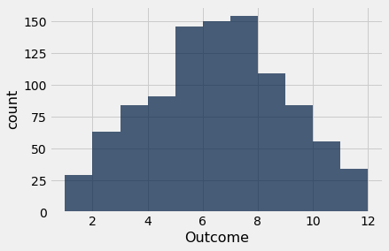
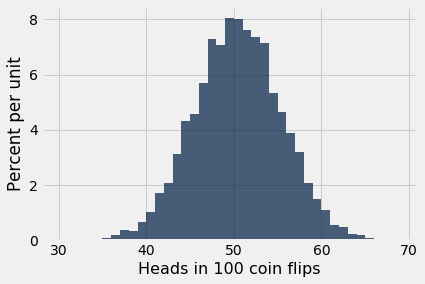

```python
from datascience import *
import numpy as np

%matplotlib inline
import matplotlib.pyplot as plots
plots.style.use('fivethirtyeight')
```

## Comparison and bool values

**Please run all cells before this cell, including the import cell at the top of the notebook.**


```python
x = 3
y = 4
x > y
```


    False


```python
10/2 != y
```


    True


```python
'Dog' > 'Cat'
#Strings can also be compared
#They are evaluated from alphabetically
```


    True


```python
'Dog' > 'Catastrophe' > 'Cat'
#If two strings start the same, then the shortest wins
```


    True


```python
a = np.arange(11, 50)
a
```


    array([11, 12, 13, 14, 15, 16, 17, 18, 19, 20, 21, 22, 23, 24, 25, 26, 27,
           28, 29, 30, 31, 32, 33, 34, 35, 36, 37, 38, 39, 40, 41, 42, 43, 44,
           45, 46, 47, 48, 49])


```python
a > 30
# arrays can also be evaluated
```


    array([False, False, False, False, False, False, False, False, False,
           False, False, False, False, False, False, False, False, False,
           False, False,  True,  True,  True,  True,  True,  True,  True,
            True,  True,  True,  True,  True,  True,  True,  True,  True,
            True,  True,  True])


```python
a == 15
```


    array([False, False, False, False,  True, False, False, False, False,
           False, False, False, False, False, False, False, False, False,
           False, False, False, False, False, False, False, False, False,
           False, False, False, False, False, False, False, False, False,
           False, False, False])


```python
def teen(x):
    ''' Takes in a value and determines which age group they below to'''
    return 13 <= x <= 19

[teen(10), teen(15), teen(20)]

```


    [False, True, False]


```python
ages = Table().with_column('Age', a)
ages = ages.with_column('Teenager', ages.apply(teen, 'Age'))
ages
# Example of applying the teen function to an array
```


<table border="1" class="dataframe">
    <thead>
        <tr>
            <th>Age</th> <th>Teenager</th>
        </tr>
    </thead>
    <tbody>
        <tr>
            <td>11  </td> <td>False   </td>
        </tr>
    </tbody>
        <tr>
            <td>12  </td> <td>False   </td>
        </tr>
    </tbody>
        <tr>
            <td>13  </td> <td>True    </td>
        </tr>
    </tbody>
        <tr>
            <td>14  </td> <td>True    </td>
        </tr>
    </tbody>
        <tr>
            <td>15  </td> <td>True    </td>
        </tr>
    </tbody>
        <tr>
            <td>16  </td> <td>True    </td>
        </tr>
    </tbody>
        <tr>
            <td>17  </td> <td>True    </td>
        </tr>
    </tbody>
        <tr>
            <td>18  </td> <td>True    </td>
        </tr>
    </tbody>
        <tr>
            <td>19  </td> <td>True    </td>
        </tr>
    </tbody>
        <tr>
            <td>20  </td> <td>False   </td>
        </tr>
    </tbody>
</table>
<p>... (29 rows omitted)</p>


```python
# Other comparisons
# x and y examples from earlier
x < 2 or y > 3
```


    True


## Combining bools

**Please run all cells before this cell, including the previous example cells and the import cell at the top of the notebook.**


```python
[x, y]
```


    [3, 4]


```python
x < 2 or y > 4
```


    False


```python
not (x < 2 or x > 4)
```


    True


```python
True + True
```


    2


```python
(3 > 2) + (2 > 1)
```


    2


```python
False + False + False
```


    0


```python
sum([False, True, True, False, True])
# Very helpful now to see how many Trues there are
```


    3


```python
ages
```


<table border="1" class="dataframe">
    <thead>
        <tr>
            <th>Age</th> <th>Teenager</th>
        </tr>
    </thead>
    <tbody>
        <tr>
            <td>11  </td> <td>False   </td>
        </tr>
    </tbody>
        <tr>
            <td>12  </td> <td>False   </td>
        </tr>
    </tbody>
        <tr>
            <td>13  </td> <td>True    </td>
        </tr>
    </tbody>
        <tr>
            <td>14  </td> <td>True    </td>
        </tr>
    </tbody>
        <tr>
            <td>15  </td> <td>True    </td>
        </tr>
    </tbody>
        <tr>
            <td>16  </td> <td>True    </td>
        </tr>
    </tbody>
        <tr>
            <td>17  </td> <td>True    </td>
        </tr>
    </tbody>
        <tr>
            <td>18  </td> <td>True    </td>
        </tr>
    </tbody>
        <tr>
            <td>19  </td> <td>True    </td>
        </tr>
    </tbody>
        <tr>
            <td>20  </td> <td>False   </td>
        </tr>
    </tbody>
</table>
<p>... (29 rows omitted)</p>


```python
ages.column(1)
```


    array([False, False,  True,  True,  True,  True,  True,  True,  True,
           False, False, False, False, False, False, False, False, False,
           False, False, False, False, False, False, False, False, False,
           False, False, False, False, False, False, False, False, False,
           False, False, False])


```python
sum(ages.column(1))
```


    7


## Predicates

** Are just functions that return true or false**


```python
ages
```


<table border="1" class="dataframe">
    <thead>
        <tr>
            <th>Age</th> <th>Teenager</th>
        </tr>
    </thead>
    <tbody>
        <tr>
            <td>11  </td> <td>False   </td>
        </tr>
    </tbody>
        <tr>
            <td>12  </td> <td>False   </td>
        </tr>
    </tbody>
        <tr>
            <td>13  </td> <td>True    </td>
        </tr>
    </tbody>
        <tr>
            <td>14  </td> <td>True    </td>
        </tr>
    </tbody>
        <tr>
            <td>15  </td> <td>True    </td>
        </tr>
    </tbody>
        <tr>
            <td>16  </td> <td>True    </td>
        </tr>
    </tbody>
        <tr>
            <td>17  </td> <td>True    </td>
        </tr>
    </tbody>
        <tr>
            <td>18  </td> <td>True    </td>
        </tr>
    </tbody>
        <tr>
            <td>19  </td> <td>True    </td>
        </tr>
    </tbody>
        <tr>
            <td>20  </td> <td>False   </td>
        </tr>
    </tbody>
</table>
<p>... (29 rows omitted)</p>


```python
still_young = are.between(35, 40)
ages.where('Age', still_young)
```


<table border="1" class="dataframe">
    <thead>
        <tr>
            <th>Age</th> <th>Teenager</th>
        </tr>
    </thead>
    <tbody>
        <tr>
            <td>35  </td> <td>False   </td>
        </tr>
    </tbody>
        <tr>
            <td>36  </td> <td>False   </td>
        </tr>
    </tbody>
        <tr>
            <td>37  </td> <td>False   </td>
        </tr>
    </tbody>
        <tr>
            <td>38  </td> <td>False   </td>
        </tr>
    </tbody>
        <tr>
            <td>39  </td> <td>False   </td>
        </tr>
    </tbody>
</table>


```python
still_young(38)
```


    True


```python
still_young(40)
```


    False


```python
ages.apply(still_young, 'Age')
```


    array([False, False, False, False, False, False, False, False, False,
           False, False, False, False, False, False, False, False, False,
           False, False, False, False, False, False,  True,  True,  True,
            True,  True, False, False, False, False, False, False, False,
           False, False, False])


```python
sum(ages.apply(still_young, 'Age'))
```


    5


```python
ages.where('Age', teen)
```


<table border="1" class="dataframe">
    <thead>
        <tr>
            <th>Age</th> <th>Teenager</th>
        </tr>
    </thead>
    <tbody>
        <tr>
            <td>13  </td> <td>True    </td>
        </tr>
    </tbody>
        <tr>
            <td>14  </td> <td>True    </td>
        </tr>
    </tbody>
        <tr>
            <td>15  </td> <td>True    </td>
        </tr>
    </tbody>
        <tr>
            <td>16  </td> <td>True    </td>
        </tr>
    </tbody>
        <tr>
            <td>17  </td> <td>True    </td>
        </tr>
    </tbody>
        <tr>
            <td>18  </td> <td>True    </td>
        </tr>
    </tbody>
        <tr>
            <td>19  </td> <td>True    </td>
        </tr>
    </tbody>
</table>


## Choice

**Please run all cells before this cell, including the previous example cells and the import cell at the top of the notebook.**


```python
two_groups = make_array('treatment', 'control')
np.random.choice(two_groups)
# np.randdom.choice, randomy choose treatment or control
```


    'treatment'


```python
np.random.choice(two_groups, 10)
```


    array(['treatment', 'treatment', 'control', 'control', 'treatment',
           'control', 'control', 'treatment', 'control', 'control'],
          dtype='<U9')


```python
np.random.choice(two_groups, 10)
```


    array(['treatment', 'treatment', 'control', 'control', 'treatment',
           'treatment', 'control', 'control', 'treatment', 'control'],
          dtype='<U9')


```python
outcomes = np.random.choice(two_groups, 10)
outcomes
```


    array(['treatment', 'control', 'treatment', 'control', 'control',
           'treatment', 'treatment', 'control', 'control', 'treatment'],
          dtype='<U9')


```python
outcomes
```


    array(['treatment', 'control', 'treatment', 'control', 'control',
           'treatment', 'treatment', 'control', 'control', 'treatment'],
          dtype='<U9')


```python
outcomes == 'control'
```


    array([False,  True, False,  True,  True, False, False,  True,  True,
           False])


```python
# sum(outcomes)
```


```python
sum(outcomes == 'control')
```


    5


```python
sum(outcomes == 'treatment')
```


    5


```python
# Same result using the numpy function
np.count_nonzero(outcomes == 'treatment')
```


    5


## Discussion Question

**Please run all cells before this cell, including the previous example cells and the import cell at the top of the notebook.**


```python
np.arange(6)+1

```


    array([1, 2, 3, 4, 5, 6])


```python
d=np.arange(6)+1
np.random.choice(d,10)
```


    array([3, 3, 2, 6, 1, 1, 6, 3, 1, 6])


```python
np.random.choice(d,10) + np.random.choice(d,10)
# create two arrays with 10 elements each and add the two arrays together
```


    array([ 4,  6,  7,  7, 11,  4,  7,  7,  8,  6])


```python
2 * np.random.choice(d,10)
#Create one array with 10 elements and multiple the values by 2
```


    array([12, 12, 10,  6,  8, 12,  4,  8, 10, 12])


```python
outcomes = np.random.choice(np.arange(6)+1, 1000) + np.random.choice(np.arange(6)+1, 1000)
Table().with_column("Outcome", outcomes).group(0).bar('Outcome')
```





## Print


```python
# built in function which displays something
```

**Please run all cells before this cell, including the previous example cells and the import cell at the top of the notebook.**


```python
def double(x):
    print('doubling', x)
    return 2 * x

def square(x):
    print('squaring', x)
    return x * x

double(square(double(5)))
```

    doubling 5
    squaring 10
    doubling 100


    200


```python
print('one', end=' long ')
print('line')
```

    one long line


## Conditional Statements

** if and for are used **


```python
def sign(x):
    print(x, 'is', end=' ')
    if x > 0:
        print('positive')
    if x < 0:
        print('negative')
    if x == 0:
        print('zero')

sign(3)
sign(-3)
sign(0)
```

    3 is positive
    -3 is negative
    0 is zero


```python
def sign(x):
    print(x, 'is', end=' ')
    if x > 1e-15:
        print('positive')
    elif x < -1e-15:
        print('negative')
    elif x == 0:
        print('zero')
    else:
        print('really close to zero')

sign(3)
sign(-3)
sign(0)
sign(2**0.5 * 2 **0.5 - 2)
```

    3 is positive
    -3 is negative
    0 is zero
    4.440892098500626e-16 is really close to zero


## For Statements

**Please run all cells before this cell, including the previous example cells and the import cell at the top of the notebook.**


```python
np.append(make_array(1, 2, 3), 4)
# start with an array
```


    array([1, 2, 3, 4])


```python
np.append(make_array(1, 2, 3), 'four')
```


    array(['1', '2', '3', 'four'], dtype='<U21')


```python
np.append(make_array(1, 2, 3), make_array(4, 5, 6))
```


    array([1, 2, 3, 4, 5, 6])


```python
np.arange(4)
```


    array([0, 1, 2, 3])


```python
for i in np.arange(4):
    print('iteration', i)
```

    iteration 0
    iteration 1
    iteration 2
    iteration 3


```python
coin = make_array('heads', 'tails')
np.random.choice(coin)
```


    'tails'


```python
sum(np.random.choice(coin, 100) == 'heads')
```


    51


```python
num_heads = make_array(sum(np.random.choice(coin, 100) == 'heads'))
num_heads
```


    array([57])


```python
num_heads = np.append(num_heads, sum(np.random.choice(coin, 100) == 'heads'))
num_heads
```


    array([57, 46])


```python
num_heads = make_array()
for i in np.arange(10000):
    num_heads = np.append(num_heads, sum(np.random.choice(coin, 100) == 'heads'))
num_heads
# creating an array, and appending the results of the random coin flip a 1000 times
```


    array([51., 53., 55., ..., 55., 48., 45.])


```python
len(num_heads)
```


    10000


```python
t = Table().with_column('Heads in 100 coin flips', num_heads)
t.hist(bins=np.arange(30, 70, 1))
```

    /usr/local/lib/python3.6/dist-packages/matplotlib/axes/_axes.py:6462: UserWarning: The 'normed' kwarg is deprecated, and has been replaced by the 'density' kwarg.
      warnings.warn("The 'normed' kwarg is deprecated, and has been "





```python
most = t.group(0).where(0, are.between(40, 60))
most
```


<table border="1" class="dataframe">
    <thead>
        <tr>
            <th>Heads in 100 coin flips</th> <th>count</th>
        </tr>
    </thead>
    <tbody>
        <tr>
            <td>40                     </td> <td>101  </td>
        </tr>
    </tbody>
        <tr>
            <td>41                     </td> <td>171  </td>
        </tr>
    </tbody>
        <tr>
            <td>42                     </td> <td>206  </td>
        </tr>
    </tbody>
        <tr>
            <td>43                     </td> <td>314  </td>
        </tr>
    </tbody>
        <tr>
            <td>44                     </td> <td>431  </td>
        </tr>
    </tbody>
        <tr>
            <td>45                     </td> <td>458  </td>
        </tr>
    </tbody>
        <tr>
            <td>46                     </td> <td>569  </td>
        </tr>
    </tbody>
        <tr>
            <td>47                     </td> <td>728  </td>
        </tr>
    </tbody>
        <tr>
            <td>48                     </td> <td>707  </td>
        </tr>
    </tbody>
        <tr>
            <td>49                     </td> <td>804  </td>
        </tr>
    </tbody>
</table>
<p>... (10 rows omitted)</p>


```python
sum(most.column('count')) / t.num_rows * 100
# 95% of the numbers occured between 40 and 60
```


    95.64


