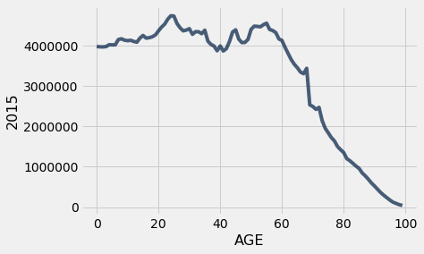

```python
from datascience import *
import numpy as np

%matplotlib inline
import matplotlib.pyplot as plots
plots.style.use('fivethirtyeight')
```

## Line Graphs

**Please run all cells before this cell, including the import cell at the top of the notebook.**


```python
# From Lecture 6

# As of Jan 2017, this census file is online here: 
data = 'http://www2.census.gov/programs-surveys/popest/datasets/2010-2015/national/asrh/nc-est2015-agesex-res.csv'

# A copy can be accessed here in case census.gov moves the file:
# data = 'http://inferentialthinking.com/notebooks/nc-est2015-agesex-res.csv'

full_census_table = Table.read_table("census.csv")
full_census_table
print(full_census_table)
mypartial=full_census_table.select([0,1,9])
print(mypartial)
mypartial2=mypartial.where("SEX", 0).where("AGE", are.between(0,200))
print(mypartial2)
partial = full_census_table.select(['SEX', 'AGE', 4, 9])
us_pop = partial.relabeled(2, '2010').relabeled(3, '2015')
ratio = (us_pop.column(3) / us_pop.column(2))
census = us_pop.with_columns(
        'Change', us_pop.column(3) - us_pop.column(2), 
        'Total Growth', ratio - 1,
        'Annual Growth', ratio ** (1/5) - 1)
census.set_format([2, 3, 4], NumberFormatter)
census.set_format([5, 6], PercentFormatter)
```

    SEX  | AGE  | CENSUS2010POP | ESTIMATESBASE2010 | POPESTIMATE2010 | POPESTIMATE2011 | POPESTIMATE2012 | POPESTIMATE2013 | POPESTIMATE2014 | POPESTIMATE2015
    0    | 0    | 3944153       | 3944160           | 3951330         | 3963087         | 3926540         | 3931141         | 3949775         | 3978038
    0    | 1    | 3978070       | 3978090           | 3957888         | 3966551         | 3977939         | 3942872         | 3949776         | 3968564
    0    | 2    | 4096929       | 4096939           | 4090862         | 3971565         | 3980095         | 3992720         | 3959664         | 3966583
    0    | 3    | 4119040       | 4119051           | 4111920         | 4102470         | 3983157         | 3992734         | 4007079         | 3974061
    0    | 4    | 4063170       | 4063186           | 4077551         | 4122294         | 4112849         | 3994449         | 4005716         | 4020035
    0    | 5    | 4056858       | 4056872           | 4064653         | 4087709         | 4132242         | 4123626         | 4006900         | 4018158
    0    | 6    | 4066381       | 4066412           | 4073013         | 4074993         | 4097605         | 4142916         | 4135930         | 4019207
    0    | 7    | 4030579       | 4030594           | 4043046         | 4083225         | 4084913         | 4108349         | 4155326         | 4148360
    0    | 8    | 4046486       | 4046497           | 4025604         | 4053203         | 4093177         | 4095711         | 4120903         | 4167887
    0    | 9    | 4148353       | 4148369           | 4125415         | 4035710         | 4063152         | 4104072         | 4108349         | 4133564
    ... (296 rows omitted)
    SEX  | AGE  | POPESTIMATE2015
    0    | 0    | 3978038
    0    | 1    | 3968564
    0    | 2    | 3966583
    0    | 3    | 3974061
    0    | 4    | 4020035
    0    | 5    | 4018158
    0    | 6    | 4019207
    0    | 7    | 4148360
    0    | 8    | 4167887
    0    | 9    | 4133564
    ... (296 rows omitted)
    SEX  | AGE  | POPESTIMATE2015
    0    | 0    | 3978038
    0    | 1    | 3968564
    0    | 2    | 3966583
    0    | 3    | 3974061
    0    | 4    | 4020035
    0    | 5    | 4018158
    0    | 6    | 4019207
    0    | 7    | 4148360
    0    | 8    | 4167887
    0    | 9    | 4133564
    ... (91 rows omitted)


<table border="1" class="dataframe">
    <thead>
        <tr>
            <th>SEX</th> <th>AGE</th> <th>2010</th> <th>2015</th> <th>Change</th> <th>Total Growth</th> <th>Annual Growth</th>
        </tr>
    </thead>
    <tbody>
        <tr>
            <td>0   </td> <td>0   </td> <td>3,951,330</td> <td>3,978,038</td> <td>26,708  </td> <td>0.68%       </td> <td>0.13%        </td>
        </tr>
    </tbody>
        <tr>
            <td>0   </td> <td>1   </td> <td>3,957,888</td> <td>3,968,564</td> <td>10,676  </td> <td>0.27%       </td> <td>0.05%        </td>
        </tr>
    </tbody>
        <tr>
            <td>0   </td> <td>2   </td> <td>4,090,862</td> <td>3,966,583</td> <td>-124,279</td> <td>-3.04%      </td> <td>-0.62%       </td>
        </tr>
    </tbody>
        <tr>
            <td>0   </td> <td>3   </td> <td>4,111,920</td> <td>3,974,061</td> <td>-137,859</td> <td>-3.35%      </td> <td>-0.68%       </td>
        </tr>
    </tbody>
        <tr>
            <td>0   </td> <td>4   </td> <td>4,077,551</td> <td>4,020,035</td> <td>-57,516 </td> <td>-1.41%      </td> <td>-0.28%       </td>
        </tr>
    </tbody>
        <tr>
            <td>0   </td> <td>5   </td> <td>4,064,653</td> <td>4,018,158</td> <td>-46,495 </td> <td>-1.14%      </td> <td>-0.23%       </td>
        </tr>
    </tbody>
        <tr>
            <td>0   </td> <td>6   </td> <td>4,073,013</td> <td>4,019,207</td> <td>-53,806 </td> <td>-1.32%      </td> <td>-0.27%       </td>
        </tr>
    </tbody>
        <tr>
            <td>0   </td> <td>7   </td> <td>4,043,046</td> <td>4,148,360</td> <td>105,314 </td> <td>2.60%       </td> <td>0.52%        </td>
        </tr>
    </tbody>
        <tr>
            <td>0   </td> <td>8   </td> <td>4,025,604</td> <td>4,167,887</td> <td>142,283 </td> <td>3.53%       </td> <td>0.70%        </td>
        </tr>
    </tbody>
        <tr>
            <td>0   </td> <td>9   </td> <td>4,125,415</td> <td>4,133,564</td> <td>8,149   </td> <td>0.20%       </td> <td>0.04%        </td>
        </tr>
    </tbody>
</table>
<p>... (296 rows omitted)</p>


```python
by_age = census.where('SEX', 0).drop('SEX').where('AGE', are.between(0, 100))
by_age
```


<table border="1" class="dataframe">
    <thead>
        <tr>
            <th>AGE</th> <th>2010</th> <th>2015</th> <th>Change</th> <th>Total Growth</th> <th>Annual Growth</th>
        </tr>
    </thead>
    <tbody>
        <tr>
            <td>0   </td> <td>3,951,330</td> <td>3,978,038</td> <td>26,708  </td> <td>0.68%       </td> <td>0.13%        </td>
        </tr>
    </tbody>
        <tr>
            <td>1   </td> <td>3,957,888</td> <td>3,968,564</td> <td>10,676  </td> <td>0.27%       </td> <td>0.05%        </td>
        </tr>
    </tbody>
        <tr>
            <td>2   </td> <td>4,090,862</td> <td>3,966,583</td> <td>-124,279</td> <td>-3.04%      </td> <td>-0.62%       </td>
        </tr>
    </tbody>
        <tr>
            <td>3   </td> <td>4,111,920</td> <td>3,974,061</td> <td>-137,859</td> <td>-3.35%      </td> <td>-0.68%       </td>
        </tr>
    </tbody>
        <tr>
            <td>4   </td> <td>4,077,551</td> <td>4,020,035</td> <td>-57,516 </td> <td>-1.41%      </td> <td>-0.28%       </td>
        </tr>
    </tbody>
        <tr>
            <td>5   </td> <td>4,064,653</td> <td>4,018,158</td> <td>-46,495 </td> <td>-1.14%      </td> <td>-0.23%       </td>
        </tr>
    </tbody>
        <tr>
            <td>6   </td> <td>4,073,013</td> <td>4,019,207</td> <td>-53,806 </td> <td>-1.32%      </td> <td>-0.27%       </td>
        </tr>
    </tbody>
        <tr>
            <td>7   </td> <td>4,043,046</td> <td>4,148,360</td> <td>105,314 </td> <td>2.60%       </td> <td>0.52%        </td>
        </tr>
    </tbody>
        <tr>
            <td>8   </td> <td>4,025,604</td> <td>4,167,887</td> <td>142,283 </td> <td>3.53%       </td> <td>0.70%        </td>
        </tr>
    </tbody>
        <tr>
            <td>9   </td> <td>4,125,415</td> <td>4,133,564</td> <td>8,149   </td> <td>0.20%       </td> <td>0.04%        </td>
        </tr>
    </tbody>
</table>
<p>... (90 rows omitted)</p>


```python
by_age.plot(0, 2)
```





```python
by_age.plot(0, 1)
```


```python
by_age.plot(0, 3)

```


```python
by_age.select(0, 1, 2).plot(0)
```


```python
by_age.select(0, 1, 2).plot(0, overlay=False)
```


## Example 1: Age

**Please run all cells before this cell, including the previous examples and the import cell at the top of the notebook.**


```python
by_age.labels
```


    ('AGE', '2010', '2015', 'Change', 'Total Growth', 'Annual Growth')


```python
by_age.plot(0, 3)
```


```python
by_age.sort(3, descending=True)
```


<table border="1" class="dataframe">
    <thead>
        <tr>
            <th>AGE</th> <th>2010</th> <th>2015</th> <th>Change</th> <th>Total Growth</th> <th>Annual Growth</th>
        </tr>
    </thead>
    <tbody>
        <tr>
            <td>68  </td> <td>2,359,816</td> <td>3,436,357</td> <td>1,076,541</td> <td>45.62%      </td> <td>7.81%        </td>
        </tr>
    </tbody>
        <tr>
            <td>64  </td> <td>2,706,055</td> <td>3,536,156</td> <td>830,101  </td> <td>30.68%      </td> <td>5.50%        </td>
        </tr>
    </tbody>
        <tr>
            <td>65  </td> <td>2,678,525</td> <td>3,450,043</td> <td>771,518  </td> <td>28.80%      </td> <td>5.19%        </td>
        </tr>
    </tbody>
        <tr>
            <td>66  </td> <td>2,621,335</td> <td>3,344,134</td> <td>722,799  </td> <td>27.57%      </td> <td>4.99%        </td>
        </tr>
    </tbody>
        <tr>
            <td>67  </td> <td>2,693,707</td> <td>3,304,187</td> <td>610,480  </td> <td>22.66%      </td> <td>4.17%        </td>
        </tr>
    </tbody>
        <tr>
            <td>72  </td> <td>1,883,820</td> <td>2,469,605</td> <td>585,785  </td> <td>31.10%      </td> <td>5.56%        </td>
        </tr>
    </tbody>
        <tr>
            <td>58  </td> <td>3,802,447</td> <td>4,320,522</td> <td>518,075  </td> <td>13.62%      </td> <td>2.59%        </td>
        </tr>
    </tbody>
        <tr>
            <td>60  </td> <td>3,616,721</td> <td>4,125,792</td> <td>509,071  </td> <td>14.08%      </td> <td>2.67%        </td>
        </tr>
    </tbody>
        <tr>
            <td>24  </td> <td>4,243,602</td> <td>4,737,345</td> <td>493,743  </td> <td>11.63%      </td> <td>2.23%        </td>
        </tr>
    </tbody>
        <tr>
            <td>34  </td> <td>3,822,189</td> <td>4,294,838</td> <td>472,649  </td> <td>12.37%      </td> <td>2.36%        </td>
        </tr>
    </tbody>
</table>
<p>... (90 rows omitted)</p>


```python
2010 - 68
```


    1942


```python
2015 - 68
```


    1947


## Scatter Plots

**Please run all cells before this cell, including the previous examples and the import cell at the top of the notebook.**


```python
actors = Table.read_table('actors.csv')
actors
```


<table border="1" class="dataframe">
    <thead>
        <tr>
            <th>Actor</th> <th>Total Gross</th> <th>Number of Movies</th> <th>Average per Movie</th> <th>#1 Movie</th> <th>Gross</th>
        </tr>
    </thead>
    <tbody>
        <tr>
            <td>Harrison Ford     </td> <td>4871.7     </td> <td>41              </td> <td>118.8            </td> <td>Star Wars: The Force Awakens</td> <td>936.7</td>
        </tr>
    </tbody>
        <tr>
            <td>Samuel L. Jackson </td> <td>4772.8     </td> <td>69              </td> <td>69.2             </td> <td>The Avengers                </td> <td>623.4</td>
        </tr>
    </tbody>
        <tr>
            <td>Morgan Freeman    </td> <td>4468.3     </td> <td>61              </td> <td>73.3             </td> <td>The Dark Knight             </td> <td>534.9</td>
        </tr>
    </tbody>
        <tr>
            <td>Tom Hanks         </td> <td>4340.8     </td> <td>44              </td> <td>98.7             </td> <td>Toy Story 3                 </td> <td>415  </td>
        </tr>
    </tbody>
        <tr>
            <td>Robert Downey, Jr.</td> <td>3947.3     </td> <td>53              </td> <td>74.5             </td> <td>The Avengers                </td> <td>623.4</td>
        </tr>
    </tbody>
        <tr>
            <td>Eddie Murphy      </td> <td>3810.4     </td> <td>38              </td> <td>100.3            </td> <td>Shrek 2                     </td> <td>441.2</td>
        </tr>
    </tbody>
        <tr>
            <td>Tom Cruise        </td> <td>3587.2     </td> <td>36              </td> <td>99.6             </td> <td>War of the Worlds           </td> <td>234.3</td>
        </tr>
    </tbody>
        <tr>
            <td>Johnny Depp       </td> <td>3368.6     </td> <td>45              </td> <td>74.9             </td> <td>Dead Man's Chest            </td> <td>423.3</td>
        </tr>
    </tbody>
        <tr>
            <td>Michael Caine     </td> <td>3351.5     </td> <td>58              </td> <td>57.8             </td> <td>The Dark Knight             </td> <td>534.9</td>
        </tr>
    </tbody>
        <tr>
            <td>Scarlett Johansson</td> <td>3341.2     </td> <td>37              </td> <td>90.3             </td> <td>The Avengers                </td> <td>623.4</td>
        </tr>
    </tbody>
</table>
<p>... (40 rows omitted)</p>


```python
actors = actors.relabeled(5, '#1 Movie Gross')
actors
```


<table border="1" class="dataframe">
    <thead>
        <tr>
            <th>Actor</th> <th>Total Gross</th> <th>Number of Movies</th> <th>Average per Movie</th> <th>#1 Movie</th> <th>#1 Movie Gross</th>
        </tr>
    </thead>
    <tbody>
        <tr>
            <td>Harrison Ford     </td> <td>4871.7     </td> <td>41              </td> <td>118.8            </td> <td>Star Wars: The Force Awakens</td> <td>936.7         </td>
        </tr>
    </tbody>
        <tr>
            <td>Samuel L. Jackson </td> <td>4772.8     </td> <td>69              </td> <td>69.2             </td> <td>The Avengers                </td> <td>623.4         </td>
        </tr>
    </tbody>
        <tr>
            <td>Morgan Freeman    </td> <td>4468.3     </td> <td>61              </td> <td>73.3             </td> <td>The Dark Knight             </td> <td>534.9         </td>
        </tr>
    </tbody>
        <tr>
            <td>Tom Hanks         </td> <td>4340.8     </td> <td>44              </td> <td>98.7             </td> <td>Toy Story 3                 </td> <td>415           </td>
        </tr>
    </tbody>
        <tr>
            <td>Robert Downey, Jr.</td> <td>3947.3     </td> <td>53              </td> <td>74.5             </td> <td>The Avengers                </td> <td>623.4         </td>
        </tr>
    </tbody>
        <tr>
            <td>Eddie Murphy      </td> <td>3810.4     </td> <td>38              </td> <td>100.3            </td> <td>Shrek 2                     </td> <td>441.2         </td>
        </tr>
    </tbody>
        <tr>
            <td>Tom Cruise        </td> <td>3587.2     </td> <td>36              </td> <td>99.6             </td> <td>War of the Worlds           </td> <td>234.3         </td>
        </tr>
    </tbody>
        <tr>
            <td>Johnny Depp       </td> <td>3368.6     </td> <td>45              </td> <td>74.9             </td> <td>Dead Man's Chest            </td> <td>423.3         </td>
        </tr>
    </tbody>
        <tr>
            <td>Michael Caine     </td> <td>3351.5     </td> <td>58              </td> <td>57.8             </td> <td>The Dark Knight             </td> <td>534.9         </td>
        </tr>
    </tbody>
        <tr>
            <td>Scarlett Johansson</td> <td>3341.2     </td> <td>37              </td> <td>90.3             </td> <td>The Avengers                </td> <td>623.4         </td>
        </tr>
    </tbody>
</table>
<p>... (40 rows omitted)</p>


```python
actors.scatter(2, 1)
```


```python
actors.labels
```


    ('Actor',
     'Total Gross',
     'Number of Movies',
     'Average per Movie',
     '#1 Movie',
     '#1 Movie Gross')


```python
actors.scatter(5,1)

```


```python
actors.select(2, 3, 5).scatter(0)
```


```python
actors.where(5, are.above(800))
```


<table border="1" class="dataframe">
    <thead>
        <tr>
            <th>Actor</th> <th>Total Gross</th> <th>Number of Movies</th> <th>Average per Movie</th> <th>#1 Movie</th> <th>#1 Movie Gross</th>
        </tr>
    </thead>
    <tbody>
        <tr>
            <td>Harrison Ford  </td> <td>4871.7     </td> <td>41              </td> <td>118.8            </td> <td>Star Wars: The Force Awakens</td> <td>936.7         </td>
        </tr>
    </tbody>
        <tr>
            <td>Anthony Daniels</td> <td>3162.9     </td> <td>7               </td> <td>451.8            </td> <td>Star Wars: The Force Awakens</td> <td>936.7         </td>
        </tr>
    </tbody>
        <tr>
            <td>Andy Serkis    </td> <td>2890.6     </td> <td>23              </td> <td>125.7            </td> <td>Star Wars: The Force Awakens</td> <td>936.7         </td>
        </tr>
    </tbody>
</table>


## Example 2: Actors

**Please run all cells before this cell, including the previous examples and the import cell at the top of the notebook.**


```python
actors
```


<table border="1" class="dataframe">
    <thead>
        <tr>
            <th>Actor</th> <th>Total Gross</th> <th>Number of Movies</th> <th>Average per Movie</th> <th>#1 Movie</th> <th>#1 Movie Gross</th>
        </tr>
    </thead>
    <tbody>
        <tr>
            <td>Harrison Ford     </td> <td>4871.7     </td> <td>41              </td> <td>118.8            </td> <td>Star Wars: The Force Awakens</td> <td>936.7         </td>
        </tr>
    </tbody>
        <tr>
            <td>Samuel L. Jackson </td> <td>4772.8     </td> <td>69              </td> <td>69.2             </td> <td>The Avengers                </td> <td>623.4         </td>
        </tr>
    </tbody>
        <tr>
            <td>Morgan Freeman    </td> <td>4468.3     </td> <td>61              </td> <td>73.3             </td> <td>The Dark Knight             </td> <td>534.9         </td>
        </tr>
    </tbody>
        <tr>
            <td>Tom Hanks         </td> <td>4340.8     </td> <td>44              </td> <td>98.7             </td> <td>Toy Story 3                 </td> <td>415           </td>
        </tr>
    </tbody>
        <tr>
            <td>Robert Downey, Jr.</td> <td>3947.3     </td> <td>53              </td> <td>74.5             </td> <td>The Avengers                </td> <td>623.4         </td>
        </tr>
    </tbody>
        <tr>
            <td>Eddie Murphy      </td> <td>3810.4     </td> <td>38              </td> <td>100.3            </td> <td>Shrek 2                     </td> <td>441.2         </td>
        </tr>
    </tbody>
        <tr>
            <td>Tom Cruise        </td> <td>3587.2     </td> <td>36              </td> <td>99.6             </td> <td>War of the Worlds           </td> <td>234.3         </td>
        </tr>
    </tbody>
        <tr>
            <td>Johnny Depp       </td> <td>3368.6     </td> <td>45              </td> <td>74.9             </td> <td>Dead Man's Chest            </td> <td>423.3         </td>
        </tr>
    </tbody>
        <tr>
            <td>Michael Caine     </td> <td>3351.5     </td> <td>58              </td> <td>57.8             </td> <td>The Dark Knight             </td> <td>534.9         </td>
        </tr>
    </tbody>
        <tr>
            <td>Scarlett Johansson</td> <td>3341.2     </td> <td>37              </td> <td>90.3             </td> <td>The Avengers                </td> <td>623.4         </td>
        </tr>
    </tbody>
</table>
<p>... (40 rows omitted)</p>


#### Interpreting Scatter Plots
Interpretations involve all three features of the plot:
1. the individuals corresponding to the points; that is, those on whom the two variables are measured
2. the variable on the horizontal axis
3. The variable on the vertical asix


```python
actors.scatter(2, 3)
```


```python
actors.where(2, are.below(10))
```


<table border="1" class="dataframe">
    <thead>
        <tr>
            <th>Actor</th> <th>Total Gross</th> <th>Number of Movies</th> <th>Average per Movie</th> <th>#1 Movie</th> <th>#1 Movie Gross</th>
        </tr>
    </thead>
    <tbody>
        <tr>
            <td>Anthony Daniels</td> <td>3162.9     </td> <td>7               </td> <td>451.8            </td> <td>Star Wars: The Force Awakens</td> <td>936.7         </td>
        </tr>
    </tbody>
</table>


```python
actors.where(2, are.above(60))
```


<table border="1" class="dataframe">
    <thead>
        <tr>
            <th>Actor</th> <th>Total Gross</th> <th>Number of Movies</th> <th>Average per Movie</th> <th>#1 Movie</th> <th>#1 Movie Gross</th>
        </tr>
    </thead>
    <tbody>
        <tr>
            <td>Samuel L. Jackson</td> <td>4772.8     </td> <td>69              </td> <td>69.2             </td> <td>The Avengers      </td> <td>623.4         </td>
        </tr>
    </tbody>
        <tr>
            <td>Morgan Freeman   </td> <td>4468.3     </td> <td>61              </td> <td>73.3             </td> <td>The Dark Knight   </td> <td>534.9         </td>
        </tr>
    </tbody>
        <tr>
            <td>Robert DeNiro    </td> <td>3081.3     </td> <td>79              </td> <td>39               </td> <td>Meet the Fockers  </td> <td>279.3         </td>
        </tr>
    </tbody>
        <tr>
            <td>Liam Neeson      </td> <td>2942.7     </td> <td>63              </td> <td>46.7             </td> <td>The Phantom Menace</td> <td>474.5         </td>
        </tr>
    </tbody>
</table>


##### When to use Line vs Scatter
* plot() 
2 variables in play
* scatter()
3 variables are in play, where you have two numerical variables and want to look at the relation


#### Types of data
* Numberical - 
* Categorical - each value is from a fixed inventory

## Distributions

**Please run all cells before this cell, including the previous examples and the import cell at the top of the notebook.**


```python
top = Table.read_table('top_movies.csv')
top
```


<table border="1" class="dataframe">
    <thead>
        <tr>
            <th>Title</th> <th>Studio</th> <th>Gross</th> <th>Gross (Adjusted)</th> <th>Year</th>
        </tr>
    </thead>
    <tbody>
        <tr>
            <td>Star Wars: The Force Awakens             </td> <td>Buena Vista (Disney)</td> <td>906723418</td> <td>906723400       </td> <td>2015</td>
        </tr>
    </tbody>
        <tr>
            <td>Avatar                                   </td> <td>Fox                 </td> <td>760507625</td> <td>846120800       </td> <td>2009</td>
        </tr>
    </tbody>
        <tr>
            <td>Titanic                                  </td> <td>Paramount           </td> <td>658672302</td> <td>1178627900      </td> <td>1997</td>
        </tr>
    </tbody>
        <tr>
            <td>Jurassic World                           </td> <td>Universal           </td> <td>652270625</td> <td>687728000       </td> <td>2015</td>
        </tr>
    </tbody>
        <tr>
            <td>Marvel's The Avengers                    </td> <td>Buena Vista (Disney)</td> <td>623357910</td> <td>668866600       </td> <td>2012</td>
        </tr>
    </tbody>
        <tr>
            <td>The Dark Knight                          </td> <td>Warner Bros.        </td> <td>534858444</td> <td>647761600       </td> <td>2008</td>
        </tr>
    </tbody>
        <tr>
            <td>Star Wars: Episode I - The Phantom Menace</td> <td>Fox                 </td> <td>474544677</td> <td>785715000       </td> <td>1999</td>
        </tr>
    </tbody>
        <tr>
            <td>Star Wars                                </td> <td>Fox                 </td> <td>460998007</td> <td>1549640500      </td> <td>1977</td>
        </tr>
    </tbody>
        <tr>
            <td>Avengers: Age of Ultron                  </td> <td>Buena Vista (Disney)</td> <td>459005868</td> <td>465684200       </td> <td>2015</td>
        </tr>
    </tbody>
        <tr>
            <td>The Dark Knight Rises                    </td> <td>Warner Bros.        </td> <td>448139099</td> <td>500961700       </td> <td>2012</td>
        </tr>
    </tbody>
</table>
<p>... (190 rows omitted)</p>


##### Use of Bar charts
* barh()
To display the relation between a categorical variable and a numberical variable
To display the distribution of a categorical variable.


```python
top10 = top.take(np.arange(10))    # np.arange to create a list 0 through 9
top10.barh(0, 2)
# notice on the x axis it shows decimals and le9 on the right.   meaning add 9 digits to that number.   
# Very hard to show large numbers on the small axis, so this is short hand to make it less crowded. 
```


```python
studios = top.group('Studio')
# group() by a catagory
studios.show()
```


<table border="1" class="dataframe">
    <thead>
        <tr>
            <th>Studio</th> <th>count</th>
        </tr>
    </thead>
    <tbody>
        <tr>
            <td>AVCO                   </td> <td>1    </td>
        </tr>
    </tbody>
        <tr>
            <td>Buena Vista (Disney)   </td> <td>29   </td>
        </tr>
    </tbody>
        <tr>
            <td>Columbia               </td> <td>10   </td>
        </tr>
    </tbody>
        <tr>
            <td>Disney                 </td> <td>11   </td>
        </tr>
    </tbody>
        <tr>
            <td>Dreamworks             </td> <td>3    </td>
        </tr>
    </tbody>
        <tr>
            <td>Fox                    </td> <td>26   </td>
        </tr>
    </tbody>
        <tr>
            <td>IFC                    </td> <td>1    </td>
        </tr>
    </tbody>
        <tr>
            <td>Lionsgate              </td> <td>3    </td>
        </tr>
    </tbody>
        <tr>
            <td>MGM                    </td> <td>7    </td>
        </tr>
    </tbody>
        <tr>
            <td>MPC                    </td> <td>1    </td>
        </tr>
    </tbody>
        <tr>
            <td>NM                     </td> <td>1    </td>
        </tr>
    </tbody>
        <tr>
            <td>New Line               </td> <td>5    </td>
        </tr>
    </tbody>
        <tr>
            <td>Orion                  </td> <td>1    </td>
        </tr>
    </tbody>
        <tr>
            <td>Paramount              </td> <td>25   </td>
        </tr>
    </tbody>
        <tr>
            <td>Paramount/Dreamworks   </td> <td>4    </td>
        </tr>
    </tbody>
        <tr>
            <td>RKO                    </td> <td>3    </td>
        </tr>
    </tbody>
        <tr>
            <td>Selz.                  </td> <td>1    </td>
        </tr>
    </tbody>
        <tr>
            <td>Sony                   </td> <td>6    </td>
        </tr>
    </tbody>
        <tr>
            <td>Sum.                   </td> <td>2    </td>
        </tr>
    </tbody>
        <tr>
            <td>TriS                   </td> <td>2    </td>
        </tr>
    </tbody>
        <tr>
            <td>UA                     </td> <td>6    </td>
        </tr>
    </tbody>
        <tr>
            <td>Universal              </td> <td>22   </td>
        </tr>
    </tbody>
        <tr>
            <td>Warner Bros.           </td> <td>29   </td>
        </tr>
    </tbody>
        <tr>
            <td>Warner Bros. (New Line)</td> <td>1    </td>
        </tr>
    </tbody>
</table>


```python
sum(studios.column(1))
# 200 individuals(movies) which falls into one named catagory(studio)
```


    200


```python
studios.barh(0)
```


```python
studios.sort(1, descending=True).barh(0)
```


```python
studios.sort(0, descending=True).sort(1, descending=True).barh(0)
# difference from above is that studio is now sorted a-z for similiar values of count.
```


