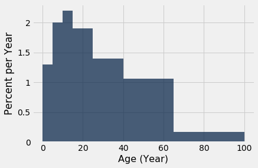
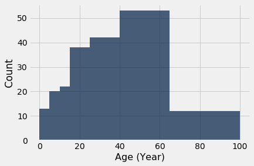
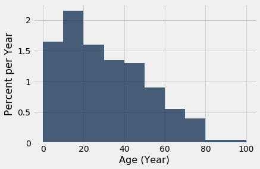
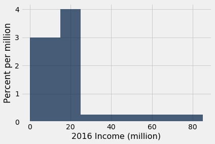

```python
from datascience import *
import numpy as np

%matplotlib inline
import matplotlib.pyplot as plots
plots.style.use('fivethirtyeight')
```

## Binning
 Binning is counting the number of numerical values that lie within ranges, called bins.
 * Bins are defined by their lower bounds (inclusive)
 * The upper bound is the lower bound of the next bin
 

**Please run all cells before this cell, including the import cell at the top of the notebook.**


```python
top = Table.read_table('top_movies.csv')
top
```


<table border="1" class="dataframe">
    <thead>
        <tr>
            <th>Title</th> <th>Studio</th> <th>Gross</th> <th>Gross (Adjusted)</th> <th>Year</th>
        </tr>
    </thead>
    <tbody>
        <tr>
            <td>Star Wars: The Force Awakens             </td> <td>Buena Vista (Disney)</td> <td>906723418</td> <td>906723400       </td> <td>2015</td>
        </tr>
    </tbody>
        <tr>
            <td>Avatar                                   </td> <td>Fox                 </td> <td>760507625</td> <td>846120800       </td> <td>2009</td>
        </tr>
    </tbody>
        <tr>
            <td>Titanic                                  </td> <td>Paramount           </td> <td>658672302</td> <td>1178627900      </td> <td>1997</td>
        </tr>
    </tbody>
        <tr>
            <td>Jurassic World                           </td> <td>Universal           </td> <td>652270625</td> <td>687728000       </td> <td>2015</td>
        </tr>
    </tbody>
        <tr>
            <td>Marvel's The Avengers                    </td> <td>Buena Vista (Disney)</td> <td>623357910</td> <td>668866600       </td> <td>2012</td>
        </tr>
    </tbody>
        <tr>
            <td>The Dark Knight                          </td> <td>Warner Bros.        </td> <td>534858444</td> <td>647761600       </td> <td>2008</td>
        </tr>
    </tbody>
        <tr>
            <td>Star Wars: Episode I - The Phantom Menace</td> <td>Fox                 </td> <td>474544677</td> <td>785715000       </td> <td>1999</td>
        </tr>
    </tbody>
        <tr>
            <td>Star Wars                                </td> <td>Fox                 </td> <td>460998007</td> <td>1549640500      </td> <td>1977</td>
        </tr>
    </tbody>
        <tr>
            <td>Avengers: Age of Ultron                  </td> <td>Buena Vista (Disney)</td> <td>459005868</td> <td>465684200       </td> <td>2015</td>
        </tr>
    </tbody>
        <tr>
            <td>The Dark Knight Rises                    </td> <td>Warner Bros.        </td> <td>448139099</td> <td>500961700       </td> <td>2012</td>
        </tr>
    </tbody>
</table>
<p>... (190 rows omitted)</p>


```python
age = 2017 - top.column('Year')
```


```python
top = top.with_column('Age', age)
```


```python
top
```


<table border="1" class="dataframe">
    <thead>
        <tr>
            <th>Title</th> <th>Studio</th> <th>Gross</th> <th>Gross (Adjusted)</th> <th>Year</th> <th>Age</th>
        </tr>
    </thead>
    <tbody>
        <tr>
            <td>Star Wars: The Force Awakens             </td> <td>Buena Vista (Disney)</td> <td>906723418</td> <td>906723400       </td> <td>2015</td> <td>2   </td>
        </tr>
    </tbody>
        <tr>
            <td>Avatar                                   </td> <td>Fox                 </td> <td>760507625</td> <td>846120800       </td> <td>2009</td> <td>8   </td>
        </tr>
    </tbody>
        <tr>
            <td>Titanic                                  </td> <td>Paramount           </td> <td>658672302</td> <td>1178627900      </td> <td>1997</td> <td>20  </td>
        </tr>
    </tbody>
        <tr>
            <td>Jurassic World                           </td> <td>Universal           </td> <td>652270625</td> <td>687728000       </td> <td>2015</td> <td>2   </td>
        </tr>
    </tbody>
        <tr>
            <td>Marvel's The Avengers                    </td> <td>Buena Vista (Disney)</td> <td>623357910</td> <td>668866600       </td> <td>2012</td> <td>5   </td>
        </tr>
    </tbody>
        <tr>
            <td>The Dark Knight                          </td> <td>Warner Bros.        </td> <td>534858444</td> <td>647761600       </td> <td>2008</td> <td>9   </td>
        </tr>
    </tbody>
        <tr>
            <td>Star Wars: Episode I - The Phantom Menace</td> <td>Fox                 </td> <td>474544677</td> <td>785715000       </td> <td>1999</td> <td>18  </td>
        </tr>
    </tbody>
        <tr>
            <td>Star Wars                                </td> <td>Fox                 </td> <td>460998007</td> <td>1549640500      </td> <td>1977</td> <td>40  </td>
        </tr>
    </tbody>
        <tr>
            <td>Avengers: Age of Ultron                  </td> <td>Buena Vista (Disney)</td> <td>459005868</td> <td>465684200       </td> <td>2015</td> <td>2   </td>
        </tr>
    </tbody>
        <tr>
            <td>The Dark Knight Rises                    </td> <td>Warner Bros.        </td> <td>448139099</td> <td>500961700       </td> <td>2012</td> <td>5   </td>
        </tr>
    </tbody>
</table>
<p>... (190 rows omitted)</p>


```python
min(top.column('Age')), max(top.column('Age'))
```


    (2, 96)


```python
my_bins = make_array(0, 5, 10, 15, 25, 40, 65, 100)
```


```python
top.bin('Age', bins = my_bins)
```


<table border="1" class="dataframe">
    <thead>
        <tr>
            <th>bin</th> <th>Age count</th>
        </tr>
    </thead>
    <tbody>
        <tr>
            <td>0   </td> <td>13       </td>
        </tr>
    </tbody>
        <tr>
            <td>5   </td> <td>20       </td>
        </tr>
    </tbody>
        <tr>
            <td>10  </td> <td>22       </td>
        </tr>
    </tbody>
        <tr>
            <td>15  </td> <td>38       </td>
        </tr>
    </tbody>
        <tr>
            <td>25  </td> <td>42       </td>
        </tr>
    </tbody>
        <tr>
            <td>40  </td> <td>53       </td>
        </tr>
    </tbody>
        <tr>
            <td>65  </td> <td>12       </td>
        </tr>
    </tbody>
        <tr>
            <td>100 </td> <td>0        </td>
        </tr>
    </tbody>
</table>


```python
sum(top.bin('Age', bins = my_bins).column(1))
```


    200


```python
top.bin('Age', bins = np.arange(0, 101, 25))
```


<table border="1" class="dataframe">
    <thead>
        <tr>
            <th>bin</th> <th>Age count</th>
        </tr>
    </thead>
    <tbody>
        <tr>
            <td>0   </td> <td>93       </td>
        </tr>
    </tbody>
        <tr>
            <td>25  </td> <td>68       </td>
        </tr>
    </tbody>
        <tr>
            <td>50  </td> <td>32       </td>
        </tr>
    </tbody>
        <tr>
            <td>75  </td> <td>7        </td>
        </tr>
    </tbody>
        <tr>
            <td>100 </td> <td>0        </td>
        </tr>
    </tbody>
</table>


```python
top.bin('Age', bins = np.arange(0, 60, 25))
# This example (Lec 8.2) illustrates that if you're not careful with your data ranges that you will miss
# data.  Python shows 0 movies at fifty years old but 0 is down because 50 has no upper bound.
# so in bin() those exactly at 50 get thrown in the prior bin.  those over 50 are thrown out.
# IMPORTANT POINT!!!!!
```


<table border="1" class="dataframe">
    <thead>
        <tr>
            <th>bin</th> <th>Age count</th>
        </tr>
    </thead>
    <tbody>
        <tr>
            <td>0   </td> <td>93       </td>
        </tr>
    </tbody>
        <tr>
            <td>25  </td> <td>71       </td>
        </tr>
    </tbody>
        <tr>
            <td>50  </td> <td>0        </td>
        </tr>
    </tbody>
</table>


```python
top.where('Age', 50)
```


<table border="1" class="dataframe">
    <thead>
        <tr>
            <th>Title</th> <th>Studio</th> <th>Gross</th> <th>Gross (Adjusted)</th> <th>Year</th> <th>Age</th>
        </tr>
    </thead>
    <tbody>
        <tr>
            <td>The Jungle Book             </td> <td>Disney  </td> <td>141843612</td> <td>641015300       </td> <td>1967</td> <td>50  </td>
        </tr>
    </tbody>
        <tr>
            <td>The Graduate                </td> <td>AVCO    </td> <td>104945305</td> <td>744517700       </td> <td>1967</td> <td>50  </td>
        </tr>
    </tbody>
        <tr>
            <td>Guess Who's Coming to Dinner</td> <td>Columbia</td> <td>56666667 </td> <td>376335900       </td> <td>1967</td> <td>50  </td>
        </tr>
    </tbody>
</table>


## Drawing Histograms

**Please run all cells before this cell, including the previous example cells and the import cell at the top of the notebook.**
Lec 8.4
* chart that displays the distribution of a numerical variable
* uses bins, there is one bar for each bin
* Uses the area principle:!!!!!!!
  The area of each bar is the percent of individuals in the corresponding bin


```python
my_bins
```


    array([  0,   5,  10,  15,  25,  40,  65, 100])


```python
top.bin('Age', bins = my_bins)
```


<table border="1" class="dataframe">
    <thead>
        <tr>
            <th>bin</th> <th>Age count</th>
        </tr>
    </thead>
    <tbody>
        <tr>
            <td>0   </td> <td>13       </td>
        </tr>
    </tbody>
        <tr>
            <td>5   </td> <td>20       </td>
        </tr>
    </tbody>
        <tr>
            <td>10  </td> <td>22       </td>
        </tr>
    </tbody>
        <tr>
            <td>15  </td> <td>38       </td>
        </tr>
    </tbody>
        <tr>
            <td>25  </td> <td>42       </td>
        </tr>
    </tbody>
        <tr>
            <td>40  </td> <td>53       </td>
        </tr>
    </tbody>
        <tr>
            <td>65  </td> <td>12       </td>
        </tr>
    </tbody>
        <tr>
            <td>100 </td> <td>0        </td>
        </tr>
    </tbody>
</table>


```python
top.hist('Age', bins = my_bins, unit = 'Year')
# look at the 0 and 65 bin.  The area of both is nearly the same, 13 vs 12 from above looks
# about the same area below, 0 bin is vert and 65 bin is laying horizontal. 
```

    /usr/local/lib/python3.6/dist-packages/matplotlib/axes/_axes.py:6462: UserWarning: The 'normed' kwarg is deprecated, and has been replaced by the 'density' kwarg.
      warnings.warn("The 'normed' kwarg is deprecated, and has been "





```python
# The distribution of data is said to have a right hand tail because it falls to the right
# Percent per Year means Percent per unit of the horizontal axis.
```


```python
top.hist('Age', bins = my_bins, unit = 'Year', normed = False)
# normed is what will allows plotting the counts on vertical axis
# the diagram below violates the area principle.  Look at 0 and 65 bins.  The 
```

    /usr/local/lib/python3.6/dist-packages/matplotlib/axes/_axes.py:6462: UserWarning: The 'normed' kwarg is deprecated, and has been replaced by the 'density' kwarg.
      warnings.warn("The 'normed' kwarg is deprecated, and has been "





```python
top.hist('Age', bins = my_bins, unit = 'Year')
```

    /usr/local/lib/python3.6/dist-packages/matplotlib/axes/_axes.py:6462: UserWarning: The 'normed' kwarg is deprecated, and has been replaced by the 'density' kwarg.
      warnings.warn("The 'normed' kwarg is deprecated, and has been "


```python
top.hist('Age', bins = np.arange(0, 110, 10), unit = 'Year')
```

    /usr/local/lib/python3.6/dist-packages/matplotlib/axes/_axes.py:6462: UserWarning: The 'normed' kwarg is deprecated, and has been replaced by the 'density' kwarg.
      warnings.warn("The 'normed' kwarg is deprecated, and has been "





## Density
The height of historgram bars are called Density.


**Please run all cells before this cell, including the previous example cells and the import cell at the top of the notebook.**


```python
top.bin('Age', bins = my_bins)
```


<table border="1" class="dataframe">
    <thead>
        <tr>
            <th>bin</th> <th>Age count</th>
        </tr>
    </thead>
    <tbody>
        <tr>
            <td>0   </td> <td>13       </td>
        </tr>
    </tbody>
        <tr>
            <td>5   </td> <td>20       </td>
        </tr>
    </tbody>
        <tr>
            <td>10  </td> <td>22       </td>
        </tr>
    </tbody>
        <tr>
            <td>15  </td> <td>38       </td>
        </tr>
    </tbody>
        <tr>
            <td>25  </td> <td>42       </td>
        </tr>
    </tbody>
        <tr>
            <td>40  </td> <td>53       </td>
        </tr>
    </tbody>
        <tr>
            <td>65  </td> <td>12       </td>
        </tr>
    </tbody>
        <tr>
            <td>100 </td> <td>0        </td>
        </tr>
    </tbody>
</table>


```python
top.hist('Age', bins = my_bins, unit = 'Year')
```

    /usr/local/lib/python3.6/dist-packages/matplotlib/axes/_axes.py:6462: UserWarning: The 'normed' kwarg is deprecated, and has been replaced by the 'density' kwarg.
      warnings.warn("The 'normed' kwarg is deprecated, and has been "


```python
42/200
# focus on 25 bar, there are 42 movies.  So the area of the 25 bar is 21% of the histogram
```


    0.21


```python
40 - 25
# The width of the bar
```


    15


```python
21 / 15
# Height / width gets area
# yields 1.4 and that's 1.4% per year which is a measure of crowdedness or density in the bin!!!
# So the higher the bar, more dense.  lower bar, less dense.
```


    1.4


```python
# Next example, focus on 10 to 15 bar with 22 movies
# the percent of total moveis is...
22/200
```


    0.11


```python
# Next take total percent div width of the bar, 5, yields a height of 2.2
11/5
```


    2.2


###Bar chart vs Histogram
* Bar Chart
-Distribution of categorical variable
-Bars have arbitrary but equal widths and spacing
-height or lenght of bars proportional to the percent of individuals

* Histogram
-Distribution of numerical variable
-horizontal axis is numerical, hence to scale with no gaps
-area of bars proportional to the percent of individuals; height measures density

## Example 2: Income

**Please run all cells before this cell, including the previous example cells and the import cell at the top of the notebook.**


```python
#What is the height of each bar in this histogram????
incomes = Table.read_table('incomes.csv').show(20)
incomes
```


<table border="1" class="dataframe">
    <thead>
        <tr>
            <th>Name</th> <th>2016 Income</th>
        </tr>
    </thead>
    <tbody>
        <tr>
            <td>Jennifer Lawrence </td> <td>61.7       </td>
        </tr>
    </tbody>
        <tr>
            <td>Scarlett Johansson</td> <td>57.5       </td>
        </tr>
    </tbody>
        <tr>
            <td>Angelina Jolie    </td> <td>40         </td>
        </tr>
    </tbody>
        <tr>
            <td>Jennifer Aniston  </td> <td>24.75      </td>
        </tr>
    </tbody>
        <tr>
            <td>Anne Hathaway     </td> <td>24         </td>
        </tr>
    </tbody>
        <tr>
            <td>Melissa McCarthy  </td> <td>24         </td>
        </tr>
    </tbody>
        <tr>
            <td>Bingbing Fan      </td> <td>20         </td>
        </tr>
    </tbody>
        <tr>
            <td>Sandra Bullock    </td> <td>20         </td>
        </tr>
    </tbody>
        <tr>
            <td>Cara Delevingne   </td> <td>15         </td>
        </tr>
    </tbody>
        <tr>
            <td>Reese Witherspoon </td> <td>15         </td>
        </tr>
    </tbody>
        <tr>
            <td>Amy Adams         </td> <td>15         </td>
        </tr>
    </tbody>
        <tr>
            <td>Kristen Stewart   </td> <td>12         </td>
        </tr>
    </tbody>
        <tr>
            <td>Amanda Seyfried   </td> <td>10.5       </td>
        </tr>
    </tbody>
        <tr>
            <td>Tina Fey          </td> <td>10.5       </td>
        </tr>
    </tbody>
        <tr>
            <td>Julia Roberts     </td> <td>10         </td>
        </tr>
    </tbody>
        <tr>
            <td>Emma Stone        </td> <td>10         </td>
        </tr>
    </tbody>
        <tr>
            <td>Natalie Portman   </td> <td>8.5        </td>
        </tr>
    </tbody>
        <tr>
            <td>Margot Robbie     </td> <td>8          </td>
        </tr>
    </tbody>
        <tr>
            <td>Meryl Streep      </td> <td>6          </td>
        </tr>
    </tbody>
        <tr>
            <td>Mila Kunis        </td> <td>4.5        </td>
        </tr>
    </tbody>
</table>


```python
incomes.bin(1, bins = [0, 15, 25, 85])
```


<table border="1" class="dataframe">
    <thead>
        <tr>
            <th>bin</th> <th>2016 Income count</th>
        </tr>
    </thead>
    <tbody>
        <tr>
            <td>0   </td> <td>9                </td>
        </tr>
    </tbody>
        <tr>
            <td>15  </td> <td>8                </td>
        </tr>
    </tbody>
        <tr>
            <td>25  </td> <td>3                </td>
        </tr>
    </tbody>
        <tr>
            <td>85  </td> <td>0                </td>
        </tr>
    </tbody>
</table>


```python
incomes.hist(1, bins = [0, 15, 25, 85], unit = 'million')
```

    /usr/local/lib/python3.6/dist-packages/matplotlib/axes/_axes.py:6462: UserWarning: The 'normed' kwarg is deprecated, and has been replaced by the 'density' kwarg.
      warnings.warn("The 'normed' kwarg is deprecated, and has been "





```python
# Q)What are the vertical axis units?
# A) Percent per Million
# Q) What's the percent of the 0 to 15 bar?
# A) 9 individuals(seen from the print output of incomes table. AND seen from bin method.
# There are
# 20 total individuals.   S0 answer is 45%
9/20
```


    0.45


```python
# The height is then relative to $15 Million which is the width
.45/15
```


    0.030000000000000002


```python
# Which comes out to 3% per mission which matches the histogram above.

# you can then calculate the remaining bars of each bars
```
